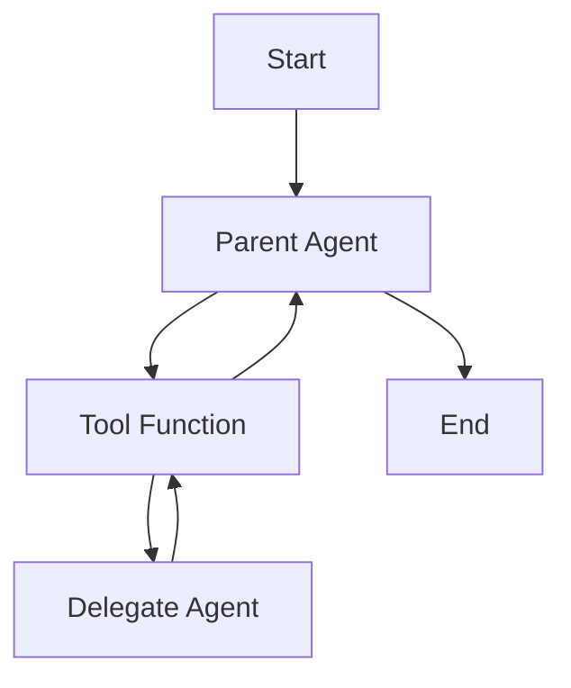
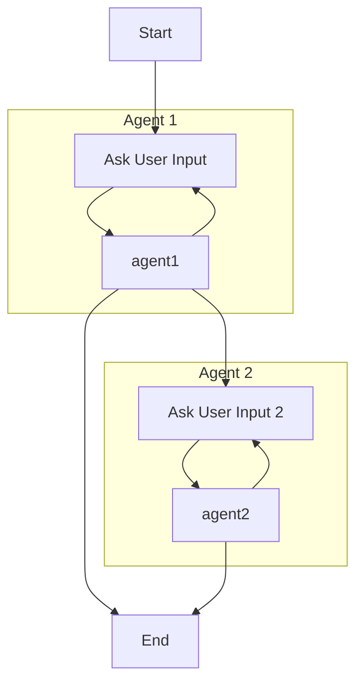
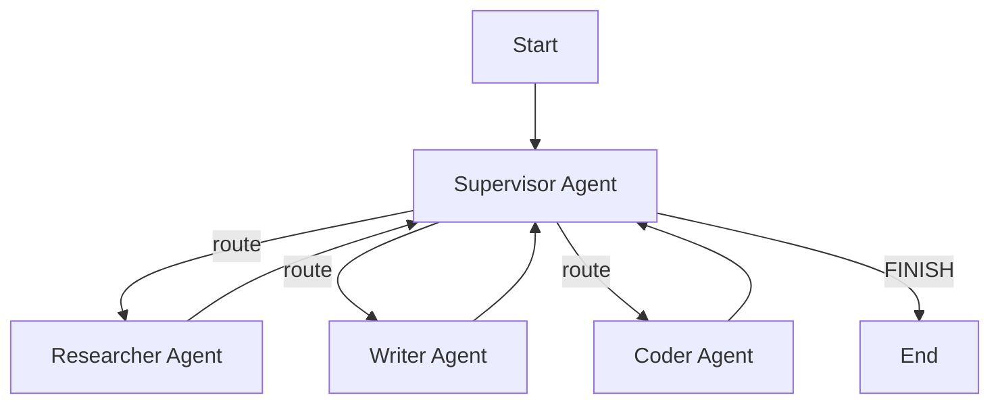
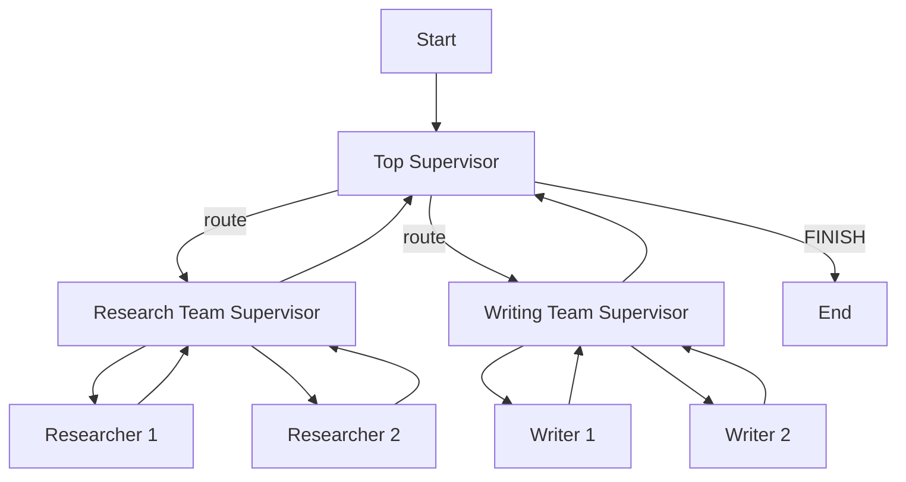
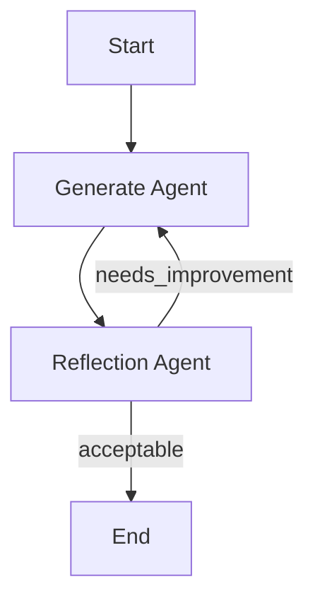
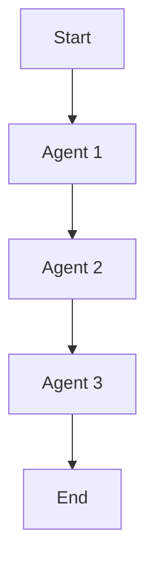
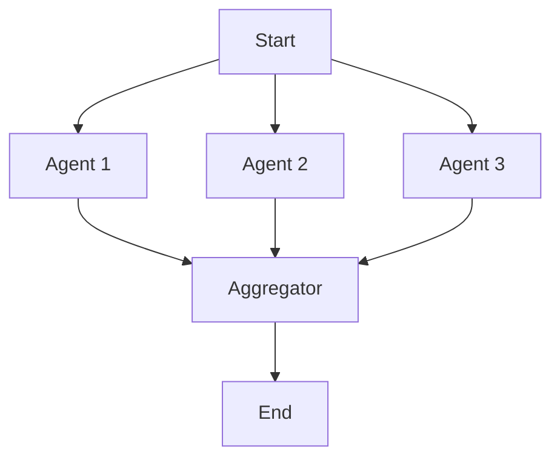
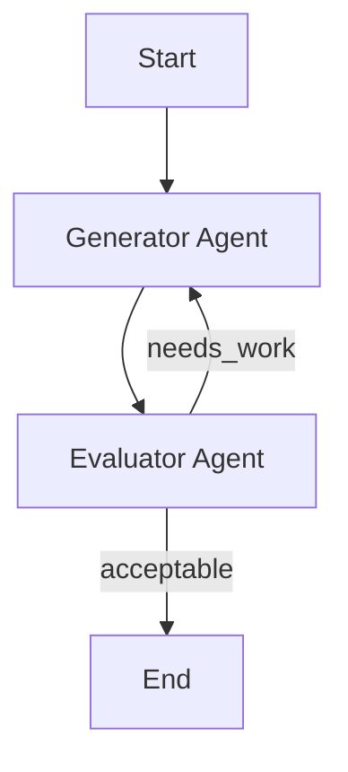
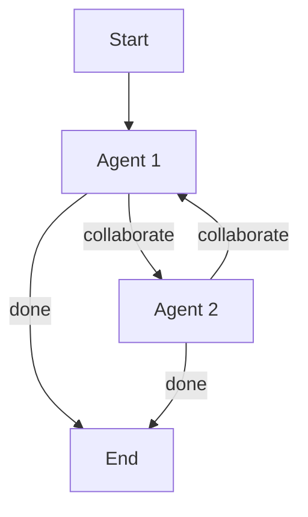

# Pydantic AI Agent Implementation Standard

Standard pattern for implementing Pydantic AI agents. All new agents should follow this structure.

## Table of Contents

- [Naming Conventions](#naming-conventions)
- [File Structure](#file-structure)
- [Complete Example](#complete-example)
- [Pattern Reference](#pattern-reference)
- [Multi-Agent Applications](#multi-agent-applications)

## Naming Conventions

1. **Dependencies MUST end with "Deps"**: `AgentDeps`, `CaptionValidationDeps`
2. **Response models MUST end with "Response"**: `CaptionValidationResponse`, `DecisionResponse`
3. **Agent instances**: `caption_validation_agent`, `decision_agent` (descriptive, snake_case)

## File Structure

```
src/capability/{domain}/{capability_name}/
├── models.py              # Pydantic models (Deps and Response)
├── agents/
│   └── {agent_name}_agent.py      # Agent implementation
├── graphs/
│   └── {capability_name}_graph.py # graph implementation
└── workflows.py          # convenience functions that call agent or graph
```

**Refactoring note**: Plan folder structures first, then incrementally move code.

## Complete Example

```python
"""
Roulette agent that checks if a customer has won.
"""

from dataclasses import dataclass
from typing import Optional
import httpx

from pydantic import BaseModel, Field
from pydantic_ai import Agent, RunContext, ModelRetry
from pydantic_ai.models.openai import OpenAIChatModel

from app.settings import settings
from src.capability.shared.model_factory import get_agent_model


# ============================================================================
# Dependencies
# ============================================================================

@dataclass
class RouletteDeps:
    """Runtime dependencies for roulette agent."""
    http_client: httpx.AsyncClient
    api_key: str
    winning_number: int
    log_prompts: bool = False

    @classmethod
    def from_settings(
        cls,
        http_client: Optional[httpx.AsyncClient] = None,
        api_key: Optional[str] = None,
        winning_number: int = 18,
        log_prompts: Optional[bool] = None,
    ) -> "RouletteDeps":
        """Create dependencies from application settings."""
        if http_client is None:
            http_client = httpx.AsyncClient()
        return cls(
            http_client=http_client,
            api_key=api_key or settings.API_KEY,
            winning_number=winning_number,
            log_prompts=log_prompts if log_prompts is not None else settings.LOG_PROMPTS,
        )


# ============================================================================
# Response Model
# ============================================================================

class RouletteResponse(BaseModel):
    is_winner: bool = Field(description="Whether the customer's number is a winner")
    customer_number: int = Field(description="The number the customer bet on")
    message: str = Field(description="A friendly message to the customer")


# ============================================================================
# Model Factory Function
# ============================================================================

def _get_roulette_model() -> OpenAIChatModel:
    """Factory function to get the model for roulette agent."""
    return get_agent_model("ROULETTE")


# ============================================================================
# System Prompts
# ============================================================================

# EXAMPLE 1 - Static prompt (declare prompt separately, pass to Agent)
roulette_system_prompt = (
        'Use the `roulette_wheel` function to see if the '
        'customer has won based on the number they provide.'
    )


roulette_agent = Agent(
    _get_roulette_model(),
    deps_type=RouletteDeps,
    output_type=RouletteResponse,
    retries=3,
    system_prompt=roulette_system_prompt,
)


# EXAMPLE 2 - Dynamic prompts (declare prompt separately as a function, update at runtime using RunContext)

def get_roulette_system_prompt(log_prompts: bool = False, **details) -> str:
    """Build the system prompt with runtime data."""
    base = "Use the `roulette_wheel` function to see if the customer has won based on the number they provide."
    if log_prompts:
        base += "\n\n[Logging enabled]"
    if details:
        base += f"\n{details}"
    return base

@roulette_agent.system_prompt
async def dynamic_system_prompt(ctx: RunContext[RouletteDeps]) -> str:
    """Dynamically build the system prompt based on runtime context."""
    return get_roulette_system_prompt(log_prompts=ctx.deps.log_prompts)


# ============================================================================
# Tools
# ============================================================================

@roulette_agent.tool
async def roulette_wheel(ctx: RunContext[RouletteDeps], square: int) -> str:
    """
    Check if the square is a winner.

    Args:
        square: The number the customer bet on

    Returns:
        'winner' if the square matches the winning number, 'loser' otherwise
    """
    return 'winner' if square == ctx.deps.winning_number else 'loser'


@roulette_agent.tool
async def get_joke_material(ctx: RunContext[RouletteDeps], subject: str) -> str:
    """
    Get joke material from an external API.

    Args:
        subject: The subject for the joke

    Returns:
        a joke
    """
    response = await ctx.deps.http_client.get(
        ' ttps://example.com/jokes',
        params={'subject': subject},
        headers={'Authorization': f'Bearer {ctx.deps.api_key}'},
    )
    response.raise_for_status()
    return response.text

# ============================================================================
# Output Validation
# ============================================================================


@roulette_agent.output_validator
async def validate_output(
    ctx: RunContext[RouletteDeps],
    output: RouletteResponse
) -> RouletteResponse:
    """
    Validate and potentially modify the agent's output.

    Raises:
        ModelRetry: If validation fails and agent should retry
    """
    validation_response = await ctx.deps.http_client.post(
        'https://example.com/validate',
        headers={'Authorization': f'Bearer {ctx.deps.api_key}'},
        params={'query': output.message},
    )
    if validation_response.status_code == 400:
        raise ModelRetry(f'invalid response: {validation_response.text}')
    validation_response.raise_for_status()
    return output


# ============================================================================
# Convenience Function (in capability route file)
# ============================================================================

# NOTE: Convenience functions should live in the capability route file
# (e.g., generate_caption_from_image.py), not in the agent file.
# This keeps the agent file focused on agent definition only.

# IMPORTANT: Convenience functions should:
# - Accept primitives (str, dict, int, bool, etc.) as parameters
# - Return primitives or simple dicts (not Pydantic models)
# - Create domain models and dependencies internally
# - Convert agent outputs back to primitives/dicts before returning

# Example in capability route file:
# async def check_roulette(
#     user_input: str,
#     winning_number: int = 18,
#     deps: Optional[RouletteDeps] = None
# ) -> dict:  # Returns dict, not RouletteResponse
#     """Check if a customer has won at roulette."""
#     if deps is None:
#         async with httpx.AsyncClient() as client:
#             deps = RouletteDeps.from_settings(http_client=client, winning_number=winning_number)
#     result = await roulette_agent.run(user_input, deps=deps)
#     return result.output.model_dump()  # Convert to dict
```

## Pattern Reference

Quick reference for each pattern. See Complete Example above for full implementations.

**Note:** Convenience functions should be defined in the capability route file (e.g., `generate_caption_from_image.py`), not in the agent file. This keeps agent files focused on agent definition only.

**Important:** Convenience functions must accept primitives (str, dict, int, bool, etc.) and return primitives or simple dicts. They should create domain models internally and convert agent outputs to primitives before returning.

### Dependencies Pattern

```python
@dataclass
class CapabilityDeps:
    http_client: httpx.AsyncClient
    api_key: str
    log_prompts: bool = False

    @classmethod
    def from_settings(cls, ...) -> "CapabilityDeps":
        # Implementation
```

**Key Points:**
- Use `@dataclass` for dependencies
- Include `from_settings()` classmethod
- Keep focused on runtime context, not static configuration

### Response Models Pattern

```python
class CapabilityResponse(BaseModel):
    result: str = Field(description="The main result")
    confidence: float = Field(default=0.0, ge=0.0, le=1.0)
    tags: List[str] = Field(default_factory=list)
```

**Key Points:**
- MUST end with "Response"
- Use `Field()` for validation and descriptions
- Use `default_factory` for mutable defaults

### Model Factory Functions

```python
from src.capability.shared.model_factory import get_agent_model

def _get_capability_model() -> OpenAIChatModel:
    return get_agent_model("CAPABILITY")
```

**Key Points:**
- Use shared `get_agent_model()` utility
- Capability name matches settings suffix

### System Prompts

**Static:** Declare string separately, pass to Agent
**Dynamic:** Declare function, call from `@agent.system_prompt` decorator

**Key Points:**
- Declare prompts separately (string for static, function for dynamic)
- Dynamic prompts: function takes runtime data, called from `@agent.system_prompt` decorator

### Tools

```python
@agent.tool
async def example_tool(ctx: RunContext[CapabilityDeps], query: str) -> str:
    """Tool description - docstring used by LLM."""
    return await ctx.deps.http_client.get(...)
```

**Key Points:**
- First parameter: `ctx: RunContext[DepsType]`
- Docstring used as tool description
- Access dependencies via `ctx.deps`

**Testing Tools:**

When testing tools directly (outside of `agent.run()`), use the `create_run_context()` helper:

```python
from server.projects.shared.context_helpers import create_run_context

# In tests or samples
deps = CapabilityDeps.from_settings()
await deps.initialize()
try:
    ctx = create_run_context(deps)
    result = await example_tool(ctx, query="test")
finally:
    await deps.cleanup()
```

**Never manually construct RunContext** - always use the helper for consistency and type safety.

### Output Validators

```python
@agent.output_validator
async def validate_output(ctx: RunContext[Deps], output: Response) -> Response:
    if output.confidence < 0.5:
        raise ModelRetry('Confidence too low')
    return output
```

**Key Points:**
- Parameters: `ctx: RunContext[DepsType]`, `output: ResponseType`
- Can modify output or raise `ModelRetry` to force retry

## Deprecated Patterns

### Agent Class Wrapper
**Deprecated**: Use module-level agents instead. All functionality achievable with factory functions and `deps_type`.

```python
# ❌ Deprecated
class CapabilityAgent:
    def __init__(self):
        self._agent: Optional[Agent] = None
    # ...

# ✅ Preferred
capability_agent = Agent(...)
```

### Manual Model Factory
**Deprecated**: Use `get_agent_model()` from `src.capability.shared.model_factory` instead of manual implementation.

## Best Practices Summary

1. **Naming**: Dependencies end with "Deps", Responses end with "Response"
2. **Structure**: Module-level agents (class wrappers deprecated)
3. **Dependencies**: Dataclasses with `from_settings()` method
4. **Models**: Use `get_agent_model()` utility
5. **Prompts**: Declare separately (string/function), use functions for dynamic prompts
6. **Tools**: First param `RunContext[DepsType]`, docstrings are important
7. **Validation**: Output validators for quality checks, raise `ModelRetry` to retry
8. **No Manual Schemas**: PydanticAI handles schema via `output_type`
9. **Type Safety**: Type hints everywhere
10. **Documentation**: Comprehensive docstrings

## Multi-Agent Applications

Pydantic AI supports multiple patterns for coordinating agents. Choose based on complexity:

1. **Single agent workflows** — Basic agent usage
2. **Agent delegation** — Agent calls another agent via tools
3. **Programmatic agent hand-off** — Application code orchestrates multiple agents
4. **Graph-based control flow** — Complex state machines
5. **Deep Agents** — Autonomous agents with planning, file ops, task delegation

### Agent Delegation

Agent calls another agent from within a tool, then regains control.



**Pattern:**
```python
from pydantic_ai import Agent, RunContext, UsageLimits

# Parent and delegate agents
parent_agent = Agent('openai:gpt-5', system_prompt='...')
delegate_agent = Agent('gemini-2.5-flash', output_type=list[str])

@parent_agent.tool
async def delegate_task(ctx: RunContext[Deps], count: int) -> list[str]:
    result = await delegate_agent.run(
        f'Generate {count} items.',
        deps=ctx.deps,  # Share dependencies
        usage=ctx.usage,  # CRITICAL: Pass usage for tracking
    )
    return result.output

# Usage tracking works across both agents
result = await parent_agent.run(
    'Generate jokes',
    usage_limits=UsageLimits(request_limit=5, total_tokens_limit=500),
)
print(result.usage())  # Includes usage from both agents
```

**Key Points:**
- Agents are stateless and global — don't include agent in dependencies
- **Always pass `ctx.usage` to delegate agent** for accurate usage tracking
- Delegate agent typically needs same or subset of parent's dependencies
- Can use different models for each agent

### Programmatic Agent Hand-Off

Application code orchestrates multiple agents in sequence.



**Pattern:**
```python
from pydantic_ai import Agent, RunUsage, UsageLimits

agent1 = Agent('openai:gpt-5', output_type=Result1 | Failed)
agent2 = Agent('openai:gpt-5', output_type=Result2 | Failed)

async def workflow():
    # Create usage tracker for entire workflow
    usage = RunUsage()
    usage_limits = UsageLimits(request_limit=15, total_tokens_limit=1000)

    # Track usage across all agents
    result1 = await agent1.run(prompt1, usage=usage, usage_limits=usage_limits)
    if isinstance(result1.output, Result1):
        result2 = await agent2.run(prompt2, usage=usage, usage_limits=usage_limits)
        # Continue workflow...

    # Final usage includes all agents
    print(usage)  # Total usage across agent1 and agent2
```

**Key Points:**
- Application code controls flow, not agents
- **Create `RunUsage()` instance and pass to all agent calls**
- Agents don't need same dependencies
- Use `UsageLimits` to control costs across entire workflow
- Human-in-the-loop possible between agent calls

### Graph-Based Control Flow with LangGraph

Use LangGraph for orchestrating Pydantic AI agents in complex workflows. LangGraph handles routing and state management; Pydantic AI provides the agents.

**Key Concepts:**
- **StateGraph**: Defines workflow structure with nodes and edges
- **State**: TypedDict containing workflow data and agent outputs
- **Nodes**: Functions that call Pydantic AI agents or perform logic
- **Edges**: Connections between nodes (conditional or fixed)
- **Usage Tracking**: Include `RunUsage` in state for cost monitoring

#### 1. Supervisor Pattern

**When to use**: Single supervisor routes tasks to specialized worker agents based on task type. Ideal when you need intelligent routing to multiple specialized agents that should all return control to a central coordinator.



**Overview:**
The supervisor pattern uses a Pydantic AI agent to make routing decisions. The supervisor agent receives the current task and conversation history, then uses structured output to decide which specialized worker agent should handle the task. All worker agents complete their work and return control to the supervisor, creating a loop until the supervisor decides the task is complete.

**Key Components:**
- **Supervisor Node**: Pydantic AI agent with structured output (`RouteDecision`) that decides routing
- **Worker Nodes**: Specialized Pydantic AI agents (researcher, writer, coder, etc.)
- **Conditional Routing**: `add_conditional_edges` routes based on supervisor's decision
- **Return Loop**: All workers return to supervisor via fixed edges

**Complete Example:** See [`graph_supervisor_pattern.py`](graph_supervisor_pattern.py)

**Key Points:**
- Supervisor uses Pydantic AI agent with structured output for routing
- All worker agents return to supervisor (creates loop)
- Conditional edges route based on supervisor decision
- Usage tracked across all agent calls

#### 2. Hierarchical Teams

**When to use**: Multi-level organization with team supervisors managing specialized teams. Best for large-scale systems where you need multiple levels of coordination and team-based specialization.



**Overview:**
Hierarchical teams extend the supervisor pattern with multiple levels. A top-level supervisor routes to team supervisors (e.g., research team, writing team), which then route to individual agents within their teams. This creates a two-level hierarchy where teams can be managed independently while still coordinating at the top level.

**Key Components:**
- **Top Supervisor**: Routes to team supervisors
- **Team Supervisors**: Route to agents within their team
- **Workers**: Individual Pydantic AI agents
- **Nested Routing**: Multiple levels of conditional edges

**Complete Example:** See [`graph_hierarchical_teams.py`](graph_hierarchical_teams.py)

**Key Points:**
- Multiple levels of supervisors (top → team → agent)
- Each level uses Pydantic AI agent for routing decisions
- Workers return to their immediate supervisor
- Can use subgraphs for team encapsulation

#### 3. Reflection Pattern

**When to use**: Agent evaluates its own output and retries if quality is insufficient. Perfect for self-improvement scenarios where an agent needs to critique and refine its own work.



**Overview:**
The reflection pattern creates a self-evaluation loop. A generator agent produces output, then a reflection agent (or the same agent in reflection mode) evaluates the quality. If the output needs improvement, the workflow loops back to generation. This continues until the output is acceptable or a maximum iteration limit is reached.

**Key Components:**
- **Generator Node**: Produces initial output
- **Reflection Node**: Pydantic AI agent that evaluates quality
- **Retry Loop**: Conditional edge that routes back to generator if quality is insufficient
- **Iteration Tracking**: Prevents infinite loops with max iteration limits

**Complete Example:** See [`graph_reflection_pattern.py`](graph_reflection_pattern.py)

**Key Points:**
- Reflection agent evaluates output quality
- Conditional edge creates retry loop
- Max iterations prevent infinite loops
- Feedback can be passed back to generator

#### 4. Prompt Chaining

**When to use**: Sequential processing where each agent's output feeds the next. Ideal for pipelines where each step transforms the output of the previous step in a predictable sequence.



**Overview:**
Prompt chaining is the simplest multi-agent pattern - a linear pipeline where each agent processes the output of the previous agent. This is useful for multi-stage transformations like translation → summarization → formatting, where each step depends on the previous one.

**Key Components:**
- **Sequential Nodes**: Each agent processes the previous agent's output
- **Linear Edges**: Simple `add_edge` calls create the chain
- **State Accumulation**: Each step's output is stored in state
- **No Conditional Logic**: Pure sequential flow

**Complete Example:** See [`graph_prompt_chaining.py`](graph_prompt_chaining.py)

**Key Points:**
- Simple sequential flow
- Each node receives previous output
- No conditional logic needed
- State accumulates outputs

#### 5. Parallelization

**When to use**: Independent tasks that can run simultaneously for speed. Best when you have multiple independent analyses or transformations that don't depend on each other.



**Overview:**
Parallelization runs multiple agents simultaneously by creating multiple edges from START. Each agent processes the same input independently, and an aggregator node combines the results once all agents complete. This pattern significantly reduces total execution time when agents can work independently.

**Key Components:**
- **Multiple START Edges**: Multiple `add_edge(START, "agent")` calls enable parallel execution
- **Reducer Pattern**: Use `Annotated[list, operator.add]` in state to accumulate results
- **Aggregator Node**: Combines parallel results after all agents complete
- **Independent Processing**: Agents don't depend on each other's outputs

**Complete Example:** See [`graph_parallelization.py`](graph_parallelization.py)

**Key Points:**
- Multiple edges from START enable parallel execution
- Use `Annotated[list, operator.add]` for reducer pattern
- Aggregator combines results after all complete
- Significantly faster than sequential execution

#### 6. Evaluator-Optimizer

**When to use**: One agent generates, another evaluates and provides feedback for improvement. Perfect for quality-critical outputs where you need external validation and iterative refinement.



**Overview:**
The evaluator-optimizer pattern separates generation from evaluation. A generator agent creates content, then an evaluator agent (a different agent with evaluation expertise) assesses quality and provides specific feedback. If the content needs work, the feedback is passed back to the generator for another iteration. This continues until quality is acceptable.

**Key Components:**
- **Generator Node**: Creates initial content
- **Evaluator Node**: Separate Pydantic AI agent that evaluates quality
- **Feedback Loop**: Conditional edge routes back to generator with feedback
- **Iteration Tracking**: Prevents infinite loops

**Complete Example:** See [`.pygraph_evaluator_optimizer`](graph_design_patterns/graph_evaluator_optimizer.py)

**Key Points:**
- Separate generator and evaluator agents
- Feedback loop improves quality iteratively
- Evaluator provides specific, actionable feedback
- Max iterations prevent infinite loops

#### 7. Multi-Agent Collaboration

**When to use**: Agents share state and collaborate directly, passing work back and forth. Ideal when agents need to build on each other's work in an iterative, conversational manner.



**Overview:**
Multi-agent collaboration enables true bidirectional collaboration where agents can see and build upon each other's contributions. Each agent receives the full shared context including the other agent's work, makes its contribution, and decides whether to continue the collaboration or finish. This creates a conversational, iterative collaboration pattern.

**Key Components:**
- **Shared State**: Both agents see all contributions
- **Bidirectional Routing**: Conditional edges allow flow in both directions
- **Turn Management**: State tracks whose turn it is
- **Agent-Controlled Flow**: Agents decide when collaboration is complete

**Complete Example:** See [`graph_multi_agent_collaboration.py`](graph_multi_agent_collaboration.py)

**Key Points:**
- Agents see each other's contributions in shared state
- Bidirectional flow enables true collaboration
- Agents decide when to pass control
- Shared context accumulates over iterations

## Pattern Selection Guide

| Pattern | Use When | Complexity |
|---------|----------|------------|
| **Supervisor** | Need intelligent routing to specialized agents | Medium |
| **Hierarchical Teams** | Large-scale multi-level organization | High |
| **Reflection** | Self-improvement through self-evaluation | Low |
| **Prompt Chaining** | Sequential processing pipeline | Low |
| **Parallelization** | Independent tasks, speed critical | Medium |
| **Evaluator-Optimizer** | Quality gate with external evaluation | Medium |
| **Collaboration** | Agents need to build on each other's work | High |

## Common Patterns

**Usage Tracking:**
```python
class GraphState(TypedDict):
    usage: RunUsage  # Include in all graph states

# In each node
result = await agent.run(
    prompt,
    usage=state.get("usage", RunUsage()),
)
return {"usage": result.usage()}  # Update state
```

**Conditional Routing:**
```python
def router(state: GraphState) -> str:
    # Return node name or END
    if condition:
        return "next_node"
    return END

workflow.add_conditional_edges(
    "current_node",
    router,
    {"next_node": "next_node", END: END},
)
```

**State Updates:**
```python
# Nodes return dict that updates state
return {
    "field1": "value1",
    "field2": "value2",
}
```

**Graph Module Exports:**
```python
# At the end of graph file, export compiled workflow and state
__all__ = ["workflow_name", "GraphState"]

workflow_name = workflow.compile()
```

**Key Points:**
- Use `__all__` to explicitly export the compiled workflow and state TypedDict
- Name the compiled workflow descriptively (e.g., `optimize_caption_workflow`, not `app`)
- Export both the workflow and state for external use

See [LangGraph documentation](https://langchain-ai.github.io/langgraph/) for advanced features like persistence, interrupts, and streaming.

### Deep Agents

Autonomous agents combining multiple patterns:
- Planning and progress tracking
- File system operations
- Task delegation
- Sandboxed code execution
- Context management (conversation summarization)
- Human-in-the-loop approval
- Durable execution

See [Multi-agent Applications](https://ai.pydantic.dev/multi-agent-applications/) for full details.

## References

- [Pydantic AI Documentation](https://ai.pydantic.dev/)
- [Agent API Reference](https://ai.pydantic.dev/api/agent/)
- [Dependencies Guide](https://ai.pydantic.dev/dependencies/)
- [Tools Guide](https://ai.pydantic.dev/tools/)
- [Output Validation](https://ai.pydantic.dev/output/)
- [Multi-Agent Applications](https://ai.pydantic.dev/multi-agent-applications/)
