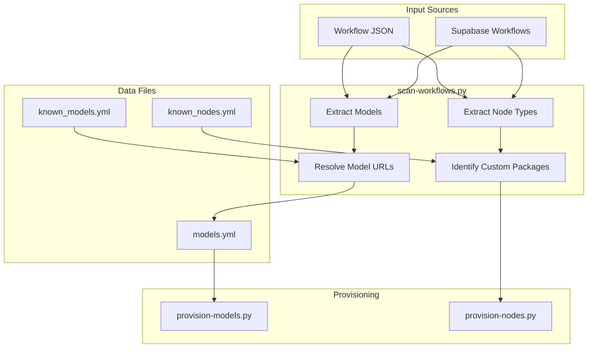

# ComfyUI Model & Custom Node Management

Guide for extending the ComfyUI model and custom node scanning/provisioning system when new workflows or node types are encountered.

## Quick Reference

| File | Purpose |
|------|---------|
| `02-compute/comfyui/scripts/scan-workflows.py` | Main scanner - extracts models AND custom nodes from workflows |
| `02-compute/comfyui/scripts/known_models.yml` | Model URL database for local lookups |
| `02-compute/comfyui/scripts/known_nodes.yml` | Custom node package database (node type → GitHub URL) |
| `02-compute/comfyui/scripts/provision-models.py` | Downloads models, skips existing |
| `02-compute/comfyui/scripts/provision-nodes.py` | Installs custom node packages, skips existing |
| `02-compute/comfyui/scripts/models.yml` | Active model provisioning config |
| `02-compute/comfyui/config/workflows/` | Local workflow JSON files |
| `02-compute/comfyui/config/provisioning/default.sh` | Docker provisioning script (nodes + models) |

## Workflow Format Detection

ComfyUI workflows exist in two formats. Both must be supported:

**Old Format** (nodes array with `widgets_values`):
```json
{
  "nodes": [
    {"type": "CLIPLoader", "widgets_values": ["model.safetensors"]}
  ]
}
```

**API Format** (node IDs as keys with `inputs`):
```json
{
  "70:39": {
    "class_type": "CLIPLoader",
    "inputs": {"clip_name": "model.safetensors"}
  }
}
```

## Adding Support for New Loader Nodes

When a workflow uses an unsupported node type, follow these steps:

### Step 1: Identify Node Type and Input Keys

Examine the workflow JSON to find:
1. The `class_type` or `type` value (e.g., `ModelPatchLoader`)
2. The input key containing the model filename (e.g., `name`, `model_name`, `ckpt_name`)
3. The model category (maps to ComfyUI directory)

**Common input key patterns**:
- Checkpoints: `ckpt_name`
- VAE: `vae_name`
- UNET: `unet_name`
- CLIP: `clip_name`, `clip_name1`, `clip_name2`
- LoRA: `lora_name`
- ControlNet: `control_net_name`
- Upscale: `model_name`

### Step 2: Update MODEL_LOADER_NODES_WIDGETS

In `scan-workflows.py`, add to `MODEL_LOADER_NODES_WIDGETS` for old format support:

```python
MODEL_LOADER_NODES_WIDGETS: dict[str, list[tuple[int, str]]] = {
    # ... existing entries ...
    "NewLoaderNode": [(0, "category")],  # widget_index, category
}
```

The `widget_index` is the position in the `widgets_values` array (0-based).

### Step 3: Update MODEL_LOADER_NODES_INPUTS

In `scan-workflows.py`, add to `MODEL_LOADER_NODES_INPUTS` for API format support:

```python
MODEL_LOADER_NODES_INPUTS: dict[str, list[tuple[str, str]]] = {
    # ... existing entries ...
    "NewLoaderNode": [("input_key", "category")],  # input_key, category
}
```

### Step 4: Update DIRECTORIES if New Category

If introducing a new model category, add it to `provision-models.py`:

```python
DIRECTORIES = {
    # ... existing entries ...
    "new_category": os.path.join(MODELS_DIR, "target_directory"),
}
```

**Category to directory mappings**:
| Category | Directory |
|----------|-----------|
| `checkpoints` | `checkpoints` |
| `vae` | `vae` |
| `unet` | `unet` |
| `clip` | `clip` |
| `loras` | `loras` |
| `controlnet` | `controlnet` |
| `upscale_models` | `upscale_models` |
| `model_patches` | `diffusion_models` |

## Adding Known Models

### known_models.yml Structure

```yaml
category_name:
  - name: model_filename.safetensors
    url: https://huggingface.co/org/repo/resolve/main/path/to/file.safetensors
    description: Brief description
    aliases:  # Optional
      - alternate_name.safetensors
```

### Finding Download URLs

**HuggingFace patterns**:
```
# Standard file
https://huggingface.co/{org}/{repo}/resolve/main/{filename}

# Nested path
https://huggingface.co/{org}/{repo}/resolve/main/{folder}/{filename}

# Split files (common for large models)
https://huggingface.co/{org}/{repo}/resolve/main/split_files/{category}/{filename}
```

**CivitAI patterns**:
```
https://civitai.com/api/download/models/{model_version_id}
```

**Tips for finding URLs**:
1. Search HuggingFace for the model name
2. Navigate to the "Files and versions" tab
3. Right-click the download button and copy the link
4. Ensure the URL uses `/resolve/main/` not `/blob/main/`

### Example: Adding Z-Image-Turbo Models

```yaml
clip:
  - name: qwen_3_4b.safetensors
    url: https://huggingface.co/Comfy-Org/z_image_turbo/resolve/main/split_files/text_encoders/qwen_3_4b.safetensors
    description: Qwen3 4B text encoder for Z-Image-Turbo

unet:
  - name: z_image_turbo_bf16.safetensors
    url: https://huggingface.co/Comfy-Org/z_image_turbo/resolve/main/z_image_turbo_bf16.safetensors
    description: Z-Image-Turbo BF16 diffusion model

model_patches:
  - name: Z-Image-Turbo-Fun-Controlnet-Union.safetensors
    url: https://huggingface.co/Comfy-Org/z_image_turbo/resolve/main/z_image_turbo_fun_controlnet_union.safetensors
    description: Z-Image-Turbo Fun ControlNet Union model
```

## Testing Workflow

### Test Scanner Extraction

```bash
cd 02-compute/comfyui/scripts

# Scan specific workflow (dry run, verbose)
python scan-workflows.py --workflow ../config/workflows/your-workflow.json --dry-run -v

# Scan all local workflows
python scan-workflows.py --source local --dry-run -v
```

### Validate YAML Syntax

```bash
cd 02-compute/comfyui/scripts

# Validate known_models.yml
python -c "import yaml; yaml.safe_load(open('known_models.yml')); print('OK')"

# Validate models.yml
python -c "import yaml; yaml.safe_load(open('models.yml')); print('OK')"
```

### Verify Provisioning Script

The `provision-models.py` script automatically skips existing models:

```python
def download_file(url, output_path, description):
    if os.path.exists(output_path):
        print(f"✓ {description} already exists, skipping...")
        return True
```

## Complete Example: Adding ModelPatchLoader Support

When encountering a workflow with `ModelPatchLoader` that wasn't previously supported:

**1. Workflow JSON shows:**
```json
{
  "70:64": {
    "class_type": "ModelPatchLoader",
    "inputs": {"name": "Z-Image-Turbo-Fun-Controlnet-Union.safetensors"}
  }
}
```

**2. Update scan-workflows.py:**
```python
# Add to MODEL_LOADER_NODES_WIDGETS
MODEL_LOADER_NODES_WIDGETS = {
    # ... existing ...
    "ModelPatchLoader": [(0, "model_patches")],
}

# Add to MODEL_LOADER_NODES_INPUTS
MODEL_LOADER_NODES_INPUTS = {
    # ... existing ...
    "ModelPatchLoader": [("name", "model_patches")],
}
```

**3. Update provision-models.py DIRECTORIES:**
```python
DIRECTORIES = {
    # ... existing ...
    "model_patches": os.path.join(MODELS_DIR, "diffusion_models"),
}
```

**4. Add to known_models.yml:**
```yaml
model_patches:
  - name: Z-Image-Turbo-Fun-Controlnet-Union.safetensors
    url: https://huggingface.co/Comfy-Org/z_image_turbo/resolve/main/z_image_turbo_fun_controlnet_union.safetensors
    description: Z-Image-Turbo Fun ControlNet Union model
```

**5. Test:**
```bash
python scan-workflows.py --workflow ../config/workflows/z-image-turbo-controlnet.json --dry-run -v
```

## Validation Checklist

Before considering changes complete:

- [ ] New node type added to `MODEL_LOADER_NODES_WIDGETS` (old format)
- [ ] New node type added to `MODEL_LOADER_NODES_INPUTS` (API format)
- [ ] Input key matches actual workflow JSON (verify exact key name)
- [ ] Category matches ComfyUI's directory structure
- [ ] If new category: added to `provision-models.py` `DIRECTORIES`
- [ ] Model URLs are direct download links (use `/resolve/main/` not `/blob/main/`)
- [ ] Tested with `--dry-run -v` flags
- [ ] YAML syntax validated

## Troubleshooting

**Scanner doesn't find models in workflow:**
- Check if workflow uses old or API format
- Verify `class_type`/`type` matches exactly (case-sensitive)
- Ensure input key name is correct

**Model not resolved:**
- Add to `known_models.yml` with correct URL
- Verify URL is direct download (test in browser)
- Check if HuggingFace requires authentication (add `HF_TOKEN` env var)

**Provisioning fails:**
- Verify category exists in `DIRECTORIES`
- Check URL is accessible
- Ensure target directory has write permissions

---

# Custom Node Management

The workflow scanner also detects required custom node packages and can provision them automatically.

## Quick Reference - Custom Nodes

| File | Purpose |
|------|---------|
| `02-compute/comfyui/scripts/known_nodes.yml` | Maps node class_types to GitHub packages |
| `02-compute/comfyui/scripts/provision-nodes.py` | Installs custom node packages |
| `02-compute/comfyui/config/provisioning/default.sh` | Docker-based provisioning |

## Scanning for Custom Nodes

The scanner automatically detects custom nodes used in workflows:

```bash
cd 02-compute/comfyui/scripts

# Scan workflows for both models AND custom nodes
python scan-workflows.py --source local --dry-run -v

# Scan for models only (skip node detection)
python scan-workflows.py --source local --skip-nodes --dry-run -v
```

**Sample output:**
```
🔌 CUSTOM NODES:
  Total node types found: 45
  Required custom node packages: 3

  Required custom node packages:

    📦 comfyui-vrgamedevgirl
       URL: https://github.com/vrgamegirl19/comfyui-vrgamedevgirl
       Description: Video enhancement nodes - film grain, color matching, sharpening
       Pip packages: kornia, librosa, imageio
       Used nodes: FastFilmGrain, FastLaplacianSharpen
```

## Adding Support for New Custom Nodes

When a workflow uses custom nodes not in `known_nodes.yml`:

### Step 1: Identify the Package

Search for the node type:
1. Check [ComfyUI Manager's custom node list](https://github.com/ltdrdata/ComfyUI-Manager)
2. Search GitHub for the node class_type
3. Check the workflow author's documentation

### Step 2: Add to known_nodes.yml

```yaml
package-name:
  url: https://github.com/author/package-name
  description: Brief description of what the package provides
  pip_packages:  # Optional - additional pip packages needed
    - kornia
    - librosa
  nodes:  # List of node class_types provided by this package
    - FastFilmGrain
    - FastLaplacianSharpen
    - ColorMatchToReference
```

### Step 3: Test Detection

```bash
# Verify the scanner detects the new package
python scan-workflows.py --workflow ../config/workflows/your-workflow.json --dry-run -v
```

## Installing Custom Nodes

### Method 1: provision-nodes.py (Recommended)

```bash
cd 02-compute/comfyui/scripts

# Install all known packages (dry run)
python provision-nodes.py --dry-run

# Install specific packages
python provision-nodes.py --packages comfyui-vrgamedevgirl ComfyUI-GGUF

# Update existing packages
python provision-nodes.py --update

# Install with verbose output
python provision-nodes.py -v
```

### Method 2: Docker Provisioning (default.sh)

For Docker-based ComfyUI, add packages to `02-compute/comfyui/config/provisioning/default.sh`:

```bash
NODES=(
    "https://github.com/ltdrdata/ComfyUI-Manager"
    "https://github.com/cubiq/ComfyUI_essentials"
    "https://github.com/vrgamegirl19/comfyui-vrgamedevgirl"  # FastLaplacianSharpen, FastFilmGrain
)

PIP_PACKAGES=(
    "kornia"      # Required by vrgamedevgirl
    "librosa"     # Required by vrgamedevgirl
    "imageio"     # Required by vrgamedevgirl
)
```

Then restart the ComfyUI container to trigger provisioning.

### Method 3: ComfyUI Manager (UI)

1. Open ComfyUI in browser
2. Click **Manager** → **Install Custom Nodes**
3. Search for package name
4. Click Install
5. Restart ComfyUI

## known_nodes.yml Structure

```yaml
# Package name (folder name in custom_nodes/)
package-name:
  # GitHub repository URL (required)
  url: https://github.com/author/package-name

  # Brief description (required)
  description: What the package provides

  # Additional pip packages needed (optional)
  pip_packages:
    - package1
    - package2

  # Node class_types provided by this package (required)
  # These are used to detect which packages are needed
  nodes:
    - NodeType1
    - NodeType2
    - NodeType3
```

## Common Custom Node Packages

| Package | Nodes | Description |
|---------|-------|-------------|
| `comfyui-vrgamedevgirl` | FastFilmGrain, FastLaplacianSharpen, ColorMatchToReference | Video enhancement |
| `ComfyUI-GGUF` | UnetLoaderGGUF, CLIPLoaderGGUF | Load quantized GGUF models |
| `comfyui_controlnet_aux` | CannyEdgePreprocessor, DepthAnythingPreprocessor | ControlNet preprocessors |
| `ComfyUI-AnimateDiff-Evolved` | ADE_AnimateDiffLoaderGen1, etc. | AnimateDiff video generation |
| `ComfyUI-VideoHelperSuite` | VHS_LoadVideo, VHS_VideoCombine | Video loading/combining |
| `ComfyUI_IPAdapter_plus` | IPAdapterApply, IPAdapterAdvanced | IP-Adapter style transfer |
| `ComfyUI-Impact-Pack` | FaceDetailer, SAMDetectorCombined | Face detection/detailing |

## Validation Checklist - Custom Nodes

- [ ] Package added to `known_nodes.yml` with correct URL
- [ ] All node class_types listed in `nodes:` array
- [ ] pip_packages listed if package has special requirements
- [ ] Tested with `python scan-workflows.py --dry-run -v`
- [ ] YAML syntax validated

## Troubleshooting - Custom Nodes

**Node shows as "unknown" in scan:**
- Add the package to `known_nodes.yml`
- Verify the node class_type matches exactly (case-sensitive)

**Package fails to install:**
- Check the GitHub URL is correct
- Verify requirements.txt dependencies
- Check for missing pip packages

**Node still missing after install:**
- Restart ComfyUI
- Refresh browser (clear cache)
- Check ComfyUI logs for import errors

---

## Architecture Overview


