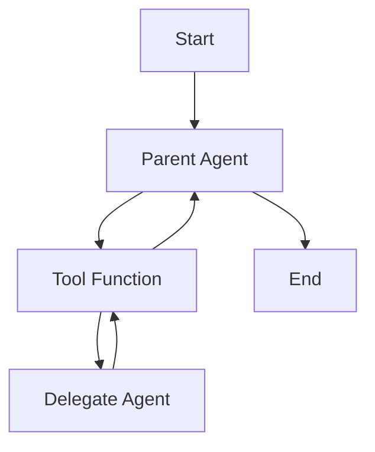
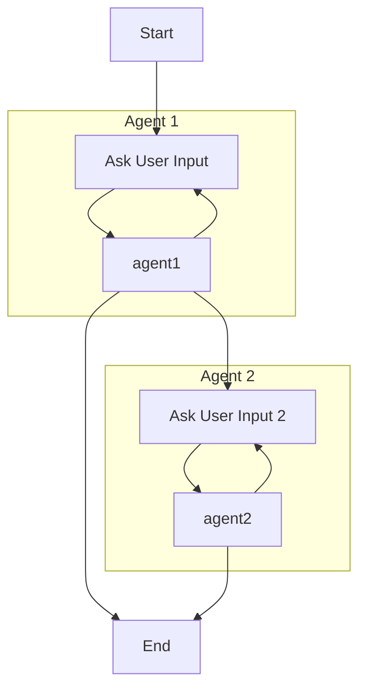
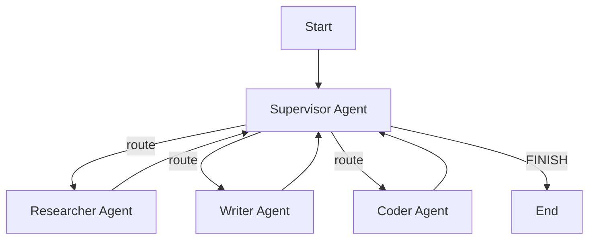
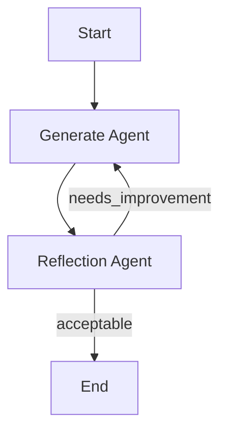
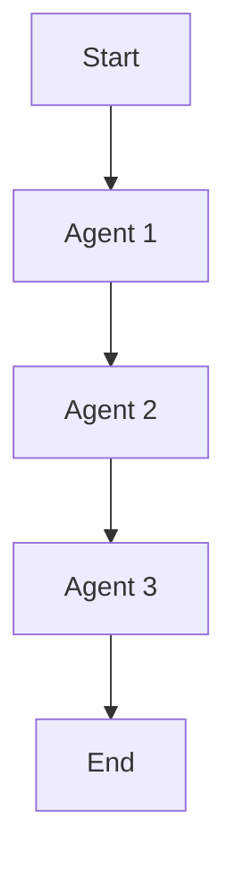
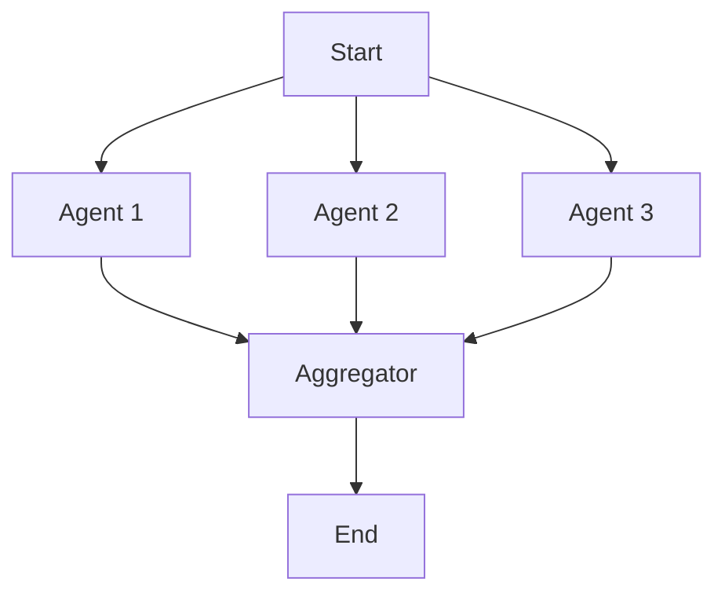
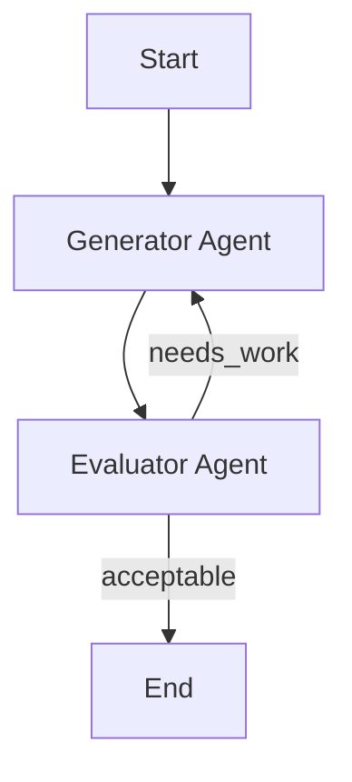
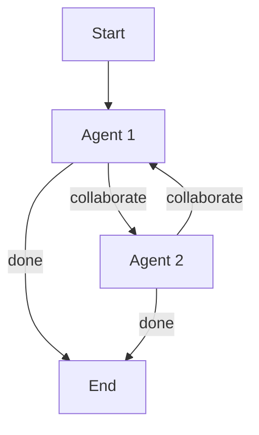

# LangGraph Integration

Patterns for integrating Pydantic AI agents with LangGraph for stateful, orchestrated workflows.

## Multi-Agent Application Patterns

Pydantic AI supports multiple patterns for coordinating agents. Choose based on complexity:

1. **Single agent workflows** — Basic agent usage (no LangGraph needed)
2. **Agent delegation** — Agent calls another agent via tools
3. **Programmatic agent hand-off** — Application code orchestrates multiple agents
4. **Graph-based control flow** — Complex state machines (LangGraph)
5. **Deep Agents** — Autonomous agents with planning, file ops, task delegation

## When to Use LangGraph

Use LangGraph when you need:
- **Stateful workflows**: Multi-step processes with shared state
- **Branching logic**: Conditional execution paths
- **Loops/retries**: Iterative refinement cycles
- **Multi-agent coordination**: Multiple agents working together
- **Checkpointing**: Resume-able workflows

For simple single-turn agent interactions, Pydantic AI alone is sufficient.

## Agent Delegation (Without LangGraph)

Agent calls another agent from within a tool, then regains control.



**Pattern:**
```python
from pydantic_ai import Agent, RunContext, UsageLimits

# Parent and delegate agents
parent_agent = Agent('openai:gpt-5', system_prompt='...')
delegate_agent = Agent('gemini-2.5-flash', output_type=list[str])

@parent_agent.tool
async def delegate_task(ctx: RunContext[ParentDeps], count: int) -> list[str]:
    result = await delegate_agent.run(
        f'Generate {count} items.',
        deps=ctx.deps,  # Share dependencies
        usage=ctx.usage,  # CRITICAL: Pass usage for tracking
    )
    return result.output

# Usage tracking works across both agents
result = await parent_agent.run(
    'Generate jokes',
    usage_limits=UsageLimits(request_limit=5, total_tokens_limit=500),
)
print(result.usage())  # Includes usage from both agents
```

**Key Points:**
- Agents are stateless and global — don't include agent in dependencies
- **Always pass `ctx.usage` to delegate agent** for accurate usage tracking
- Delegate agent typically needs same or subset of parent's dependencies
- Can use different models for each agent

## Programmatic Agent Hand-Off (Without LangGraph)

Application code orchestrates multiple agents in sequence.



**Pattern:**
```python
from pydantic_ai import Agent, RunUsage, UsageLimits

agent1 = Agent('openai:gpt-5', output_type=Result1 | Failed)
agent2 = Agent('openai:gpt-5', output_type=Result2 | Failed)

async def workflow():
    # Create usage tracker for entire workflow
    usage = RunUsage()
    usage_limits = UsageLimits(request_limit=15, total_tokens_limit=1000)

    # Track usage across all agents
    result1 = await agent1.run(prompt1, usage=usage, usage_limits=usage_limits)
    if isinstance(result1.output, Result1):
        result2 = await agent2.run(prompt2, usage=usage, usage_limits=usage_limits)
        # Continue workflow...

    # Final usage includes all agents
    print(usage)  # Total usage across agent1 and agent2
```

**Key Points:**
- Application code controls flow, not agents
- **Create `RunUsage()` instance and pass to all agent calls**
- Agents don't need same dependencies
- Use `UsageLimits` to control costs across entire workflow
- Human-in-the-loop possible between agent calls

## Basic LangGraph Setup

### State Schema with Pydantic

```python
from typing import Annotated, Sequence
import operator
from pydantic import BaseModel, Field
from langchain_core.messages import BaseMessage

class WorkflowState(BaseModel):
    """Shared state for the workflow."""

    # Input
    user_query: str = Field(..., description="Original user query")

    # Message history (accumulates)
    messages: Annotated[Sequence[BaseMessage], operator.add] = Field(
        default_factory=list
    )

    # Intermediate results
    search_results: list[dict] = Field(default_factory=list)
    analysis: str | None = None

    # Output
    final_response: str | None = None

    # Control flow
    needs_more_search: bool = False
    iteration_count: int = 0
```

### Building a StateGraph

```python
from langgraph.graph import StateGraph, START, END

def create_workflow():
    """Create a LangGraph workflow."""

    # Initialize graph with state schema
    graph = StateGraph(state_schema=WorkflowState)

    # Add nodes
    graph.add_node("search", search_node)
    graph.add_node("analyze", analyze_node)
    graph.add_node("respond", respond_node)

    # Add edges
    graph.add_edge(START, "search")
    graph.add_edge("search", "analyze")

    # Conditional edge based on state
    graph.add_conditional_edges(
        "analyze",
        should_continue,
        {
            "continue": "search",  # Loop back
            "finish": "respond",   # Move forward
        }
    )

    graph.add_edge("respond", END)

    return graph.compile()
```

## Node Functions

### Basic Node Pattern

```python
async def search_node(state: WorkflowState) -> dict:
    """Search node that updates state."""

    # Perform search using Pydantic AI agent
    deps = SearchDependencies.from_settings()
    await deps.initialize()

    try:
        result = await search_agent.run(
            state.user_query,
            deps=deps,
        )

        # Return state updates (not full state)
        return {
            "search_results": result.data.results,
            "iteration_count": state.iteration_count + 1,
        }
    finally:
        await deps.cleanup()
```

### Node with Pydantic AI Agent

```python
from pydantic_ai import Agent
from shared.llm import get_llm_model

# Define agent for this node
analyze_agent = Agent(
    get_llm_model(),
    deps_type=AnalysisDependencies,
    output_type=AnalysisOutput,
    system_prompt="Analyze the search results and determine if more information is needed."
)

async def analyze_node(state: WorkflowState) -> dict:
    """Analyze results using Pydantic AI agent."""

    deps = AnalysisDependencies(
        search_results=state.search_results,
        query=state.user_query,
    )
    await deps.initialize()

    try:
        result = await analyze_agent.run(
            f"Analyze these results for query: {state.user_query}",
            deps=deps,
        )

        return {
            "analysis": result.data.summary,
            "needs_more_search": result.data.needs_more_info,
        }
    finally:
        await deps.cleanup()
```

## Conditional Edges

```python
def should_continue(state: WorkflowState) -> str:
    """Decide whether to continue searching or finish."""

    # Limit iterations to prevent infinite loops
    if state.iteration_count >= 3:
        return "finish"

    # Check analysis result
    if state.needs_more_search:
        return "continue"

    return "finish"
```

## Checkpointing

```python
from langgraph.checkpoint.memory import MemorySaver

def create_workflow_with_checkpoint():
    """Create workflow with memory checkpointing."""

    graph = StateGraph(state_schema=WorkflowState)
    # ... add nodes and edges ...

    # Add memory checkpointer
    checkpointer = MemorySaver()

    return graph.compile(checkpointer=checkpointer)

# Usage with thread_id for resumption
async def run_workflow(query: str, thread_id: str):
    """Run workflow with checkpointing."""

    workflow = create_workflow_with_checkpoint()

    config = {"configurable": {"thread_id": thread_id}}

    result = await workflow.ainvoke(
        {"user_query": query},
        config=config,
    )

    return result
```

## Graph-Based Control Flow Patterns

Use LangGraph for orchestrating Pydantic AI agents in complex workflows. LangGraph handles routing and state management; Pydantic AI provides the agents.

### Pattern Selection Guide

| Pattern | Use When | Complexity |
|---------|----------|------------|
| **Supervisor** | Need intelligent routing to specialized agents | Medium |
| **Hierarchical Teams** | Large-scale multi-level organization | High |
| **Reflection** | Self-improvement through self-evaluation | Low |
| **Prompt Chaining** | Sequential processing pipeline | Low |
| **Parallelization** | Independent tasks, speed critical | Medium |
| **Evaluator-Optimizer** | Quality gate with external evaluation | Medium |
| **Collaboration** | Agents need to build on each other's work | High |

### 1. Supervisor Pattern

**When to use**: Single supervisor routes tasks to specialized worker agents based on task type.



**Implementation:**
```python
from pydantic import BaseModel, Field
from pydantic_ai import Agent, RunUsage
from langgraph.graph import StateGraph, START, END
from typing import Literal

class RouteDecision(BaseModel):
    """Supervisor routing decision."""
    next_agent: Literal["researcher", "writer", "coder", "FINISH"]
    reasoning: str

class SupervisorState(BaseModel):
    query: str
    messages: list[str] = Field(default_factory=list)
    current_agent: str | None = None
    usage: RunUsage = Field(default_factory=RunUsage)

# Supervisor uses structured output for routing
supervisor_agent = Agent(
    get_llm_model(),
    deps_type=SupervisorDeps,
    output_type=RouteDecision,
    system_prompt="Route tasks to the appropriate specialist agent."
)

async def supervisor_node(state: SupervisorState) -> dict:
    deps = SupervisorDeps.from_settings()
    result = await supervisor_agent.run(
        f"Query: {state.query}\nHistory: {state.messages}",
        deps=deps,
        usage=state.usage,
    )
    return {"current_agent": result.output.next_agent}

def route_decision(state: SupervisorState) -> str:
    return state.current_agent

def create_supervisor_workflow():
    graph = StateGraph(state_schema=SupervisorState)

    graph.add_node("supervisor", supervisor_node)
    graph.add_node("researcher", researcher_node)
    graph.add_node("writer", writer_node)
    graph.add_node("coder", coder_node)

    graph.add_edge(START, "supervisor")
    graph.add_conditional_edges(
        "supervisor",
        route_decision,
        {"researcher": "researcher", "writer": "writer", "coder": "coder", "FINISH": END}
    )

    # All workers return to supervisor
    for worker in ["researcher", "writer", "coder"]:
        graph.add_edge(worker, "supervisor")

    return graph.compile()
```

### 2. Reflection Pattern

**When to use**: Agent evaluates its own output and retries if quality is insufficient.



**Implementation:**
```python
class ReflectionState(BaseModel):
    query: str
    draft: str | None = None
    feedback: str | None = None
    iteration: int = 0
    max_iterations: int = 3
    is_acceptable: bool = False

reflection_agent = Agent(
    get_llm_model(),
    deps_type=ReflectionDeps,
    output_type=ReflectionResult,
    system_prompt="Evaluate the quality of the draft. Provide feedback if improvement needed."
)

async def reflect_node(state: ReflectionState) -> dict:
    deps = ReflectionDeps.from_settings()
    result = await reflection_agent.run(
        f"Evaluate this draft:\n{state.draft}",
        deps=deps,
    )
    return {
        "feedback": result.output.feedback,
        "is_acceptable": result.output.is_acceptable,
        "iteration": state.iteration + 1,
    }

def should_continue(state: ReflectionState) -> str:
    if state.is_acceptable or state.iteration >= state.max_iterations:
        return END
    return "generate"
```

### 3. Prompt Chaining

**When to use**: Sequential processing where each agent's output feeds the next.



**Implementation:**
```python
class ChainState(BaseModel):
    input_text: str
    translated: str | None = None
    summarized: str | None = None
    formatted: str | None = None

def create_chain_workflow():
    graph = StateGraph(state_schema=ChainState)

    graph.add_node("translate", translate_node)
    graph.add_node("summarize", summarize_node)
    graph.add_node("format", format_node)

    # Simple sequential chain
    graph.add_edge(START, "translate")
    graph.add_edge("translate", "summarize")
    graph.add_edge("summarize", "format")
    graph.add_edge("format", END)

    return graph.compile()
```

### 4. Parallelization

**When to use**: Independent tasks that can run simultaneously for speed.



**Implementation:**
```python
from typing import Annotated
import operator

class ParallelState(BaseModel):
    query: str
    # Use reducer to accumulate results from parallel branches
    results: Annotated[list[str], operator.add] = Field(default_factory=list)
    combined: str | None = None

def create_parallel_workflow():
    graph = StateGraph(state_schema=ParallelState)

    graph.add_node("semantic_search", semantic_search_node)
    graph.add_node("keyword_search", keyword_search_node)
    graph.add_node("graph_search", graph_search_node)
    graph.add_node("aggregator", aggregator_node)

    # Multiple edges from START enable parallel execution
    graph.add_edge(START, "semantic_search")
    graph.add_edge(START, "keyword_search")
    graph.add_edge(START, "graph_search")

    # All converge to aggregator
    graph.add_edge("semantic_search", "aggregator")
    graph.add_edge("keyword_search", "aggregator")
    graph.add_edge("graph_search", "aggregator")

    graph.add_edge("aggregator", END)

    return graph.compile()
```

**Key Points:**
- Multiple edges from START enable parallel execution
- Use `Annotated[list, operator.add]` for reducer pattern
- Aggregator combines results after all complete

### 5. Evaluator-Optimizer

**When to use**: One agent generates, another evaluates and provides feedback for improvement.



Similar to reflection, but with separate specialized agents for generation and evaluation.

### 6. Multi-Agent Collaboration

**When to use**: Agents share state and collaborate directly, passing work back and forth.



## Multi-Agent Workflow (Sequential Pipeline)

```python
class MultiAgentState(BaseModel):
    """State for multi-agent workflow."""
    query: str
    researcher_output: str | None = None
    writer_output: str | None = None
    editor_output: str | None = None
    final_output: str | None = None
    usage: RunUsage = Field(default_factory=RunUsage)

# Define specialized agents
researcher_agent = Agent(
    get_llm_model(),
    deps_type=ResearchDeps,
    system_prompt="You are a research specialist..."
)

writer_agent = Agent(
    get_llm_model(),
    deps_type=WriterDeps,
    system_prompt="You are a content writer..."
)

editor_agent = Agent(
    get_llm_model(),
    deps_type=EditorDeps,
    system_prompt="You are an editor..."
)

async def researcher_node(state: MultiAgentState) -> dict:
    """Research node."""
    deps = ResearchDeps.from_settings()
    await deps.initialize()
    try:
        result = await researcher_agent.run(
            state.query,
            deps=deps,
            usage=state.usage,  # Track usage
        )
        return {"researcher_output": result.data}
    finally:
        await deps.cleanup()

async def writer_node(state: MultiAgentState) -> dict:
    """Writer node."""
    deps = WriterDeps(research=state.researcher_output)
    await deps.initialize()
    try:
        result = await writer_agent.run(
            f"Write about: {state.query}\nResearch: {state.researcher_output}",
            deps=deps,
            usage=state.usage,
        )
        return {"writer_output": result.data}
    finally:
        await deps.cleanup()

async def editor_node(state: MultiAgentState) -> dict:
    """Editor node."""
    deps = EditorDeps(draft=state.writer_output)
    await deps.initialize()
    try:
        result = await editor_agent.run(
            f"Edit this draft:\n{state.writer_output}",
            deps=deps,
            usage=state.usage,
        )
        return {"editor_output": result.data, "final_output": result.data}
    finally:
        await deps.cleanup()

def create_multi_agent_workflow():
    """Create multi-agent pipeline."""
    graph = StateGraph(state_schema=MultiAgentState)

    graph.add_node("research", researcher_node)
    graph.add_node("write", writer_node)
    graph.add_node("edit", editor_node)

    graph.add_edge(START, "research")
    graph.add_edge("research", "write")
    graph.add_edge("write", "edit")
    graph.add_edge("edit", END)

    return graph.compile()

# Export compiled workflow
__all__ = ["multi_agent_workflow", "MultiAgentState"]
multi_agent_workflow = create_multi_agent_workflow()
```

## Parallel Execution

```python
from langgraph.graph import StateGraph

class ParallelState(BaseModel):
    query: str
    search_results: list[dict] = []
    graph_results: list[dict] = []
    combined: str | None = None

def create_parallel_workflow():
    """Workflow with parallel branches."""
    graph = StateGraph(state_schema=ParallelState)

    graph.add_node("vector_search", vector_search_node)
    graph.add_node("graph_search", graph_search_node)
    graph.add_node("combine", combine_node)

    # Parallel branches from START
    graph.add_edge(START, "vector_search")
    graph.add_edge(START, "graph_search")

    # Both converge to combine
    graph.add_edge("vector_search", "combine")
    graph.add_edge("graph_search", "combine")

    graph.add_edge("combine", END)

    return graph.compile()
```

## Error Handling

```python
async def safe_node(state: WorkflowState) -> dict:
    """Node with error handling."""
    try:
        # Normal processing
        result = await process(state)
        return {"result": result, "error": None}

    except ConnectionError as e:
        # Recoverable error - retry
        return {"error": f"Connection failed: {e}", "should_retry": True}

    except Exception as e:
        # Non-recoverable error
        return {"error": f"Fatal error: {e}", "should_retry": False}

def error_router(state: WorkflowState) -> str:
    """Route based on error state."""
    if state.error is None:
        return "continue"
    elif state.should_retry and state.retry_count < 3:
        return "retry"
    else:
        return "error_handler"
```

## Testing LangGraph Workflows

```python
import pytest

@pytest.mark.asyncio
async def test_workflow_happy_path():
    """Test complete workflow execution."""
    workflow = create_workflow()

    result = await workflow.ainvoke({
        "user_query": "What is Python?",
    })

    assert result["final_response"] is not None
    assert "Python" in result["final_response"]

@pytest.mark.asyncio
async def test_workflow_iteration_limit():
    """Test that workflow respects iteration limit."""
    workflow = create_workflow()

    # Force needs_more_search to True
    result = await workflow.ainvoke({
        "user_query": "Complex query",
        "needs_more_search": True,
    })

    assert result["iteration_count"] <= 3  # Max iterations

@pytest.mark.asyncio
async def test_node_in_isolation():
    """Test individual node."""
    state = WorkflowState(user_query="test query")

    result = await search_node(state)

    assert "search_results" in result
```

## Common Patterns

**Usage Tracking:**
```python
from pydantic_ai import RunUsage

class GraphState(TypedDict):
    usage: RunUsage  # Include in all graph states

# In each node
result = await agent.run(
    prompt,
    usage=state.get("usage", RunUsage()),
)
return {"usage": result.usage()}  # Update state
```

**Conditional Routing:**
```python
def router(state: GraphState) -> str:
    # Return node name or END
    if condition:
        return "next_node"
    return END

workflow.add_conditional_edges(
    "current_node",
    router,
    {"next_node": "next_node", END: END},
)
```

**State Updates:**
```python
# Nodes return dict that updates state
return {
    "field1": "value1",
    "field2": "value2",
}
```

**Graph Module Exports:**
```python
# At the end of graph file, export compiled workflow and state
__all__ = ["workflow_name", "GraphState"]

workflow_name = workflow.compile()
```

## Best Practices

1. **Keep nodes focused**: Each node should do one thing well
2. **Use typed state**: Pydantic models for state ensure type safety
3. **Handle errors gracefully**: Return error state, don't raise exceptions
4. **Limit iterations**: Always set maximum iteration counts for loops
5. **Clean up resources**: Use try/finally in nodes for proper cleanup
6. **Test nodes independently**: Test each node before testing full workflow
7. **Use checkpointing**: Enable resumption for long-running workflows
8. **Track usage**: Include `RunUsage` in state for cost monitoring across agents
9. **Export workflows**: Use `__all__` to export compiled workflow and state TypedDict
10. **Name descriptively**: Name compiled workflows descriptively (e.g., `optimize_caption_workflow`, not `app`)

## References

- [Pydantic AI Documentation](https://ai.pydantic.dev/)
- [Multi-Agent Applications](https://ai.pydantic.dev/multi-agent-applications/)
- [LangGraph Documentation](https://langchain-ai.github.io/langgraph/)
