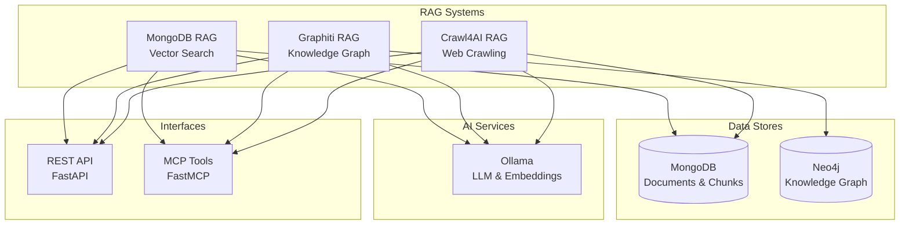

# RAG Functionality Documentation

## Executive Summary

This project implements three distinct RAG (Retrieval-Augmented Generation) systems, each optimized for different use cases:

1. **MongoDB RAG** - Vector-based RAG with MongoDB for document search and retrieval
2. **Graphiti RAG** - Graph-based RAG using Graphiti and Neo4j for knowledge graph operations
3. **Crawl4AI RAG** - Web crawling RAG that automatically ingests web content into MongoDB

All three systems integrate with the Lambda server's FastAPI endpoints and MCP (Model Context Protocol) tools, providing both REST API and programmatic interfaces.

## Architecture Overview



## MongoDB RAG

### Overview

MongoDB RAG is a comprehensive vector-based retrieval system that combines semantic search, full-text search, and advanced RAG features. It supports document ingestion, memory operations, and enhanced query processing.

**Location**: `04-lambda/server/projects/mongo_rag/`

**Inspiration**: This implementation is inspired by [MongoDB-RAG-Agent](https://github.com/coleam00/MongoDB-RAG-Agent), which demonstrates best practices for building production-ready RAG systems with MongoDB Atlas Vector Search and Docling document processing.

### Core Features

#### 1. Search Capabilities

**Semantic Search** (`semantic_search`)
- Pure vector similarity search using MongoDB `$vectorSearch`
- Uses embeddings for conceptual matching
- Best for: Natural language queries, finding related concepts
- Performance: ~100-200ms per query

**Text Search** (`text_search`)
- Full-text keyword matching using MongoDB Atlas Search
- Supports fuzzy matching and phrase matching
- Best for: Exact terms, function names, technical documentation
- Performance: ~50-150ms per query

**Hybrid Search** (`hybrid_search`) - **Recommended**
- Combines semantic and text search using Reciprocal Rank Fusion (RRF)
- Automatically includes Graphiti results if available
- Best for: General-purpose search requiring both semantic understanding and keyword precision
- Performance: ~150-300ms (runs searches concurrently)
- Algorithm: RRF with k=60 constant

**Code Example Search** (`search_code_examples`)
- Extracts and searches code snippets from documents
- Filters by programming language
- Returns code with summaries and context
- Requires: `USE_AGENTIC_RAG=true`

#### 2. Document Ingestion with Docling

**Docling Integration**: The MongoDB RAG pipeline uses [Docling](https://github.com/DS4SD/docling) for intelligent document processing, inspired by the MongoDB-RAG-Agent project. Docling provides production-grade document conversion and chunking capabilities.

**Supported Formats** (via Docling):
- **Documents**: PDF, Word (.docx, .doc), PowerPoint (.pptx, .ppt), Excel (.xlsx, .xls)
- **Text**: Markdown (.md, .markdown), Plain text (.txt)
- **Web**: HTML (.html, .htm)
- **Audio**: MP3, WAV, M4A, FLAC (transcribed with Whisper ASR via Docling's ASR pipeline)

**Docling Document Converter**:
- Converts complex document formats (PDF, Word, PowerPoint, Excel) to clean markdown
- Preserves document structure (headings, sections, tables, lists)
- Handles multi-column layouts and complex formatting
- Extracts metadata (title, author, creation date)
- Maintains semantic coherence across document sections

**Docling HybridChunker**:
- **Token-aware chunking**: Uses actual tokenizer (not character estimates) to respect embedding model limits
- **Structure preservation**: Respects document hierarchy (headings, sections, paragraphs)
- **Semantic boundaries**: Avoids splitting code blocks, tables, and related content
- **Contextualized output**: Each chunk includes heading hierarchy for better context
- **Fast processing**: No LLM API calls required, pure tokenizer-based chunking
- **Battle-tested**: Maintained by IBM's Docling team, used in production systems

**Ingestion Pipeline**:
1. File upload to `/app/uploads`
2. **Docling DocumentConverter** processes document:
   - Converts PDF/Word/PowerPoint/Excel to markdown (preserves structure)
   - For audio files: Uses Docling's ASR pipeline with Whisper ASR for transcription
   - Returns both markdown content and DoclingDocument object
3. **Docling HybridChunker** chunks the document:
   - Uses tokenizer-aware chunking (respects `max_tokens` limit)
   - Preserves document structure and semantic boundaries
   - Adds contextualized heading hierarchy to each chunk
4. Embeddings generated for each chunk (batch processing for efficiency)
5. Documents and chunks stored in MongoDB with metadata

**Collections**:
- `documents` - Document metadata and source information
- `chunks` - Chunked content with embeddings and metadata (includes Docling chunk metadata)

#### 3. Memory Tools

**Message Storage** (`record_message`)
- Stores conversation messages with user_id, persona_id, role, content
- Used for conversation context and continuity

**Context Window** (`get_context_window`)
- Retrieves recent messages for conversation context
- Configurable limit (default: 20 messages)
- Sorted by timestamp (most recent first)

**Fact Storage** (`store_fact`)
- Stores structured facts with tags
- Searchable by content and tags
- Useful for persistent knowledge storage

**Fact Search** (`search_facts`)
- Semantic search over stored facts
- Filters by user_id and persona_id
- Returns relevant facts with similarity scores

**Web Content Storage** (`store_web_content`)
- Stores web content with metadata (URL, title, description)
- Automatically chunks and embeds content
- Integrates with document search

#### 4. Enhanced RAG Features

**Query Decomposition** (`decompose_query`)
- Breaks complex multi-part questions into focused sub-queries
- Uses LLM to determine if decomposition is needed
- Example: "What is X and how does Y work?" → ["What is X?", "How does Y work?"]

**Document Grading** (`grade_documents`)
- LLM-based relevance scoring for retrieved documents
- Filters out irrelevant results
- Improves answer quality by focusing on relevant content

**Citation Extraction** (`extract_citations`, `format_citations`)
- Extracts source citations from documents
- Formats citations with metadata (title, source, URL)
- Tracks source information for transparency

**Result Synthesis** (`synthesize_results`)
- Combines results from multiple sub-queries
- Uses LLM to create coherent answers from multiple sources
- Handles conflicting information gracefully

**Query Rewriting** (`rewrite_query`)
- Improves query clarity and retrieval effectiveness
- Handles ambiguous or unclear queries
- Optimizes for better search results

#### 5. Advanced Features

**Reranking** (Optional)
- Cross-encoder reranking for improved relevance
- Requires: `USE_RERANKING=true`
- Uses sentence-transformers cross-encoder models

**Entity Extraction** (Optional)
- Extracts entities from documents
- Supports LLM-based and NER model extraction
- Requires: `ENABLE_ENTITY_EXTRACTION=true`

**Knowledge Graph Integration** (Optional)
- Integrates with Neo4j for entity relationships
- Requires: `USE_KNOWLEDGE_GRAPH=true`
- Enhances search with graph traversal

### API Endpoints

**Search**:
- `POST /api/v1/rag/search` - Search knowledge base (semantic/text/hybrid)
- `POST /api/v1/rag/code-examples/search` - Search code examples

**Ingestion**:
- `POST /api/v1/rag/ingest` - Upload and ingest documents

**Agent**:
- `POST /api/v1/rag/agent` - Conversational RAG agent

**Memory**:
- `POST /api/v1/rag/memory/record` - Record message
- `GET /api/v1/rag/memory/context` - Get context window
- `POST /api/v1/rag/memory/facts` - Store fact
- `GET /api/v1/rag/memory/facts/search` - Search facts
- `POST /api/v1/rag/memory/web-content` - Store web content

**Sources**:
- `GET /api/v1/rag/sources` - List available sources

### MCP Tools

- `search_knowledge_base` - Search with semantic/text/hybrid
- `ingest_documents` - Ingest files from server filesystem
- `agent_query` - Query conversational agent
- `search_code_examples` - Search code examples
- `get_available_sources` - List crawled sources

### Configuration

**Required Environment Variables**:
- `MONGODB_URI` - MongoDB connection string
- `MONGODB_DATABASE` - Database name
- `LLM_MODEL` - LLM model name (default: llama3.2)
- `LLM_BASE_URL` - LLM API base URL (default: http://ollama:11434/v1)
- `EMBEDDING_MODEL` - Embedding model (default: nomic-embed-text)

**Docling Configuration**:
- Docling is automatically configured with sensible defaults
- HybridChunker uses `max_tokens=512` by default (configurable via `ChunkingConfig`)
- Tokenizer: `sentence-transformers/all-MiniLM-L6-v2` (for token counting)
- ASR Pipeline: Uses Whisper ASR for audio transcription (via Docling)

**Optional Feature Flags**:
- `USE_KNOWLEDGE_GRAPH` - Enable Neo4j graph operations
- `USE_RERANKING` - Enable cross-encoder reranking
- `USE_AGENTIC_RAG` - Enable code example extraction
- `ENABLE_ENTITY_EXTRACTION` - Enable entity extraction

### Integration Points

- **MongoDB**: Primary vector store (`mongodb:27017`)
- **Ollama**: LLM and embeddings (`ollama:11434`)
- **Neo4j**: Optional knowledge graph (`neo4j:7687`)
- **Docling**: Document processing and chunking (integrated in ingestion pipeline)
- **REST API**: `server/api/mongo_rag.py`
- **MCP Tools**: `server/mcp/fastmcp_server.py`

### Docling Implementation Details

**Document Conversion** (`ingestion/pipeline.py`):
- Uses `docling.document_converter.DocumentConverter` for PDF, Word, PowerPoint, Excel
- Converts documents to markdown while preserving structure
- Returns both markdown content and `DoclingDocument` object for efficient chunking

**HybridChunker** (`ingestion/chunker.py`):
- Wraps `docling.chunking.HybridChunker` for intelligent chunking
- Uses tokenizer (`sentence-transformers/all-MiniLM-L6-v2`) for token-aware chunking
- Respects `max_tokens` limit to fit embedding model constraints
- Contextualizes chunks with heading hierarchy for better RAG performance

**Audio Transcription** (`ingestion/pipeline.py`):
- Uses Docling's ASR pipeline with Whisper ASR
- Supports MP3, WAV, M4A, FLAC formats
- Transcribes audio to markdown format
- Returns both transcription and DoclingDocument for chunking

**Benefits of Docling Integration**:
- **Production-ready**: Battle-tested document processing used in enterprise systems
- **Structure-aware**: Preserves document hierarchy better than simple text extraction
- **Token-precise**: Uses actual tokenizer, not character estimates
- **Fast**: No LLM API calls for chunking, pure tokenizer-based
- **Maintained**: Actively maintained by IBM's Docling team

## Graphiti RAG

### Overview

Graphiti RAG provides graph-based retrieval using Graphiti framework and Neo4j. It focuses on knowledge graph operations, repository parsing, and AI script validation.

**Location**: `04-lambda/server/projects/graphiti_rag/`

### Core Features

#### 1. Knowledge Graph Search

**Graphiti Search** (`search_graphiti_knowledge_graph`)
- Hybrid search (semantic + keyword + graph traversal)
- Searches temporal facts and relationships
- Returns facts with metadata and similarity scores
- Requires: `USE_GRAPHITI=true`

**Search Capabilities**:
- Semantic search over fact embeddings
- Keyword matching in fact text
- Graph traversal to find related entities
- Temporal filtering (valid_from, valid_to)

#### 2. Repository Parsing

**GitHub Repository Parsing** (`parse_github_repository`)
- Extracts code structure from GitHub repositories
- Creates nodes for: Classes, Methods, Functions, Imports
- Creates relationships: Inheritance, Calls, Imports
- Stores in Neo4j knowledge graph
- Requires: `USE_KNOWLEDGE_GRAPH=true`

**Extracted Structure**:
- Classes with methods and properties
- Functions with parameters and return types
- Import relationships
- Method call relationships
- Inheritance hierarchies

#### 3. AI Script Validation

**Script Validation** (`validate_ai_script`)
- Validates AI-generated Python scripts against knowledge graph
- Detects hallucinations in:
  - Import statements
  - Method calls
  - Class instantiations
  - Function calls
- Returns validation summary with confidence scores
- Requires: `USE_KNOWLEDGE_GRAPH=true`

**Validation Process**:
1. Parse script for imports, classes, methods, functions
2. Query knowledge graph for each component
3. Check if components exist in parsed repositories
4. Report hallucinations with recommendations

#### 4. Knowledge Graph Querying

**Graph Querying** (`query_knowledge_graph`)
- Execute Cypher queries on Neo4j
- Explore repository structure
- List repositories and statistics
- Commands:
  - `repos` - List all repositories
  - `explore <repo>` - Get repository statistics
  - `query <cypher>` - Execute Cypher query
- Requires: `USE_KNOWLEDGE_GRAPH=true`

### API Endpoints

**Search**:
- `POST /api/v1/graphiti/search` - Search Graphiti knowledge graph

**Repository Operations**:
- `POST /api/v1/graphiti/knowledge-graph/repositories` - Parse GitHub repository

**Validation**:
- `POST /api/v1/graphiti/knowledge-graph/validate` - Validate AI script

**Querying**:
- `POST /api/v1/graphiti/knowledge-graph/query` - Query knowledge graph

### MCP Tools

- `search_graphiti` - Search knowledge graph
- `parse_github_repository` - Parse repository into graph
- `check_ai_script_hallucinations` - Validate AI script
- `query_knowledge_graph` - Query graph with Cypher

### Configuration

**Required Environment Variables**:
- `NEO4J_URI` - Neo4j connection URI (default: bolt://neo4j:7687)
- `NEO4J_USER` - Neo4j username (default: neo4j)
- `NEO4J_PASSWORD` - Neo4j password
- `NEO4J_DATABASE` - Neo4j database name (default: neo4j)
- `USE_GRAPHITI` - Enable Graphiti (default: true, enabled by default for crawl4ai RAG flow)
- `LLM_MODEL` - LLM model for Graphiti (default: llama3.2)
- `LLM_BASE_URL` - LLM API base URL (default: http://ollama:11434/v1)

**Feature Flags**:
- `USE_GRAPHITI` - Enable Graphiti operations (default: true, enabled by default for crawl4ai RAG flow)
- `USE_KNOWLEDGE_GRAPH` - Enable code structure knowledge graph (separate from Graphiti)

### Integration Points

- **Neo4j**: Knowledge graph storage (`neo4j:7687`)
- **Ollama**: LLM for Graphiti operations (`ollama:11434`)
- **REST API**: `server/api/graphiti_rag.py`
- **MCP Tools**: `server/mcp/fastmcp_server.py`
- **MongoDB RAG**: Can be used alongside for hybrid search

## Crawl4AI RAG

### Overview

Crawl4AI RAG automatically crawls websites and ingests content into MongoDB RAG. It supports both single-page and deep recursive crawling with domain filtering.

**Location**: `04-lambda/server/projects/crawl4ai_rag/`

### Core Features

#### 1. Single Page Crawling

**Single Page Crawl** (`crawl_and_ingest_single_page`)
- Crawls a single URL without following links
- Extracts content as markdown
- Automatically chunks and ingests into MongoDB
- Returns crawl metadata (title, description, images, links)

**Use Cases**:
- Quickly index a specific documentation page
- Add a single article or blog post
- Test crawling functionality

**Performance**: 2-5 seconds per page + embedding time

#### 2. Deep Recursive Crawling

**Deep Crawl** (`crawl_and_ingest_deep`)
- Recursively crawls starting from a URL
- Follows internal links up to specified depth
- Filters by allowed domains and subdomains
- Crawls concurrently (up to 10 pages simultaneously)
- Automatically ingests all discovered pages

**Depth Levels**:
- Depth 1: Only the starting page
- Depth 2: Starting page + pages linked from it
- Depth 3: Starting page + 2 levels of links (recommended)

**Domain Filtering**:
- `allowed_domains`: Exact domain match (e.g., `example.com`)
- `allowed_subdomains`: Prefix match (e.g., `docs` matches `docs.example.com`)
- If both provided, URL must match at least one domain AND one subdomain

**Use Cases**:
- Index entire documentation sites
- Crawl blog archives
- Build knowledge base from multi-page resources

**Performance**: 5-10 seconds per page at depth 1, scales with depth

#### 3. Automatic Ingestion

**Ingestion Pipeline**:
1. Crawl page and extract markdown content
2. Chunk content with configurable size and overlap
3. Generate embeddings for each chunk
4. Store in MongoDB (same collections as document ingestion)
5. Extract metadata (title, description, language, images, links)
6. Store crawl metadata (depth, parent URL)

**Chunking Configuration**:
- `chunk_size`: Maximum characters per chunk (default: 1000, range: 100-5000)
- `chunk_overlap`: Character overlap between chunks (default: 200, range: 0-500)

**Integration**:
- Uses same MongoDB collections as document ingestion
- Crawled content is immediately searchable via MongoDB RAG search
- Metadata includes source type: `web_crawl`

### API Endpoints

**Crawling**:
- `POST /api/v1/crawl/single` - Crawl single page
- `POST /api/v1/crawl/deep` - Deep recursive crawl

### MCP Tools

- `crawl_single_page` - Crawl single page and ingest
- `crawl_deep` - Deep crawl and ingest
- `get_available_sources` - List crawled sources (shared with MongoDB RAG)

### Configuration

**Required Environment Variables**:
- `MONGODB_URI` - MongoDB connection string
- `MONGODB_DATABASE` - Database name
- `LLM_BASE_URL` - LLM API base URL (default: http://ollama:11434/v1)
- `EMBEDDING_MODEL` - Embedding model (default: nomic-embed-text)

**Crawl Configuration**:
- `chunk_size`: Chunk size for document splitting (default: 1000)
- `chunk_overlap`: Chunk overlap size (default: 200)
- `max_depth`: Maximum crawl depth (default: 3, range: 1-10)
- `allowed_domains`: List of allowed domains for exact matching
- `allowed_subdomains`: List of allowed subdomain prefixes

### Integration Points

- **MongoDB RAG**: Stores crawled content as searchable documents (`mongodb:27017`)
- **Ollama**: Generates embeddings for crawled content (`ollama:11434`)
- **REST API**: `server/api/crawl4ai_rag.py`
- **MCP Tools**: `server/mcp/fastmcp_server.py`

## Comparison Matrix

| Feature | MongoDB RAG | Graphiti RAG | Crawl4AI RAG |
|---------|------------|--------------|--------------|
| **Primary Use Case** | Document search & retrieval | Knowledge graph operations | Web content ingestion |
| **Search Type** | Vector + Text + Hybrid | Graph traversal + Semantic | N/A (ingestion only) |
| **Data Store** | MongoDB | Neo4j | MongoDB (via ingestion) |
| **Document Formats** | PDF, Word, PPT, Excel, HTML, Markdown, Audio | N/A | Web pages (HTML) |
| **Memory Operations** | ✅ Messages, Facts, Web Content | ❌ | ❌ |
| **Enhanced RAG** | ✅ Decomposition, Grading, Citations, Synthesis | ❌ | ❌ |
| **Code Examples** | ✅ Extraction & Search | ❌ | ❌ |
| **Repository Parsing** | ❌ | ✅ GitHub repos | ❌ |
| **Script Validation** | ❌ | ✅ Hallucination detection | ❌ |
| **Web Crawling** | ❌ | ❌ | ✅ Single & Deep crawl |
| **Domain Filtering** | ❌ | ❌ | ✅ Domains & Subdomains |
| **REST API** | ✅ Multiple endpoints | ✅ Multiple endpoints | ✅ 2 endpoints |
| **MCP Tools** | ✅ 5+ tools | ✅ 4 tools | ✅ 2 tools |

## Use Case Recommendations

### Use MongoDB RAG When:
- You need to search uploaded documents
- You want semantic understanding of content
- You need memory operations (messages, facts)
- You want enhanced RAG features (decomposition, grading)
- You need code example extraction
- You want the most comprehensive search capabilities

### Use Graphiti RAG When:
- You need knowledge graph operations
- You want to parse GitHub repositories
- You need to validate AI-generated scripts
- You want temporal fact storage
- You need graph traversal for relationships

### Use Crawl4AI RAG When:
- You need to index web content automatically
- You want to crawl entire documentation sites
- You need domain/subdomain filtering
- You want to combine web crawling with MongoDB RAG search

### Combined Usage:
- **Crawl4AI + MongoDB RAG**: Crawl websites and search the content
- **Graphiti + MongoDB RAG**: Use knowledge graph alongside vector search
- **All Three**: Comprehensive knowledge base with documents, web content, and graph relationships

## Performance Characteristics

### MongoDB RAG
- **Semantic Search**: 100-200ms per query
- **Text Search**: 50-150ms per query
- **Hybrid Search**: 150-300ms (concurrent execution)
- **Document Ingestion**: 2-5 seconds per page (PDF), 1-2x audio duration (transcription)
- **Embedding Generation**: 1-2 seconds per document

### Graphiti RAG
- **Knowledge Graph Search**: 200-500ms per query (depends on graph size)
- **Repository Parsing**: 30-60 seconds per repository (depends on size)
- **Script Validation**: 5-10 seconds per script

### Crawl4AI RAG
- **Single Page Crawl**: 2-5 seconds per page
- **Deep Crawl**: 5-10 seconds per page at depth 1, scales with depth
- **Concurrent Crawling**: Up to 10 pages simultaneously
- **Ingestion Time**: 1-3 seconds per page (chunking + embedding)

## Configuration Requirements

### MongoDB RAG
- MongoDB with vector search index (`vector_index`)
- MongoDB Atlas Search index (`text_index`) for text search
- Ollama or compatible LLM API
- Embedding model (default: nomic-embed-text)

### Graphiti RAG
- Neo4j database
- Graphiti framework (optional, for temporal facts)
- Ollama or compatible LLM API
- Feature flags: `USE_GRAPHITI`, `USE_KNOWLEDGE_GRAPH`

### Crawl4AI RAG
- MongoDB (for ingestion storage)
- Ollama or compatible LLM API
- Embedding model
- Crawl4AI library with Playwright

## Integration Examples

### Example 1: Search Crawled Content

```python
# 1. Crawl a website
POST /api/v1/crawl/deep
{
    "url": "https://docs.example.com",
    "max_depth": 3,
    "chunk_size": 1000
}

# 2. Search the crawled content
POST /api/v1/rag/search
{
    "query": "authentication setup",
    "search_type": "hybrid",
    "match_count": 10
}
```

### Example 2: Parse Repository and Validate Script

```python
# 1. Parse repository into knowledge graph
POST /api/v1/graphiti/knowledge-graph/repositories
{
    "repo_url": "https://github.com/user/repo.git"
}

# 2. Validate AI-generated script
POST /api/v1/graphiti/knowledge-graph/validate
{
    "script_path": "/path/to/script.py"
}
```

### Example 3: Enhanced RAG with Decomposition

```python
# Agent automatically uses enhanced RAG features
POST /api/v1/rag/agent
{
    "query": "What is authentication and how does it relate to authorization?"
}

# Agent will:
# 1. Decompose query into sub-queries
# 2. Search each sub-query
# 3. Grade documents for relevance
# 4. Synthesize results into coherent answer
# 5. Extract and format citations
```

## References

- **MongoDB RAG AGENTS.md**: `04-lambda/server/projects/mongo_rag/AGENTS.md`
- **Graphiti RAG AGENTS.md**: `04-lambda/server/projects/graphiti_rag/AGENTS.md`
- **Crawl4AI RAG AGENTS.md**: `04-lambda/server/projects/crawl4ai_rag/AGENTS.md`
- **API Endpoints**: `04-lambda/server/api/mongo_rag.py`, `graphiti_rag.py`, `crawl4ai_rag.py`
- **MCP Tools**: `04-lambda/server/mcp/fastmcp_server.py`
