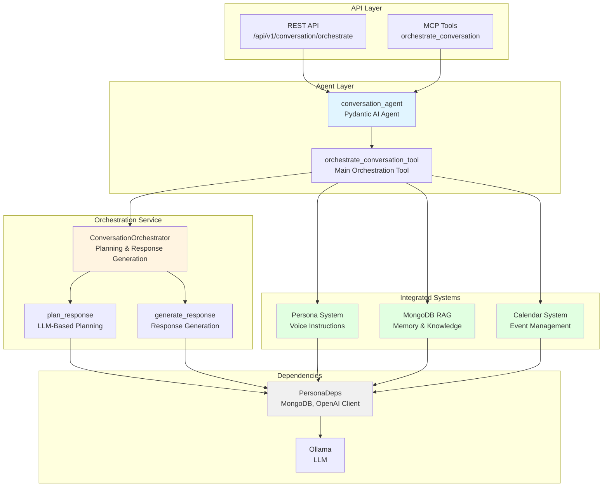
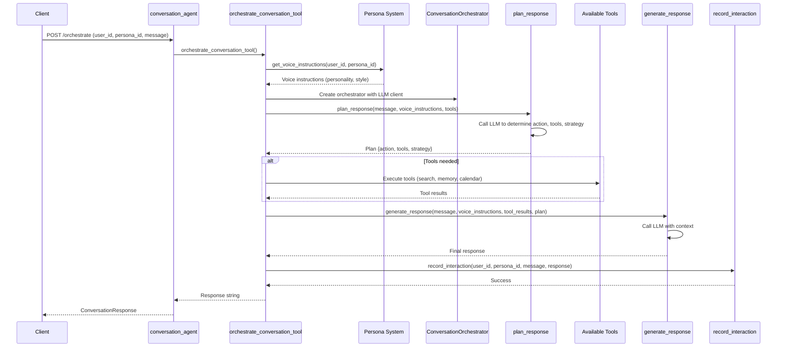

# Conversation Orchestration Project - AGENTS.md

> **Override**: This file extends [../../AGENTS.md](../../AGENTS.md). Project-specific rules take precedence.

## Overview

The Conversation Orchestration project provides a unified interface for coordinating multiple AI agents and tools to deliver context-aware, personalized responses. It acts as the central orchestrator that plans responses, coordinates memory retrieval, knowledge search, persona voice instructions, and calendar operations to create natural, coherent conversations.

**Key Capabilities:**
- **Multi-Agent Coordination**: Orchestrates persona, memory, knowledge, and calendar systems
- **Response Planning**: Uses LLM to plan response strategy and tool selection before execution
- **Voice Instructions**: Incorporates persona-specific voice and personality into responses
- **Tool Routing**: Intelligently routes to appropriate tools (search, memory, calendar) based on user intent
- **Interaction Recording**: Automatically records interactions for persona state updates
- **Context-Aware Responses**: Generates responses that consider conversation history, persona state, and available knowledge

**Use Cases:**
- Unified conversation interface that coordinates multiple specialized agents
- Personalized AI assistant that maintains persona consistency across conversations
- Context-aware Q&A that combines memory, knowledge search, and calendar information
- Multi-tool conversations that seamlessly switch between search, memory, and calendar operations

## Component Identity

- **Project**: `conversation`
- **Location**: `04-lambda/server/projects/conversation/`
- **Purpose**: Multi-agent conversation orchestration coordinating persona, memory, knowledge, and calendar systems
- **Dependencies**: Persona project, MongoDB RAG project, Calendar project, Ollama (02-compute)
- **Agent**: `conversation_agent` (Pydantic AI agent with StateDeps)

## Architecture & Patterns

### System Architecture



### Conversation Flow



### File Organization

```
conversation/
├── agent.py              # Main conversation agent definition
├── config.py             # Project-specific configuration
├── models.py             # Pydantic request/response models
└── services/              # Business logic services
    └── orchestrator.py   # ConversationOrchestrator class (planning and response generation)
```

### Key Patterns

**DO's:**
- ✅ **Use ConversationOrchestrator**: Centralized orchestration logic
  ```python
  orchestrator = ConversationOrchestrator(llm_client=deps.openai_client)
  plan = await orchestrator.plan_response(message, voice_instructions, available_tools)
  response = await orchestrator.generate_response(message, voice_instructions, tool_results, plan)
  ```

- ✅ **Get Voice Instructions First**: Always get persona voice instructions before planning
  ```python
  voice_instructions = await get_voice_instructions(persona_deps, user_id, persona_id)
  ```

- ✅ **Plan Before Execute**: Use LLM to plan response strategy and tool selection
  ```python
  plan = await orchestrator.plan_response(
      user_message, voice_instructions, available_tools
  )
  # plan contains: action, tools, strategy
  ```

- ✅ **Record Interactions**: Always record interactions for persona state updates
  ```python
  await record_interaction(
      persona_deps, user_id, persona_id, user_message, bot_response
  )
  ```

- ✅ **Tool Execution**: Execute tools based on plan, collect results for synthesis
  ```python
  tool_results = {}
  if plan.get("tools"):
      for tool in plan.get("tools", []):
          # Execute tool, collect results
          tool_results[tool] = await execute_tool(tool, args)
  ```

**DON'Ts:**
- ❌ **Don't skip voice instructions**: Always get persona context before planning
- ❌ **Don't hardcode tool list**: Use available_tools parameter
- ❌ **Don't forget to record interactions**: Every conversation should update persona state
- ❌ **Don't bypass planning**: Always plan before generating response
- ❌ **Don't ignore tool results**: Pass tool results to response generation

### Code Examples

**Orchestration Pattern** (from `services/orchestrator.py`):
```python
# Step 1: Plan response
plan = await orchestrator.plan_response(
    user_message, voice_instructions, available_tools
)
# Returns: {"action": "search_knowledge", "tools": ["enhanced_search"], "strategy": "..."}

# Step 2: Execute tools (if any)
tool_results = {}
if plan.get("tools"):
    for tool_name in plan.get("tools", []):
        # Execute tool...
        tool_results[tool_name] = result

# Step 3: Generate response
response = await orchestrator.generate_response(
    user_message, voice_instructions, tool_results, plan
)
```

**Agent Tool Pattern** (from `agent.py`):
```python
@conversation_agent.tool
async def orchestrate_conversation_tool(
    ctx: RunContext[StateDeps[ConversationState]],
    user_id: str,
    persona_id: str,
    message: str
) -> str:
    """Orchestrate conversation by coordinating multiple agents."""
    persona_deps = PersonaDeps.from_settings()
    await persona_deps.initialize()
    try:
        # Get voice instructions
        voice_instructions = await get_voice_instructions(persona_deps, user_id, persona_id)
        
        # Create orchestrator
        orchestrator = ConversationOrchestrator(llm_client=persona_deps.openai_client)
        
        # Plan and execute
        plan = await orchestrator.plan_response(message, voice_instructions, available_tools)
        # ... execute tools ...
        response = await orchestrator.generate_response(message, voice_instructions, tool_results, plan)
        
        # Record interaction
        await record_interaction(persona_deps, user_id, persona_id, message, response)
        
        return response
    finally:
        await persona_deps.cleanup()
```

## Key Files & JIT Search

**Touch Points:**
- `agent.py:50` - `conversation_agent` definition
- `services/orchestrator.py:15` - `ConversationOrchestrator` class
- `services/orchestrator.py:30` - `plan_response` method
- `services/orchestrator.py:80` - `generate_response` method

**Search Hints:**
```bash
# Find conversation agent tools
rg -n "@conversation_agent\.tool" 04-lambda/server/projects/conversation/

# Find orchestration methods
rg -n "def (plan_response|generate_response)" 04-lambda/server/projects/conversation/

# Find tool coordination
rg -n "available_tools|tool_results" 04-lambda/server/projects/conversation/
```

## Testing & Validation

**Manual Testing:**
```bash
# Orchestrate conversation
curl -X POST http://lambda-server:8000/api/v1/conversation/orchestrate \
  -H "Content-Type: application/json" \
  -d '{"user_id": "user1", "persona_id": "persona1", "message": "What is RAG?"}'
```

**Validation Strategy:**
- Verify planning: Check that plan contains action, tools, and strategy
- Test tool execution: Verify tools are executed when planned
- Check response quality: Response should incorporate tool results and persona context
- Validate state updates: Verify persona state is updated after interaction

## Domain Dictionary

- **Orchestration**: Coordinating multiple agents and tools to generate responses
- **Response Planning**: Using LLM to determine action, tools, and strategy
- **Tool Coordination**: Executing multiple tools and synthesizing results
- **Voice Instructions**: Persona context injected into response generation

## Integration Points

- **Persona Project**: Gets voice instructions and records interactions
- **MongoDB RAG Project**: Uses enhanced_search and memory tools
- **Calendar Project**: Uses calendar event tools when needed
- **Ollama**: LLM for planning and response generation (`ollama:11434`)
- **REST API**: Endpoints in `server/api/conversation.py`
- **MCP Tools**: Exposed via `server/mcp/fastmcp_server.py`

## Configuration

**Required Environment Variables:**
- `LLM_MODEL` - LLM model for planning and generation (default: llama3.2)
- `LLM_BASE_URL` - LLM API base URL (default: http://ollama:11434/v1)
- `MONGODB_URI` - MongoDB connection (for persona state)
- `MONGODB_DATABASE` - Database name

**Available Tools** (configured in orchestrator):
- `enhanced_search` - Enhanced RAG search
- `search_facts` - Memory fact search
- `get_context_window` - Recent message retrieval
- `create_calendar_event` - Calendar event creation
- `list_calendar_events` - Calendar event listing
