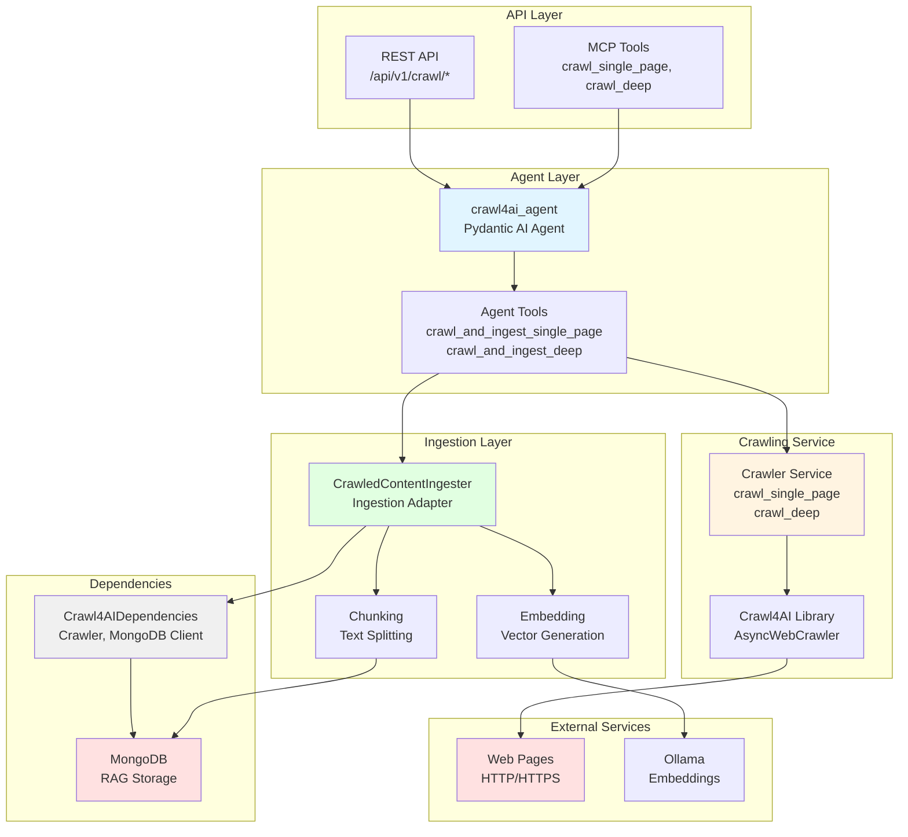
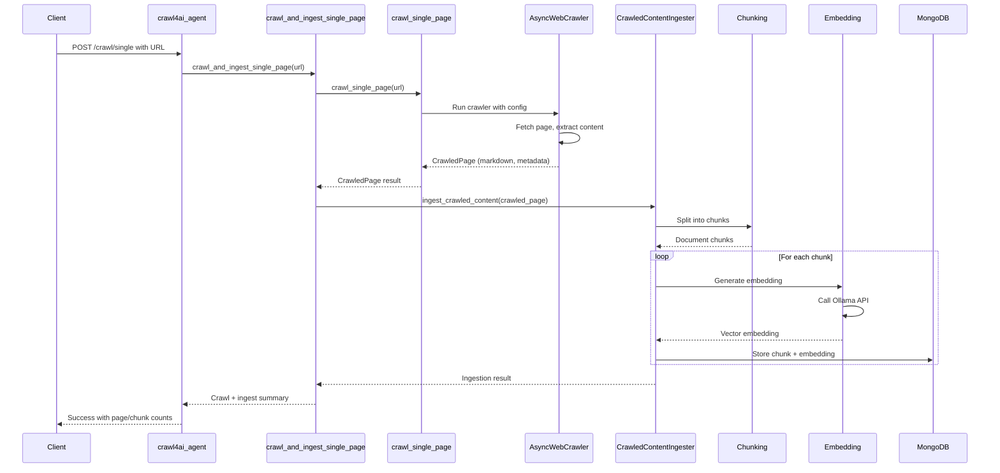
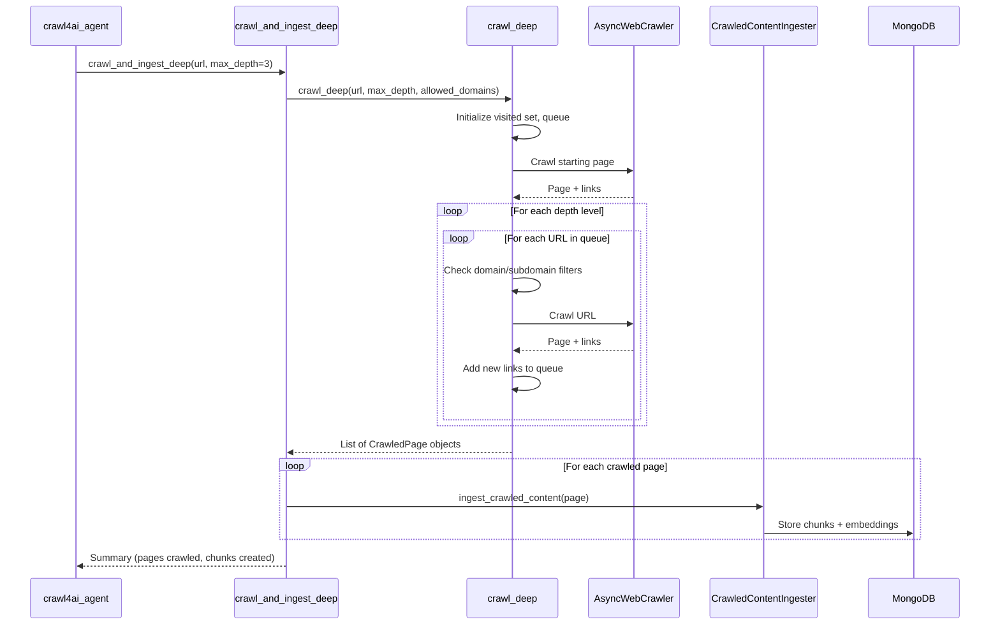

# Crawl4AI RAG Project - AGENTS.md

> **Override**: This file extends [../../AGENTS.md](../../AGENTS.md). Project-specific rules take precedence.

## Overview

The Crawl4AI RAG project provides automated web crawling with immediate ingestion into the MongoDB RAG knowledge base. It crawls websites, extracts content, and automatically processes it into searchable chunks with embeddings, making web content immediately available for semantic search.

**Key Capabilities:**
- **Single Page Crawling**: Crawl individual URLs and extract structured content (markdown, text, metadata)
- **Deep Crawling**: Recursively crawl websites following internal links up to specified depth
- **Automatic Ingestion**: Crawled content is automatically chunked, embedded, and stored in MongoDB RAG
- **Domain Filtering**: Control crawling scope with allowed domains and subdomains
- **Metadata Extraction**: Extracts page titles, descriptions, images, and links automatically
- **Chunking Configuration**: Configurable chunk size and overlap for optimal retrieval

**Use Cases:**
- Documentation Ingestion: Crawl and ingest technical documentation for Q&A
- Website Knowledge Base: Build searchable knowledge bases from website content
- Content Discovery: Automatically discover and index related pages from a starting URL
- Research Automation: Crawl research papers, articles, or documentation sites
- Real-time Web Content: Make web content immediately searchable via RAG

## Component Identity

- **Project**: `crawl4ai_rag`
- **Location**: `04-lambda/server/projects/crawl4ai_rag/`
- **Purpose**: Web crawling and automatic ingestion into MongoDB RAG knowledge base
- **Dependencies**: MongoDB (01-data), Crawl4AI library, Ollama (02-compute for embeddings)
- **Agent**: `crawl4ai_agent` (Pydantic AI agent with StateDeps)

## Architecture & Patterns

### System Architecture



### Crawl & Ingest Flow



### Deep Crawl Flow



### File Organization

```
crawl4ai_rag/
├── agent.py              # Main Crawl4AI agent definition
├── config.py             # Project-specific configuration
├── dependencies.py       # Crawl4AIDependencies (MongoDB, OpenAI client, Crawler)
├── models.py             # Pydantic request/response models
├── tools.py             # Crawl4AI tools (crawl_and_ingest_single_page, crawl_and_ingest_deep)
├── services/             # Business logic services
│   └── crawler.py        # Core crawling logic (crawl_single_page, crawl_deep)
└── ingestion/           # Ingestion adapter for crawled content
    └── adapter.py        # CrawledContentIngester
```

### Key Patterns

**DO's:**
- ✅ **Use Crawl4AIDependencies**: Always initialize and cleanup in try/finally blocks
  ```python
  deps = Crawl4AIDependencies()
  await deps.initialize()
  try:
      # Use deps.crawler, deps.mongo_client
  finally:
      await deps.cleanup()
  ```

- ✅ **Crawl and Ingest**: Use `crawl_and_ingest_single_page` or `crawl_and_ingest_deep` for combined operations
  ```python
  # In tools.py
  result = await crawl_and_ingest_single_page(
      ctx, url, chunk_size=1000, chunk_overlap=200
  )
  ```

- ✅ **Use Crawler Service**: Use `services/crawler.py` for core crawling logic
  ```python
  from server.projects.crawl4ai_rag.services.crawler import crawl_single_page, crawl_deep
  ```

- ✅ **Configure Chunking**: Always specify chunk_size and chunk_overlap for ingestion
  ```python
  result = await crawl_and_ingest_single_page(
      ctx, url, chunk_size=1000, chunk_overlap=200
  )
  ```

**DON'Ts:**
- ❌ **Don't skip ingestion**: Always ingest crawled content into MongoDB RAG
- ❌ **Don't hardcode chunk sizes**: Use configurable chunk_size and chunk_overlap
- ❌ **Don't bypass crawler service**: Use services/crawler.py, not direct Crawl4AI calls
- ❌ **Don't ignore crawl errors**: Log errors but continue with successful pages

## Key Files & JIT Search

**Touch Points:**
- `agent.py:25` - `crawl4ai_agent` definition with tools
- `dependencies.py:14` - `Crawl4AIDependencies` class
- `tools.py:16` - `crawl_and_ingest_single_page` function
- `tools.py:85` - `crawl_and_ingest_deep` function
- `services/crawler.py:12` - Core crawling logic

**Search Hints:**
```bash
# Find Crawl4AI agent tools
rg -n "@crawl4ai_agent\.tool" 04-lambda/server/projects/crawl4ai_rag/

# Find crawling operations
rg -n "crawl_(single_page|deep)" 04-lambda/server/projects/crawl4ai_rag/

# Find ingestion logic
rg -n "CrawledContentIngester|ingest_crawled" 04-lambda/server/projects/crawl4ai_rag/
```

## Testing & Validation

**Manual Testing:**
```bash
# Crawl single page
curl -X POST http://lambda-server:8000/api/v1/crawl/single \
  -H "Content-Type: application/json" \
  -d '{"url": "https://example.com", "chunk_size": 1000, "chunk_overlap": 200}'

# Deep crawl
curl -X POST http://lambda-server:8000/api/v1/crawl/deep \
  -H "Content-Type: application/json" \
  -d '{"url": "https://example.com", "max_depth": 3, "chunk_size": 1000}'
```

**Validation Strategy:**
- Verify crawled pages: Check that pages are successfully crawled
- Validate ingestion: Verify content is ingested into MongoDB RAG
- Test chunking: Verify chunks are created with correct size and overlap
- Check error handling: Test with invalid URLs, network errors

## Domain Dictionary

- **Crawl4AI**: Web crawling library for extracting content from websites
- **Deep Crawl**: Recursive crawling following internal links up to specified depth
- **Single Page Crawl**: Crawling a single URL without following links
- **Ingestion**: Process of chunking, embedding, and storing crawled content in MongoDB RAG

## Integration Points

- **MongoDB RAG**: Stores crawled content as searchable documents (`mongodb:27017`)
- **Ollama**: Generates embeddings for crawled content (`ollama:11434`)
- **REST API**: Endpoints in `server/api/crawl4ai_rag.py`
- **MCP Tools**: Exposed via `server/mcp/fastmcp_server.py`

## Configuration

**Required Environment Variables:**
- `MONGODB_URI` - MongoDB connection string
- `MONGODB_DATABASE` - Database name
- `LLM_BASE_URL` - LLM API base URL (default: http://ollama:11434/v1)
- `EMBEDDING_MODEL` - Embedding model (default: nomic-embed-text)
- `USE_GRAPHITI` - Enable Graphiti ingestion (default: true, enabled by default for crawl4ai RAG flow)
- `NEO4J_URI` - Neo4j connection URI (default: bolt://neo4j:7687, required if Graphiti enabled)
- `NEO4J_USER` - Neo4j username (default: neo4j)
- `NEO4J_PASSWORD` - Neo4j password (required if Graphiti enabled)

**Crawl Configuration:**
- `chunk_size`: Chunk size for document splitting (default: 1000)
- `chunk_overlap`: Chunk overlap size (default: 200)
- `max_depth`: Maximum crawl depth for deep crawl (default: 3)
- `allowed_domains`: List of allowed domains for crawling
- `allowed_subdomains`: List of allowed subdomain prefixes

**Graphiti Integration:**
- Graphiti is **enabled by default** for crawl4ai RAG flow
- All crawled content is automatically ingested into Graphiti to extract entities and relationships
- Set `USE_GRAPHITI=false` to disable Graphiti ingestion
- Requires Neo4j to be running and accessible if Graphiti is enabled
