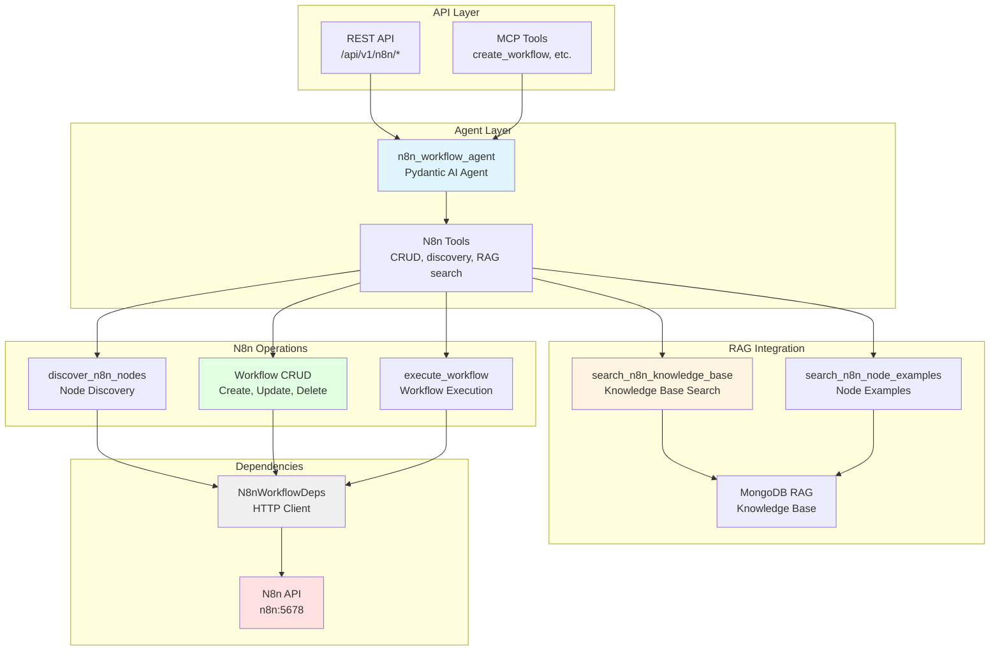

# N8n Workflow Project - AGENTS.md

> **Override**: This file extends [../../AGENTS.md](../../AGENTS.md). Project-specific rules take precedence.

## Overview

The N8n Workflow project provides agentic workflow management for the N8n automation platform. It enables AI agents to create, update, delete, activate, and execute N8n workflows through natural language, with RAG-enhanced knowledge base search for informed workflow design.

**Key Capabilities:**
- **Workflow CRUD**: Create, update, delete, list, and execute N8n workflows
- **RAG-Enhanced Creation**: Searches MongoDB RAG knowledge base before creating workflows for best practices
- **Node Discovery**: Discovers available N8n nodes via API for informed workflow design
- **Node Examples**: Searches for specific node configuration examples from knowledge base
- **Workflow Activation**: Activate or deactivate workflows programmatically
- **Manual Execution**: Execute workflows with custom input data
- **Knowledge Integration**: Uses RAG to inform workflow design with documentation and examples

**Use Cases:**
- AI agents that can create and manage automation workflows
- Natural language workflow creation with RAG-informed design
- Automated workflow management and orchestration
- Workflow discovery and example-based learning

## Component Identity

- **Project**: `n8n_workflow`
- **Location**: `04-lambda/server/projects/n8n_workflow/`
- **Purpose**: N8n workflow management with RAG-enhanced workflow creation, node discovery, and workflow operations
- **Dependencies**: N8n API (03-apps), MongoDB RAG project (for knowledge base search)
- **Agent**: `n8n_workflow_agent` (Pydantic AI agent with StateDeps)

## Architecture & Patterns

### System Architecture



### RAG-Enhanced Workflow Creation Flow

```mermaid
sequenceDiagram
    participant Client
    participant Agent as n8n_workflow_agent
    participant Tool as create_workflow
    participant RAGSearch as search_n8n_knowledge_base
    participant NodeExamples as search_n8n_node_examples
    participant Discover as discover_n8n_nodes
    participant RAG as MongoDB RAG
    participant N8n as N8n API
    participant Create as create_workflow
    
    Client->>Agent: Create workflow (name, description)
    Agent->>Tool: create_workflow(name, description)
    
    Tool->>RAGSearch: Search knowledge base for workflow patterns
    RAGSearch->>RAG: Semantic search
    RAG-->>RAGSearch: Relevant documentation/examples
    RAGSearch-->>Tool: Knowledge base results
    
    Tool->>Discover: Discover available nodes
    Discover->>N8n: GET /nodes
    N8n-->>Discover: Available node types
    Discover-->>Tool: Node list
    
    Tool->>NodeExamples: Search for node configuration examples
    NodeExamples->>RAG: Search for specific node examples
    RAG-->>NodeExamples: Node configuration examples
    NodeExamples-->>Tool: Examples
    
    Tool->>Tool: Design workflow using RAG knowledge + node examples
    Tool->>Create: Create workflow with nodes and connections
    Create->>N8n: POST /workflows
    N8n-->>Create: Workflow created
    Create-->>Tool: Workflow result
    
    Tool-->>Agent: Workflow created with RAG-informed design
    Agent-->>Client: Workflow creation response
```

### File Organization

```
n8n_workflow/
├── agent.py              # Main N8n workflow agent definition
├── config.py             # Project-specific configuration
├── dependencies.py      # N8nWorkflowDeps (httpx client for N8n API)
├── models.py            # Pydantic request/response models
├── prompts.py           # System prompts for workflow agent
└── tools.py             # N8n workflow tools (CRUD, discovery, RAG search)
```

### Key Patterns

**DO's:**
- ✅ **Use N8nWorkflowDeps**: Always initialize and cleanup in try/finally blocks
  ```python
  deps = N8nWorkflowDeps.from_settings()
  await deps.initialize()
  try:
      # Use deps.http_client for N8n API calls
  finally:
      await deps.cleanup()
  ```

- ✅ **RAG-Enhanced Workflow Creation**: Always search knowledge base before creating workflows
  ```python
  # In tools.py
  # Step 1: Search knowledge base
  rag_results = await search_n8n_knowledge_base(deps, query, match_count=5)
  
  # Step 2: Discover nodes
  available_nodes = await discover_n8n_nodes(deps, category=None)
  
  # Step 3: Create workflow with RAG-informed design
  workflow = await create_workflow(deps, name, nodes, connections)
  ```

- ✅ **Node Discovery**: Use N8n API to discover available nodes
  ```python
  # In tools.py
  nodes = await discover_n8n_nodes(deps, category="trigger")
  # Returns: List of available node types with descriptions
  ```

- ✅ **Node Examples Search**: Search for node configuration examples
  ```python
  # In tools.py
  examples = await search_node_examples(
      deps, node_type="webhook", query="authentication"
  )
  ```

- ✅ **Workflow Operations**: Use N8n REST API for CRUD operations
  ```python
  # In tools.py
  # Create
  response = await deps.http_client.post(
      f"{deps.api_url}/workflows",
      json={"name": name, "nodes": nodes, "connections": connections}
  )
  
  # Update
  response = await deps.http_client.put(
      f"{deps.api_url}/workflows/{workflow_id}",
      json={"name": name, "nodes": nodes}
  )
  
  # Delete
  response = await deps.http_client.delete(
      f"{deps.api_url}/workflows/{workflow_id}"
  )
  ```

**DON'Ts:**
- ❌ **Don't skip RAG search**: Always search knowledge base before creating workflows
- ❌ **Don't hardcode node types**: Use node discovery to find available nodes
- ❌ **Don't ignore API errors**: Handle N8n API errors (404, 401, etc.)
- ❌ **Don't bypass authentication**: Use API key if configured
- ❌ **Don't create workflows without validation**: Validate node types and connections

### Code Examples

**Agent Tool Pattern** (from `agent.py`):
```python
@n8n_workflow_agent.tool
async def create_n8n_workflow_tool(
    ctx: RunContext[StateDeps[N8nWorkflowState]],
    name: str,
    nodes: List[Dict[str, Any]],
    connections: Optional[Dict[str, Any]] = None
) -> str:
    """Create N8n workflow with RAG-enhanced design."""
    deps = N8nWorkflowDeps.from_settings()
    await deps.initialize()
    try:
        # Search knowledge base first
        rag_results = await search_n8n_knowledge_base(deps, name, match_count=5)
        
        # Create workflow
        workflow = await create_workflow(deps, name, nodes, connections)
        return f"Workflow created: {workflow.get('id')}"
    finally:
        await deps.cleanup()
```

**RAG Search Pattern** (from `tools.py`):
```python
async def search_n8n_knowledge_base(
    deps: N8nWorkflowDeps,
    query: str,
    match_count: int = 5
) -> List[Dict[str, Any]]:
    """Search MongoDB RAG for N8n documentation and examples."""
    # Use MongoDB RAG project's search
    from server.projects.mongo_rag.tools import hybrid_search
    from server.projects.mongo_rag.dependencies import AgentDependencies
    
    rag_deps = AgentDependencies()
    await rag_deps.initialize()
    try:
        # Create wrapper for context
        class DepsWrapper:
            def __init__(self, deps):
                self.deps = deps
        wrapper = DepsWrapper(rag_deps)
        
        results = await hybrid_search(
            ctx=wrapper,
            query=query,
            match_count=match_count
        )
        return [r.dict() for r in results]
    finally:
        await rag_deps.cleanup()
```

**Node Discovery Pattern** (from `tools.py`):
```python
async def discover_n8n_nodes(
    deps: N8nWorkflowDeps,
    category: Optional[str] = None
) -> List[Dict[str, Any]]:
    """Discover available N8n nodes via API."""
    # Call N8n API to get node types
    response = await deps.http_client.get(
        f"{deps.api_url}/node-types",
        params={"category": category} if category else None
    )
    return response.json()
```

## Key Files & JIT Search

**Touch Points:**
- `agent.py:50` - `n8n_workflow_agent` definition with tools
- `dependencies.py:10` - `N8nWorkflowDeps` class
- `tools.py:20` - N8n workflow tool functions
- `tools.py:100` - RAG search integration
- `tools.py:150` - Node discovery functions

**Search Hints:**
```bash
# Find N8n workflow agent tools
rg -n "@n8n_workflow_agent\.tool" 04-lambda/server/projects/n8n_workflow/

# Find N8n API calls
rg -n "http_client\.(get|post|put|delete)" 04-lambda/server/projects/n8n_workflow/

# Find RAG integration
rg -n "search_n8n_knowledge_base|search_node_examples" 04-lambda/server/projects/n8n_workflow/

# Find node discovery
rg -n "discover_n8n_nodes|node-types" 04-lambda/server/projects/n8n_workflow/
```

## Testing & Validation

**Manual Testing:**
```bash
# Create workflow
curl -X POST http://lambda-server:8000/api/v1/n8n/create \
  -H "Content-Type: application/json" \
  -d '{
    "name": "Test Workflow",
    "nodes": [{"name": "Start", "type": "n8n-nodes-base.start"}],
    "connections": {}
  }'

# List workflows
curl "http://lambda-server:8000/api/v1/n8n/list"

# Discover nodes
curl "http://lambda-server:8000/api/v1/n8n/discover-nodes?category=trigger"

# Search knowledge base
curl -X POST http://lambda-server:8000/api/v1/n8n/search-knowledge-base \
  -H "Content-Type: application/json" \
  -d '{"query": "webhook authentication", "match_count": 5}'
```

**Validation Strategy:**
- Verify N8n API connection: Check N8n is accessible at configured URL
- Test workflow creation: Create workflow, verify in N8n UI
- Validate RAG search: Search knowledge base, verify relevant results
- Test node discovery: Discover nodes, verify node types returned
- Check error handling: Test with invalid workflow ID, missing API key

## Domain Dictionary

- **N8n Workflow**: Automation workflow with nodes and connections
- **Node**: Workflow step (trigger, action, transformation)
- **Connection**: Link between nodes defining workflow flow
- **RAG-Enhanced**: Using knowledge base search to inform workflow design
- **Node Discovery**: Finding available node types via N8n API

## Integration Points

- **N8n Service**: Workflow management API (`n8n:5678` from 03-apps stack)
- **MongoDB RAG**: Knowledge base for N8n documentation and examples
- **REST API**: Endpoints in `server/api/n8n_workflow.py`
- **MCP Tools**: Exposed via `server/mcp/fastmcp_server.py`

## Configuration

**Required Environment Variables:**
- `N8N_API_URL` - N8n API base URL (default: http://n8n:5678/api/v1)
- `N8N_API_KEY` - N8n API key (optional, for authentication)

**N8n API Endpoints:**
- `POST /workflows` - Create workflow
- `PUT /workflows/{id}` - Update workflow
- `DELETE /workflows/{id}` - Delete workflow
- `POST /workflows/{id}/activate` - Activate/deactivate workflow
- `GET /workflows` - List workflows
- `POST /workflows/{id}/execute` - Execute workflow
- `GET /node-types` - Discover available nodes

**RAG Integration:**
- Uses MongoDB RAG project's `hybrid_search` for knowledge base queries
- Searches for N8n documentation, workflow examples, and node configuration guides
- Filters results by source type (e.g., "n8n_documentation")
