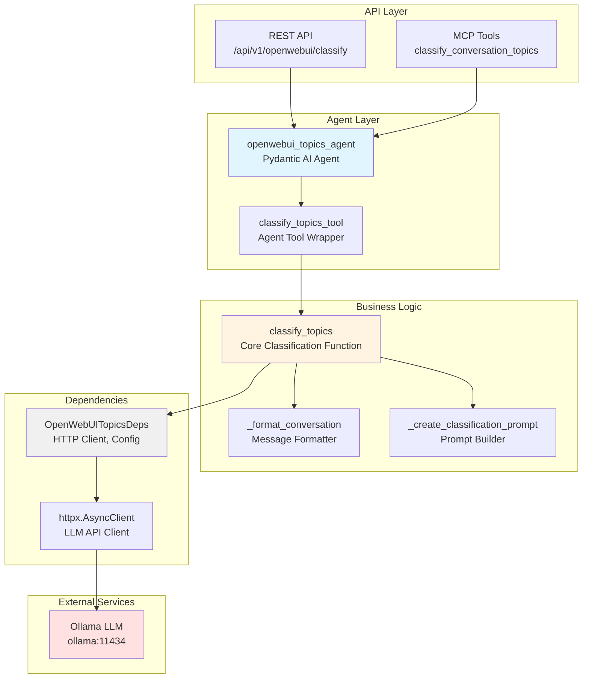
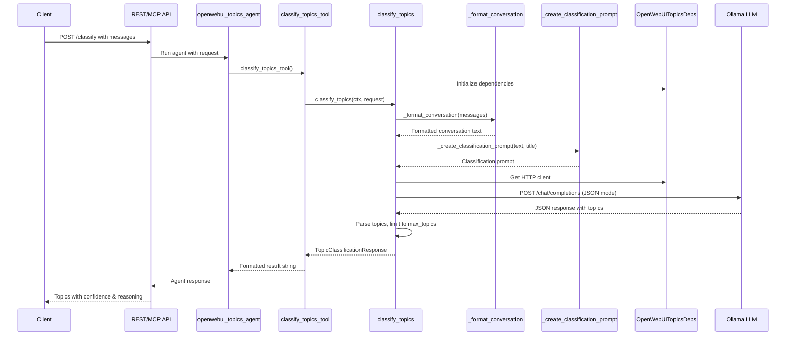

# Open WebUI Topics Project - AGENTS.md

> **Override**: This file extends [../../AGENTS.md](../../AGENTS.md). Project-specific rules take precedence.

## Overview

The Open WebUI Topics project provides automated topic classification for conversations using LLM-based analysis. It analyzes conversation messages and automatically generates 3-5 relevant topics that describe the main themes, enabling better organization, filtering, and discovery of conversations.

**Key Capabilities:**
- **LLM-Based Classification**: Uses language models to understand conversation context and extract meaningful topics
- **Dynamic Topic Generation**: Topics are generated dynamically based on conversation content, not from a fixed taxonomy
- **Confidence Scoring**: Provides confidence scores and reasoning for topic assignments
- **Flexible Integration**: Can be used standalone via REST API or integrated with Open WebUI for automatic tagging

**Use Cases:**
- Automatically tag conversations in Open WebUI for better organization
- Filter conversations by topic for quick discovery
- Analyze conversation themes across multiple discussions
- Generate topic suggestions for existing conversations

## Component Identity

- **Project**: `openwebui_topics`
- **Location**: `04-lambda/server/projects/openwebui_topics/`
- **Purpose**: Classify conversation topics using LLM for organization and filtering
- **Dependencies**: Ollama (02-compute for LLM)
- **Agent**: `openwebui_topics_agent` (Pydantic AI agent with StateDeps)

## Architecture & Patterns

### System Architecture



### Class & Function Flow



### File Organization

```
openwebui_topics/
├── agent.py              # Main Open WebUI topics agent definition
├── config.py             # Project-specific configuration
├── dependencies.py       # OpenWebUITopicsDeps (httpx client for LLM)
├── models.py             # Pydantic request/response models
├── tools.py             # Topic classification tools
└── services/             # Business logic services
    └── classifier.py     # TopicClassifier class (legacy, may be unused)
```

### Key Patterns

**DO's:**
- ✅ **Use OpenWebUITopicsDeps**: Always initialize and cleanup in try/finally blocks
  ```python
  deps = OpenWebUITopicsDeps.from_settings()
  await deps.initialize()
  try:
      # Use deps.http_client for LLM calls
  finally:
      await deps.cleanup()
  ```

- ✅ **Classify Topics**: Use `classify_topics` tool to classify conversation topics
  ```python
  # In tools.py
  result = await classify_topics(ctx, request)
  ```

- ✅ **Format Conversation**: Use `_format_conversation` to format messages for LLM
  ```python
  conversation_text = _format_conversation(request.messages)
  ```

- ✅ **Use JSON Response Format**: Always request JSON response from LLM
  ```python
  payload = {
      "response_format": {"type": "json_object"},
      ...
  }
  ```

**DON'Ts:**
- ❌ **Don't skip formatting**: Always format conversation before sending to LLM
- ❌ **Don't hardcode topics**: Let LLM generate topics dynamically
- ❌ **Don't ignore classification errors**: Return default topics on error
- ❌ **Don't bypass tools**: Use tools.py functions, not direct LLM calls

## Key Files & JIT Search

**Touch Points:**
- `agent.py:24` - `openwebui_topics_agent` definition with tools
- `dependencies.py` - `OpenWebUITopicsDeps` class
- `tools.py:44` - `classify_topics` function
- `tools.py:14` - `_format_conversation` function
- `tools.py:24` - `_create_classification_prompt` function

**Search Hints:**
```bash
# Find Open WebUI topics agent tools
rg -n "@openwebui_topics_agent\.tool" 04-lambda/server/projects/openwebui_topics/

# Find classification operations
rg -n "classify_topics|_format_conversation" 04-lambda/server/projects/openwebui_topics/

# Find LLM calls
rg -n "http_client\.post.*chat/completions" 04-lambda/server/projects/openwebui_topics/
```

## Testing & Validation

**Manual Testing:**
```bash
# Classify topics
curl -X POST http://lambda-server:8000/api/v1/openwebui/classify \
  -H "Content-Type: application/json" \
  -d '{
    "conversation_id": "conv_123",
    "messages": [
      {"role": "user", "content": "How do I set up authentication?"},
      {"role": "assistant", "content": "To set up authentication..."}
    ],
    "title": "Authentication Discussion"
  }'
```

**Validation Strategy:**
- Verify classification: Check that topics are generated correctly
- Test with various conversations: Verify topics are relevant
- Check error handling: Test with invalid input, network errors
- Validate JSON response: Verify LLM returns valid JSON

## Domain Dictionary

- **Topic Classification**: Process of identifying main themes in a conversation
- **LLM-Based Classification**: Using LLM to generate topics (more accurate)
- **Topic Confidence**: Confidence score for topic classification (0.0-1.0)
- **Topic Reasoning**: Explanation of why specific topics were chosen

## Integration Points

- **Ollama**: LLM for topic classification (`ollama:11434`)
- **REST API**: Endpoints in `server/api/openwebui_topics.py`
- **MCP Tools**: Exposed via `server/mcp/fastmcp_server.py`
- **Open WebUI**: Can be integrated with Open WebUI for automatic topic tagging

## Configuration

**Required Environment Variables:**
- `LLM_MODEL` - LLM model name (default: llama3.2)
- `LLM_BASE_URL` - LLM API base URL (default: http://ollama:11434/v1)

**Classification Configuration:**
- `max_topics`: Maximum number of topics to generate (default: 5)
- `temperature`: LLM temperature for classification (default: 0.3)
