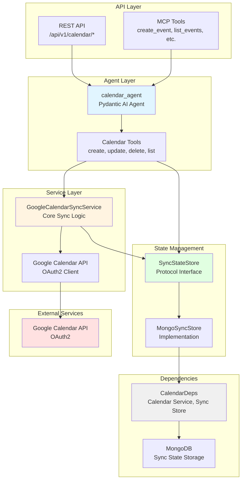
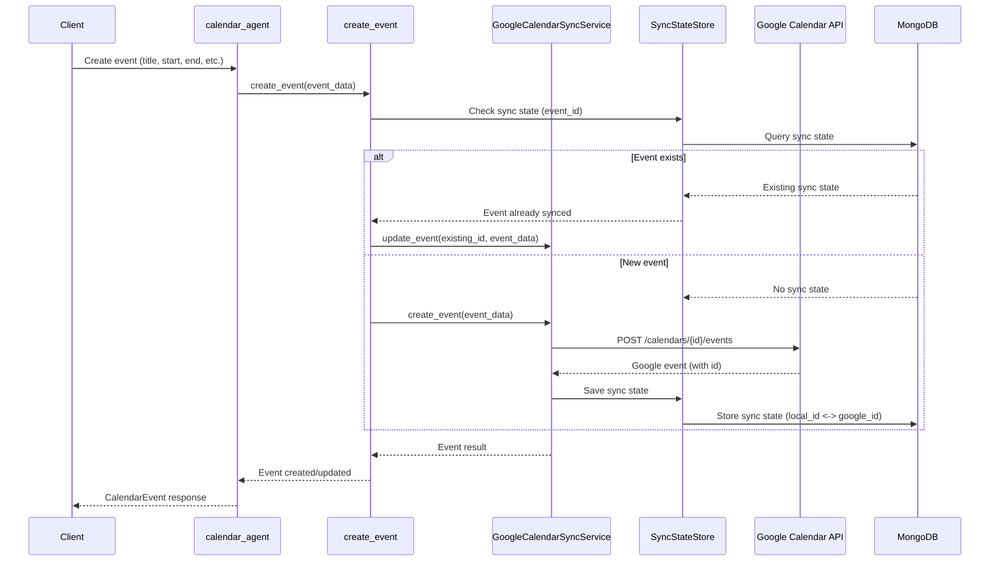

# Calendar Project - AGENTS.md

> **Override**: This file extends [../../AGENTS.md](../../AGENTS.md). Project-specific rules take precedence.

## Related API Documentation

- **[API Strategy](../../../../docs/API_STRATEGY.md)** - Route naming conventions, error handling, and API standards

## Overview

The Calendar project provides Google Calendar integration with full CRUD operations for events and sync state tracking. It enables AI agents to create, update, delete, and list calendar events while maintaining sync state to prevent duplicates and track changes.

**Key Capabilities:**
- **Event CRUD**: Create, read, update, and delete Google Calendar events
- **Sync State Tracking**: Maintains sync state in MongoDB to track event mappings and prevent duplicates
- **OAuth2 Integration**: Handles Google Calendar API authentication
- **Event Search**: List and filter events by date range, calendar ID, and other criteria
- **Bidirectional Sync**: Tracks both local and remote event states for synchronization
- **Error Handling**: Robust error handling for API failures and sync conflicts

**Use Cases:**
- AI assistants that can schedule and manage calendar events
- Event extraction from web content with automatic calendar creation
- Calendar synchronization between systems
- Automated event management and reminders

## Component Identity

- **Project**: `calendar`
- **Location**: `04-lambda/src/calendar/`
- **Purpose**: Google Calendar integration with event CRUD operations and sync state tracking
- **Dependencies**: MongoDB (01-data for sync state), Google Calendar API (OAuth2)
- **Agent**: `calendar_agent` (Pydantic AI agent with StateDeps)

## Architecture & Patterns

### System Architecture



### Event Creation Flow



### File Organization

```
calendar/
├── agent.py              # Main calendar agent definition
├── config.py             # Project-specific configuration
├── dependencies.py       # CalendarDeps (Google Calendar client, MongoDB store)
├── models.py             # Pydantic models (CalendarEvent, requests/responses)
├── tools.py              # Calendar CRUD tools (create, update, delete, list)
├── services/              # Business logic services
│   └── sync_service.py   # GoogleCalendarSyncService (core sync logic)
└── stores/               # Sync state storage
    └── mongodb_store.py   # MongoDB implementation for sync state
```

### Key Patterns

**DO's:**
- ✅ **Use CalendarDeps**: Always initialize and cleanup in try/finally blocks
  ```python
  deps = CalendarDeps.from_settings()
  await deps.initialize()
  try:
      # Use deps.calendar_service, deps.sync_store
  finally:
      await deps.cleanup()
  ```

- ✅ **Sync State Tracking**: Always check sync state before creating events
  ```python
  # In sync_service.py
  existing = await sync_store.get_sync_state(event_id)
  if existing:
      # Update existing event
      await calendar_service.update_event(...)
  else:
      # Create new event
      await calendar_service.create_event(...)
      await sync_store.record_sync_state(...)
  ```

- ✅ **Duplicate Prevention**: Use event_id or external_id for deduplication
  ```python
  # In sync_service.py
  external_id = f"{source_system}:{event_id}"
  existing = await sync_store.get_by_external_id(external_id)
  ```

- ✅ **OAuth2 Credentials**: Load credentials from configured paths
  ```python
  # In dependencies.py
  credentials_path = config.google_calendar_credentials_path
  token_path = config.google_calendar_token_path
  ```

- ✅ **Error Handling**: Handle Google API errors gracefully
  ```python
  try:
      event = await calendar_service.create_event(...)
  except HttpError as e:
      if e.status_code == 409:
          # Conflict - event already exists
          return await calendar_service.update_event(...)
  ```

**DON'Ts:**
- ❌ **Don't skip sync state**: Always record sync state after operations
- ❌ **Don't hardcode calendar ID**: Use `config.google_calendar_id`
- ❌ **Don't ignore OAuth errors**: Handle token refresh and authentication failures
- ❌ **Don't create duplicates**: Check sync state before creating events
- ❌ **Don't bypass service layer**: Use `GoogleCalendarSyncService`, not direct API calls

### Code Examples

**Agent Tool Pattern** (from `agent.py`):
```python
@calendar_agent.tool
async def create_calendar_event_tool(
    ctx: RunContext[StateDeps[CalendarState]],
    summary: str,
    start: str,
    end: str,
    description: Optional[str] = None
) -> str:
    """Create a calendar event."""
    deps = CalendarDeps.from_settings()
    await deps.initialize()
    try:
        event = await create_calendar_event(
            deps, summary, start, end, description
        )
        return f"Event created: {event.get('id')}"
    finally:
        await deps.cleanup()
```

**Sync Service Pattern** (from `sync_service.py`):
```python
# Create event with sync state tracking
async def create_event(self, event_data: Dict[str, Any], source_system: str) -> Dict[str, Any]:
    # Check for existing sync state
    external_id = f"{source_system}:{event_data.get('id')}"
    existing = await self.sync_store.get_by_external_id(external_id)

    if existing:
        # Update existing
        google_event = await self._update_event(existing.google_event_id, event_data)
    else:
        # Create new
        google_event = await self._create_event(event_data)
        await self.sync_store.record_sync_state(
            external_id=external_id,
            google_event_id=google_event['id'],
            source_system=source_system
        )

    return google_event
```

**Store Pattern** (from `stores/mongodb_store.py`):
```python
# Record sync state
await sync_store.record_sync_state(
    external_id=external_id,
    google_event_id=google_event_id,
    source_system=source_system,
    metadata={}
)

# Get sync state
sync_state = await sync_store.get_by_external_id(external_id)
if sync_state:
    google_event_id = sync_state.google_event_id
```

## Key Files & JIT Search

**Touch Points:**
- `agent.py:50` - `calendar_agent` definition with tools
- `dependencies.py:8` - `CalendarDeps` class
- `services/sync_service.py:20` - `GoogleCalendarSyncService` class
- `tools.py:15` - Calendar CRUD tool functions
- `stores/mongodb_store.py:10` - `MongoDBCalendarSyncStore` implementation

**Search Hints:**
```bash
# Find calendar agent tools
rg -n "@calendar_agent\.tool" 04-lambda/src/calendar/

# Find sync service methods
rg -n "def (create|update|delete|list)_event" 04-lambda/src/calendar/

# Find sync state operations
rg -n "sync_store|record_sync_state|get_by_external_id" 04-lambda/src/calendar/

# Find Google Calendar API usage
rg -n "calendar\.events\(\)\.(insert|update|delete|list)" 04-lambda/src/calendar/
```

## Testing & Validation

**Manual Testing:**
```bash
# Create calendar event
curl -X POST http://lambda-server:8000/api/v1/calendar/events/create \
  -H "Content-Type: application/json" \
  -d '{"summary": "Test Event", "start": "2024-01-01T10:00:00Z", "end": "2024-01-01T11:00:00Z"}'

# List calendar events
curl "http://lambda-server:8000/api/v1/calendar/events/list?max_results=10"

# Update calendar event
curl -X POST http://lambda-server:8000/api/v1/calendar/events/update \
  -H "Content-Type: application/json" \
  -d '{"event_id": "event123", "summary": "Updated Event"}'

# Delete calendar event
curl -X DELETE "http://lambda-server:8000/api/v1/calendar/events/delete?event_id=event123"
```

**Validation Strategy:**
- Verify OAuth2 credentials: Check token file exists and is valid
- Test event creation: Create event, verify in Google Calendar
- Check sync state: Verify sync state is recorded in MongoDB
- Test duplicate prevention: Create same event twice, verify update not duplicate
- Validate error handling: Test with invalid credentials, missing calendar ID

## Domain Dictionary

- **Sync State**: Tracks mapping between external event IDs and Google Calendar event IDs
- **External ID**: Unique identifier from source system (format: `{source_system}:{event_id}`)
- **Google Event ID**: Google Calendar's event identifier
- **OAuth2 Flow**: Authentication flow for Google Calendar API access
- **Calendar ID**: Google Calendar identifier (default: "primary")

## Integration Points

- **MongoDB**: Sync state storage (`mongodb:27017`)
- **Google Calendar API**: Event CRUD operations (OAuth2 authenticated)
- **REST API**: Endpoints in `server/api/calendar.py`
- **MCP Tools**: Exposed via `src/mcp_server/server.py`
- **Knowledge Project**: Event extraction can create calendar events

## Configuration

**Required Environment Variables:**
- `GOOGLE_CALENDAR_CREDENTIALS_PATH` - Path to OAuth2 credentials JSON file
- `GOOGLE_CALENDAR_TOKEN_PATH` - Path to store OAuth2 token
- `GOOGLE_CALENDAR_ID` - Google Calendar ID (default: "primary")
- `MONGODB_URI` - MongoDB connection for sync state
- `MONGODB_DATABASE` - Database name

**OAuth2 Setup:**
1. Create Google Cloud project
2. Enable Calendar API
3. Create OAuth2 credentials
4. Download credentials JSON to `GOOGLE_CALENDAR_CREDENTIALS_PATH`
5. First run will prompt for authorization and save token

**MongoDB Collections:**
- `calendar_sync_state` - Maps external IDs to Google Calendar event IDs
