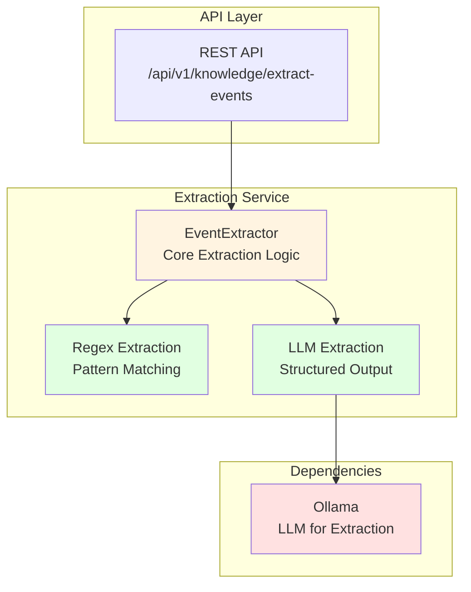
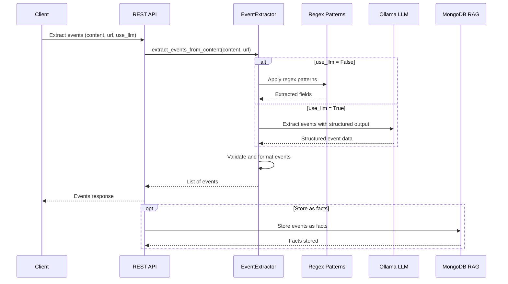

# Knowledge Project - AGENTS.md

> **Override**: This file extends [../../AGENTS.md](../../AGENTS.md). Project-specific rules take precedence.

## Overview

The Knowledge project provides event extraction from web content using both regex-based and LLM-based approaches. It extracts structured event information (title, date, time, location, instructor) from web pages and can store extracted events as facts in MongoDB RAG.

**Key Capabilities:**
- **Event Extraction**: Extracts structured event data from web content (HTML, markdown, text)
- **Dual Extraction Modes**: Fast regex-based extraction or accurate LLM-based extraction
- **Structured Output**: Returns events with title, date, time, location, instructor, description
- **Batch Processing**: Process multiple crawled pages at once
- **Fact Storage Integration**: Can store extracted events as facts in MongoDB RAG
- **URL Preservation**: Maintains source URL for event tracking

**Use Cases:**
- Extract events from crawled websites for calendar integration
- Parse event listings from web pages automatically
- Convert unstructured event information into structured data
- Build event databases from web content

## Component Identity

- **Project**: `knowledge`
- **Location**: `04-lambda/server/projects/knowledge/`
- **Purpose**: Event extraction from web content and integration with MongoDB RAG for fact storage
- **Dependencies**: MongoDB RAG project (for storing extracted events as facts)
- **Agent**: No dedicated agent (utility project, used by other projects)

## Architecture & Patterns

### System Architecture



### Event Extraction Flow



### File Organization

```
knowledge/
└── event_extractor.py    # EventExtractor class for extracting event information
```

### Key Patterns

**DO's:**
- ✅ **Use EventExtractor**: Initialize extractor with LLM option
  ```python
  extractor = EventExtractor(use_llm=True)  # More accurate but slower
  # OR
  extractor = EventExtractor(use_llm=False)  # Faster, keyword-based
  ```

- ✅ **Extract from Content**: Pass web content and optional URL
  ```python
  events = extractor.extract_events_from_content(
      content=web_content,
      url=source_url
  )
  ```

- ✅ **Store as Facts**: Store extracted events in MongoDB RAG as facts
  ```python
  # In API endpoint
  events = extractor.extract_events_from_content(content, url)
  for event in events:
      # Store as fact in MongoDB RAG
      await mongo_rag.store_fact(
          user_id, persona_id,
          fact=f"Event: {event.title} on {event.date} at {event.location}",
          tags=["event", "extracted"]
      )
  ```

- ✅ **Handle Missing Fields**: Events may have optional fields (date, time, location)
  ```python
  if event.date:
      # Use date
  if event.location:
      # Use location
  ```

**DON'Ts:**
- ❌ **Don't hardcode extraction patterns**: Use EventExtractor class
- ❌ **Don't skip URL**: Always pass source URL for event tracking
- ❌ **Don't ignore extraction errors**: Log errors but continue processing
- ❌ **Don't store raw events**: Convert to facts or structured format before storage

### Code Examples

**Event Extraction Pattern** (from `event_extractor.py`):
```python
# Initialize extractor
extractor = EventExtractor(use_llm=False)  # Fast keyword-based

# Extract events from content
events = extractor.extract_events_from_content(
    content=html_content,
    url="https://example.com/events"
)

# Process extracted events
for event in events:
    print(f"Event: {event.title}")
    if event.date:
        print(f"Date: {event.date}")
    if event.location:
        print(f"Location: {event.location}")
```

**Integration with MongoDB RAG** (from `server/api/knowledge.py`):
```python
@router.post("/extract-events")
async def extract_events_from_content(
    content: str,
    url: str,
    user_id: str,
    persona_id: str
):
    """Extract events and store as facts."""
    extractor = EventExtractor(use_llm=False)
    events = extractor.extract_events_from_content(content, url)

    # Store as facts in MongoDB RAG
    deps = AgentDependencies()
    await deps.initialize()
    try:
        memory_tools = MemoryTools(deps=deps)
        for event in events:
            fact_text = f"Event: {event.title}"
            if event.date:
                fact_text += f" on {event.date}"
            if event.location:
                fact_text += f" at {event.location}"

            memory_tools.store_fact(
                user_id, persona_id, fact_text, tags=["event", "extracted"]
            )
    finally:
        await deps.cleanup()

    return {"events": [e.dict() for e in events]}
```

## Key Files & JIT Search

**Touch Points:**
- `event_extractor.py:24` - `EventExtractor` class
- `event_extractor.py:36` - `extract_events_from_content` method
- `server/api/knowledge.py` - REST API endpoint for event extraction

**Search Hints:**
```bash
# Find event extraction usage
rg -n "EventExtractor|extract_events_from_content" 04-lambda/server/projects/knowledge/

# Find event model
rg -n "class ExtractedEvent" 04-lambda/server/projects/knowledge/

# Find event extraction patterns
rg -n "date|time|location|instructor" 04-lambda/server/projects/knowledge/event_extractor.py
```

## Testing & Validation

**Manual Testing:**
```bash
# Extract events from content
curl -X POST http://lambda-server:8000/api/v1/knowledge/extract-events \
  -H "Content-Type: application/json" \
  -d '{
    "content": "<html>Event: Workshop on 2024-01-15 at 10:00 AM, Location: Room 101</html>",
    "url": "https://example.com/events",
    "user_id": "user1",
    "persona_id": "persona1"
  }'
```

**Validation Strategy:**
- Test extraction: Extract events from known HTML content
- Verify event fields: Check that title, date, time, location are extracted
- Validate fact storage: Verify events are stored as facts in MongoDB RAG
- Test error handling: Test with malformed content

## Domain Dictionary

- **Event Extraction**: Parsing event information (title, date, time, location, instructor) from web content
- **ExtractedEvent**: Pydantic model for extracted event data
- **LLM-Based Extraction**: Using LLM for more accurate extraction (slower)
- **Keyword-Based Extraction**: Using regex patterns for faster extraction (less accurate)

## Integration Points

- **MongoDB RAG**: Stores extracted events as facts
- **Calendar Project**: Extracted events can be used to create calendar events
- **REST API**: Endpoint in `server/api/knowledge.py`
- **MCP Tools**: Exposed via `server/mcp/fastmcp_server.py`

## Configuration

**No Required Environment Variables**: This is a utility project with no external dependencies beyond MongoDB RAG.

**Extraction Modes:**
- **LLM-Based** (`use_llm=True`): More accurate, uses LLM to parse content
- **Keyword-Based** (`use_llm=False`): Faster, uses regex patterns (default)

**Event Fields:**
- `title` (required): Event title
- `date` (optional): Event date
- `time` (optional): Event time
- `location` (optional): Event location
- `instructor` (optional): Event instructor/teacher
- `description` (optional): Event description
- `url` (optional): Source URL
- `source` (default: "web_crawl"): Source identifier
