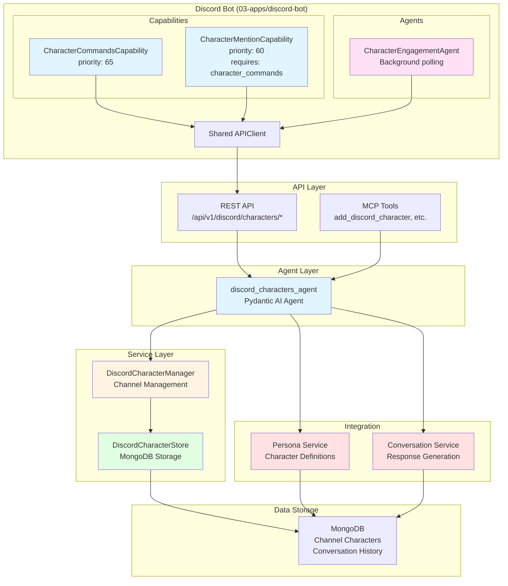
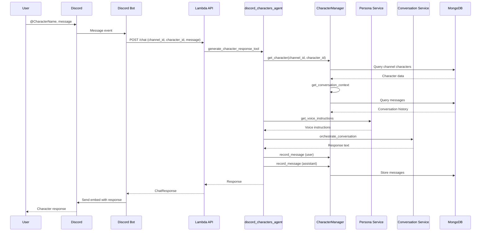

# Discord Characters Project - AGENTS.md

> **Override**: This file extends [../../AGENTS.md](../../AGENTS.md). Project-specific rules take precedence.

## Related API Documentation

- **[API Strategy](../../../../docs/API_STRATEGY.md)** - Route naming conventions, error handling, and API standards

## Overview

The Discord Characters project enables AI characters with distinct personalities to interact in Discord channels. It provides character management, chat interactions, and integration with the persona and conversation services.

**Key Capabilities:**
- **Character Management**: Add, remove, and list AI characters in Discord channels
- **Chat Interactions**: Characters respond to direct mentions with personality-appropriate responses
- **Random Engagement**: Characters may spontaneously join conversations (configurable probability)
- **Conversation History**: Maintains separate conversation history per channel+character
- **Personality Integration**: Uses persona service for character definitions and voice instructions
- **MCP Tools**: Programmatic character management via MCP protocol

**Use Cases:**
- Discord servers with AI character interactions
- Roleplay communities with persistent character personalities
- Interactive storytelling with multiple AI characters
- Community engagement with personality-driven bots

## Component Identity

- **Project**: `discord_characters`
- **Location**: `04-lambda/src/discord_characters/`
- **Purpose**: Discord character management and interaction system
- **Dependencies**: MongoDB (01-data), Persona service, Conversation service, Ollama (02-compute)
- **Agent**: `discord_characters_agent` (Pydantic AI agent with StateDeps)

## Architecture & Patterns

### System Architecture



### Character Interaction Flow



## File Structure

```
discord_characters/
├── __init__.py              # Public API exports
├── agent.py                 # Pydantic AI agent
├── api.py                   # REST API endpoints
├── tools.py                 # MCP tool implementations
├── dependencies.py          # Agent dependencies
├── models.py                # Request/response models
├── config.py                # Configuration
└── AGENTS.md                # This file
```

## API Endpoints

### Character Management

- `POST /api/v1/discord/characters/add` - Add character to channel
- `POST /api/v1/discord/characters/remove` - Remove character from channel
- `GET /api/v1/discord/characters/list?channel_id={id}` - List channel characters
- `POST /api/v1/discord/characters/clear-history` - Clear conversation history

### Chat & Engagement

- `POST /api/v1/discord/characters/chat` - Generate character response
- `POST /api/v1/discord/characters/engage` - Check engagement opportunity

## MCP Tools

- `add_discord_character` - Add character to channel
- `remove_discord_character` - Remove character from channel
- `list_discord_characters` - List channel characters
- `clear_discord_history` - Clear conversation history
- `chat_with_discord_character` - Generate character response

## Data Models

### ChannelCharacter
- `channel_id`: Discord channel ID
- `character_id`: Character identifier
- `persona_id`: Persona ID from persona service
- `added_at`: Timestamp when added
- `message_count`: Number of messages from character
- `last_active`: Last activity timestamp

### CharacterMessage
- `channel_id`: Discord channel ID
- `character_id`: Character identifier
- `user_id`: Discord user ID
- `content`: Message content
- `role`: "user" or "assistant"
- `timestamp`: Message timestamp
- `message_id`: Optional Discord message ID

## Configuration

Environment variables:
- `MONGODB_URI`: MongoDB connection URI (uses global `MONGODB_URI` setting)
- `MONGODB_DB_NAME`: Database name (default: "localai")
- `PERSONA_SERVICE_URL`: Persona service URL
- `CONVERSATION_SERVICE_URL`: Conversation service URL
- `ENGAGEMENT_PROBABILITY`: Probability for random engagement (default: 0.15)
- `MAX_CHARACTERS_PER_CHANNEL`: Maximum characters per channel (default: 5)
- `CONTEXT_MESSAGE_LIMIT`: Messages to include in context (default: 20)

## Integration Points

### Persona Service
- Get personality definitions
- Get voice instructions for characters
- Track persona state (mood, relationships)

### Conversation Service
- Generate conversational responses
- Use LangGraph workflows
- Apply personality system prompts

### MongoDB
- Store channel character mappings
- Store conversation history per channel+character
- Track character activity

## Discord Bot Service

The Discord bot service (`03-apps/discord-bot/`) handles character functionality through a split architecture:

**When `ENABLED_CAPABILITIES=character` is set, the following components are loaded:**

| Component | Type | Description |
|-----------|------|-------------|
| `CharacterCommandsCapability` | Capability | Slash commands: /add_character, /remove_character, /list_characters, /clear_history, /query_knowledge |
| `CharacterMentionCapability` | Capability | Responds when characters are mentioned in messages (requires: character_commands) |
| `CharacterEngagementAgent` | Agent | Background polling for spontaneous character engagement |

**Architecture Flow**:
```
User Message → CharacterMentionCapability → Lambda API → Response
                      ↓
             (Checks CharacterCommandsCapability for character list)

Background → CharacterEngagementAgent → Lambda API → Engagement Check
                      ↓
             (Posts to Discord if engagement opportunity found)
```

**Configuration**:
```yaml
ENABLED_CAPABILITIES: character  # Loads all three components automatically
# Or separately:
ENABLED_CAPABILITIES: echo,upload,character_commands,character_mention
```

**Note**: The monolithic `CharacterCapability` has been deprecated and split into the above components for better separation of concerns. The legacy `character.py` file is marked as DEPRECATED.

## Usage Examples

### Adding a Character

```python
# Via REST API
POST /api/v1/discord/characters/add
{
    "channel_id": "123456789",
    "character_id": "athena",
    "persona_id": "athena"
}

# Via MCP
await add_discord_character(
    channel_id="123456789",
    character_id="athena",
    persona_id="athena"
)
```

### Generating Response

```python
# Via REST API
POST /api/v1/discord/characters/chat
{
    "channel_id": "123456789",
    "character_id": "athena",
    "user_id": "987654321",
    "message": "What's your opinion on courage?"
}

# Via MCP
await chat_with_discord_character(
    channel_id="123456789",
    character_id="athena",
    user_id="987654321",
    message="What's your opinion on courage?"
)
```

## Error Handling

- Character not found: Returns 404 with error message
- Channel limit exceeded: Returns 400 with limit message
- API errors: Logged and returned as 500 with error details
- MongoDB errors: Handled with connection retry logic

## Testing

Manual testing via:
- Discord slash commands
- REST API endpoints (see `/docs`)
- MCP tools (via MCP client)

## Future Enhancements

- Character-specific conversation modes
- Multi-character conversations
- Character relationship tracking between characters
- Character memory across channels
- Character profile customization UI
