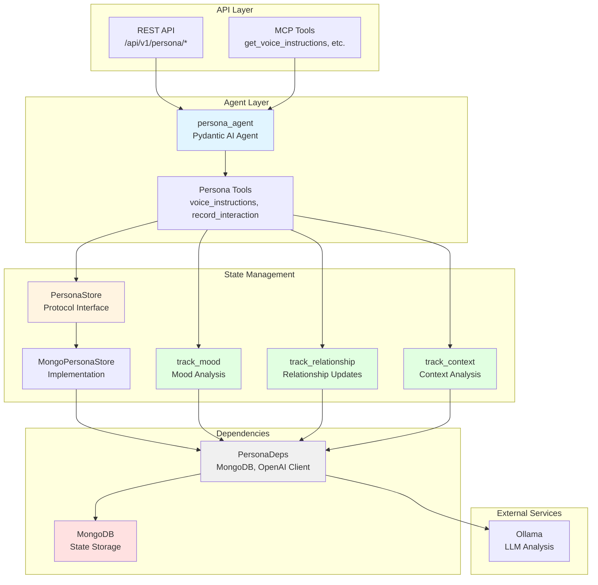
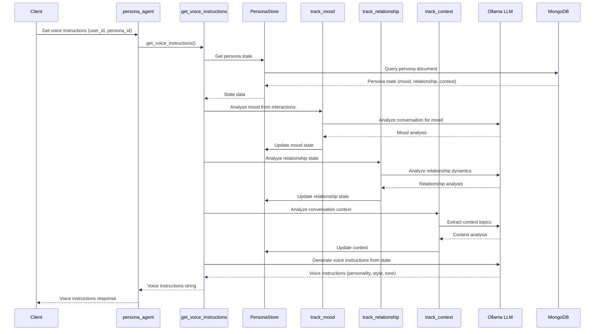

# Persona Project - AGENTS.md

> **Override**: This file extends [../../AGENTS.md](../../AGENTS.md). Project-specific rules take precedence.

## Related API Documentation

- **[API Strategy](../../../../docs/API_STRATEGY.md)** - Route naming conventions, error handling, and API standards

## Overview

The Persona project manages character/persona state including mood, relationships, conversation context, and generates dynamic voice instructions that shape how the AI responds. It enables personalized, consistent AI interactions that adapt based on conversation history and relationship dynamics.

**Key Capabilities:**
- **Mood Tracking**: Analyzes and tracks persona mood state based on conversation interactions
- **Relationship Management**: Maintains relationship state between users and personas (familiarity, trust, etc.)
- **Context Analysis**: Tracks conversation context and topics for continuity
- **Voice Instructions**: Generates dynamic personality guidelines that influence response style and tone
- **State Persistence**: Stores persona state in MongoDB for consistency across sessions
- **LLM-Based Analysis**: Uses language models to analyze interactions and update state

**Use Cases:**
- Personalized AI assistants with consistent personality traits
- Character-based interactions that maintain mood and relationship state
- Context-aware conversations that remember past interactions
- Dynamic personality adaptation based on conversation history

## Component Identity

- **Project**: `persona`
- **Location**: `04-lambda/src/persona/`
- **Purpose**: Persona/character state management with mood tracking, relationship management, conversation context, and dynamic voice instruction generation
- **Dependencies**: MongoDB (01-data), Ollama (02-compute for LLM-based analysis)
- **Agent**: `persona_agent` (Pydantic AI agent with StateDeps)

## Architecture & Patterns

### System Architecture



### Voice Instructions Flow



### File Organization

```
persona/
├── agent.py              # Main persona agent definition
├── config.py             # Project-specific configuration
├── dependencies.py       # PersonaDeps (MongoDB, OpenAI client)
├── models.py             # Pydantic models (Personality, MoodState, RelationshipState, etc.)
├── protocols.py          # PersonaStore protocol definition
├── tools.py              # High-level persona tools (voice instructions, interaction recording)
├── stores/               # Persona store implementations
│   └── mongodb_store.py  # MongoDB implementation of PersonaStore
└── actions/              # State tracking actions
    ├── track_mood.py      # Mood analysis and tracking
    ├── track_relationship.py  # Relationship state updates
    └── track_context.py   # Conversation context analysis
```

### Key Patterns

**DO's:**
- ✅ **Use PersonaDeps**: Always initialize and cleanup in try/finally blocks
  ```python
  deps = PersonaDeps.from_settings()
  await deps.initialize()
  try:
      # Use deps.persona_store, deps.openai_client
  finally:
      await deps.cleanup()
  ```

- ✅ **Store Protocol**: Use PersonaStore protocol for all state operations
  ```python
  store = deps.persona_store
  mood = store.get_mood(user_id, persona_id)
  store.update_mood(user_id, persona_id, new_mood)
  ```

- ✅ **LLM-Based Analysis**: Use LLM for mood/relationship/context analysis when available
  ```python
  # In actions/track_mood.py
  mood = analyze_mood_from_interaction(
      user_message, bot_response, persona_store, user_id, persona_id, llm_client
  )
  ```

- ✅ **Voice Instructions**: Generate dynamic instructions from current state
  ```python
  # In tools.py
  instructions = generate_voice_instructions(persona_store, user_id, persona_id, personality)
  ```

- ✅ **Interaction Recording**: Record interactions to update all state components
  ```python
  # In tools.py
  await record_interaction(deps, user_id, persona_id, user_message, bot_response)
  # This updates mood, relationship, and context automatically
  ```

**DON'Ts:**
- ❌ **Don't access MongoDB directly**: Always use PersonaStore protocol
- ❌ **Don't skip LLM fallback**: If LLM fails, use simple keyword-based analysis
- ❌ **Don't hardcode state values**: Use models (MoodState, RelationshipState, etc.)
- ❌ **Don't forget to update all state**: Interaction recording should update mood, relationship, AND context
- ❌ **Don't create state without defaults**: Always provide default values for new users/personas

### Code Examples

**Agent Tool Pattern** (from `agent.py`):
```python
@persona_agent.tool
async def get_persona_voice_instructions_tool(
    ctx: RunContext[StateDeps[PersonaAgentState]],
    user_id: str,
    persona_id: str
) -> str:
    """Generate voice instructions from persona state."""
    deps = PersonaDeps.from_settings()
    await deps.initialize()
    try:
        return await get_voice_instructions(deps, user_id, persona_id)
    finally:
        await deps.cleanup()
```

**Mood Tracking Pattern** (from `actions/track_mood.py`):
```python
# LLM-based analysis (preferred)
mood = analyze_mood_from_interaction(
    user_message, bot_response, persona_store, user_id, persona_id, llm_client
)

# Fallback to keyword-based analysis if LLM unavailable
if not llm_client:
    # Simple keyword matching
    message_lower = (user_message + " " + bot_response).lower()
    if "happy" in message_lower:
        emotion = "happy"
        intensity = 0.7
```

**Store Implementation Pattern** (from `stores/mongodb_store.py`):
```python
# Get mood
mood = store.get_mood(user_id, persona_id)
if not mood:
    # Return None, caller should handle default

# Update mood
mood = MoodState(primary_emotion="happy", intensity=0.8, timestamp=datetime.now())
store.update_mood(user_id, persona_id, mood)
```

## Key Files & JIT Search

**Touch Points:**
- `agent.py:50` - `persona_agent` definition with tools
- `dependencies.py:8` - `PersonaDeps` class
- `tools.py:15` - `generate_voice_instructions` function
- `stores/mongodb_store.py:14` - `MongoPersonaStore` implementation
- `actions/track_mood.py:12` - Mood analysis logic
- `actions/track_relationship.py:12` - Relationship update logic
- `actions/track_context.py:11` - Context analysis logic

**Search Hints:**
```bash
# Find persona agent tools
rg -n "@persona_agent\.tool" 04-lambda/src/persona/

# Find state models
rg -n "class (MoodState|RelationshipState|ConversationContext|PersonaState)" 04-lambda/src/persona/

# Find store operations
rg -n "def (get|update)_(mood|relationship|conversation_context)" 04-lambda/src/persona/stores/

# Find action tracking functions
rg -n "def (analyze|track|calculate)" 04-lambda/src/persona/actions/
```

## Testing & Validation

**Manual Testing:**
```bash
# Get voice instructions
curl -X POST http://lambda-server:8000/api/v1/persona/get-voice \
  -H "Content-Type: application/json" \
  -d '{"user_id": "user1", "persona_id": "persona1"}'

# Record interaction
curl -X POST http://lambda-server:8000/api/v1/persona/record-interaction \
  -H "Content-Type: application/json" \
  -d '{"user_id": "user1", "persona_id": "persona1", "user_message": "Hello!", "bot_response": "Hi there!"}'

# Get persona state
curl "http://lambda-server:8000/api/v1/persona/state?user_id=user1&persona_id=persona1"

# Update mood manually
curl -X POST http://lambda-server:8000/api/v1/persona/update-mood \
  -H "Content-Type: application/json" \
  -d '{"user_id": "user1", "persona_id": "persona1", "primary_emotion": "excited", "intensity": 0.9}'
```

**Validation Strategy:**
- Verify MongoDB collections exist: `persona_profiles`, `persona_state`, `persona_interactions`
- Check state persistence: Record interaction, retrieve state, verify updates
- Test LLM analysis: Use LLM-based mood analysis, verify results
- Validate voice instructions: Generate instructions, check format and content

## Domain Dictionary

- **Persona**: A chatbot character with identity, behavior, and preferences
- **Mood State**: Current emotional state (emotion + intensity 0.0-1.0)
- **Relationship State**: User relationship metrics (affection, trust, interaction count)
- **Conversation Context**: Current conversation mode (deep_empathy, casual_chat, etc.) and depth
- **Voice Instructions**: Dynamic prompt injection based on current state
- **PersonaStore**: Protocol for swappable persona backends (MongoDB implementation provided)

## Integration Points

- **MongoDB**: State storage (`mongodb:27017`)
- **Ollama**: LLM for mood/relationship/context analysis (`ollama:11434`)
- **REST API**: Endpoints in `server/api/persona.py`
- **MCP Tools**: Exposed via `src/mcp_server/server.py`
- **Conversation Project**: Uses persona voice instructions for response generation

## Configuration

**Required Environment Variables:**
- `MONGODB_URI` - MongoDB connection string
- `MONGODB_DATABASE` - Database name
- `LLM_MODEL` - LLM model for analysis (default: llama3.2)
- `LLM_BASE_URL` - LLM API base URL (default: http://ollama:11434/v1)

**MongoDB Collections:**
- `persona_profiles` - Personality definitions
- `persona_state` - User-persona state (mood, relationships, context)
- `persona_interactions` - Interaction history (optional, for analytics)
