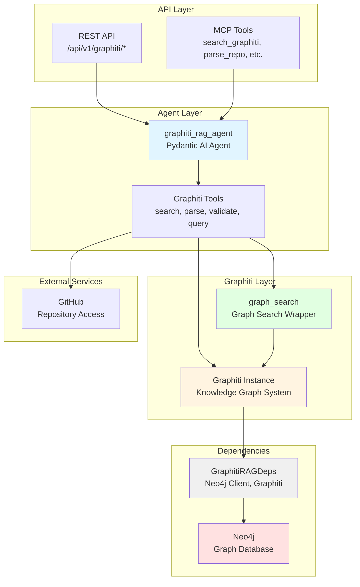
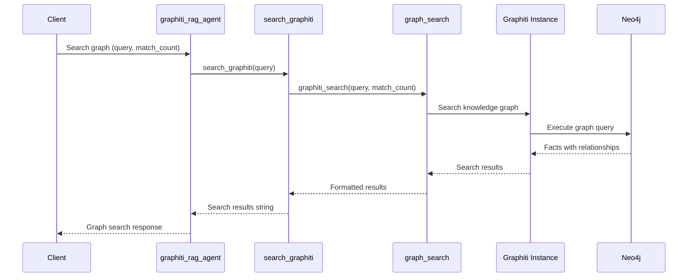
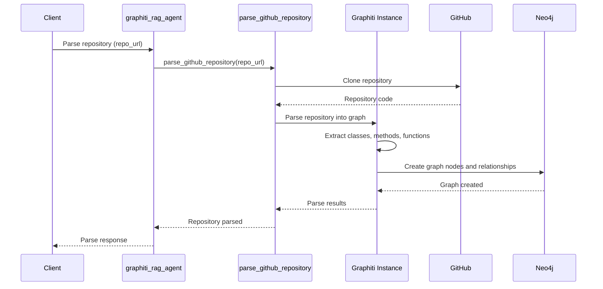

# Graphiti RAG Project - AGENTS.md

> **Override**: This file extends [../../AGENTS.md](../../AGENTS.md). Project-specific rules take precedence.

## Related API Documentation

- **[API Strategy](../../../../docs/API_STRATEGY.md)** - Route naming conventions, error handling, and API standards

## Overview

The Graphiti RAG project provides graph-based retrieval using Graphiti, a knowledge graph system built on Neo4j. It enables semantic search over knowledge graphs, repository code structure parsing, and AI script validation against real codebases.

**Key Capabilities:**
- **Knowledge Graph Search**: Search for facts, entities, and relationships in Neo4j knowledge graphs
- **Repository Parsing**: Parse GitHub repositories into knowledge graphs for code structure analysis
- **AI Script Validation**: Validate AI-generated scripts against real repository code to detect hallucinations
- **Graph Querying**: Execute Cypher queries to explore entity relationships
- **Temporal Facts**: Search facts with temporal information and source metadata
- **Code Structure Analysis**: Extract classes, methods, functions, and their relationships from codebases

**Use Cases:**
- Knowledge graph Q&A over structured facts and relationships
- Code understanding and navigation through repository parsing
- AI code generation validation to ensure accuracy
- Entity relationship exploration in knowledge graphs
- Fact-based reasoning over temporal data

## Component Identity

- **Project**: `graphiti_rag`
- **Location**: `04-lambda/src/graphiti_rag/`
- **Purpose**: Graph-based RAG using Graphiti for knowledge graph search, repository parsing, and AI script validation
- **Dependencies**: Neo4j (01-data), Ollama (02-compute)
- **Agent**: `graphiti_rag_agent` (Pydantic AI agent with StateDeps)

## Architecture & Patterns

### System Architecture



### Graph Search Flow



### Repository Parsing Flow



### File Organization

```
graphiti_rag/
├── agent.py              # Main Graphiti RAG agent definition
├── config.py             # Project-specific configuration
├── dependencies.py       # GraphitiRAGDeps (Neo4j, Graphiti instance)
├── tools.py              # Graphiti tools (search, parse, validate, query)
└── search/               # Graph search implementations
    └── graph_search.py   # Graphiti search wrapper
```

### Key Patterns

**DO's:**
- ✅ **Use GraphitiRAGDeps**: Always initialize and cleanup in try/finally blocks
  ```python
  deps = GraphitiRAGDeps()
  await deps.initialize()
  try:
      # Use deps.graphiti, deps.neo4j_client
  finally:
      await deps.cleanup()
  ```

- ✅ **Check Feature Flag**: Verify `USE_GRAPHITI` is enabled before operations
  ```python
  if not config.use_graphiti:
      return "Graphiti is not enabled"
  ```

- ✅ **Use Graphiti Search**: Use Graphiti's search for knowledge graph queries
  ```python
  # In search/graph_search.py
  results = await graphiti_search(
      graphiti_instance=deps.graphiti,
      query=query,
      match_count=match_count
  )
  ```

- ✅ **Repository Parsing**: Parse GitHub repositories into knowledge graph
  ```python
  # In tools.py
  result = await parse_github_repository(deps, repo_url)
  # Returns: classes, methods, relationships extracted
  ```

- ✅ **Script Validation**: Validate AI-generated scripts against knowledge graph
  ```python
  # In tools.py
  validation = await validate_ai_script(deps, script_path)
  # Returns: validation results with hallucination detection
  ```

**DON'Ts:**
- ❌ **Don't skip Neo4j check**: Verify Neo4j is configured before operations
- ❌ **Don't bypass Graphiti**: Use Graphiti wrapper, not direct Neo4j queries
- ❌ **Don't ignore feature flags**: Check `USE_GRAPHITI` before initialization
- ❌ **Don't hardcode Neo4j queries**: Use Graphiti's query interface
- ❌ **Don't forget to cleanup**: Always cleanup Graphiti and Neo4j connections

### Code Examples

**Agent Tool Pattern** (from `agent.py`):
```python
@graphiti_rag_agent.tool
async def search_graphiti_knowledge_graph_tool(
    ctx: RunContext[StateDeps[GraphitiRAGState]],
    query: str,
    match_count: int = 10
) -> str:
    """Search Graphiti knowledge graph."""
    deps = GraphitiRAGDeps()
    await deps.initialize()
    try:
        if not deps.graphiti:
            return "Graphiti is not available"
        results = await search_graphiti_knowledge_graph(deps, query, match_count)
        return format_results(results)
    finally:
        await deps.cleanup()
```

**Graphiti Search Pattern** (from `search/graph_search.py`):
```python
async def graphiti_search(
    graphiti_instance: Any,
    query: str,
    match_count: int = 10
) -> List[Dict[str, Any]]:
    """Search using Graphiti."""
    # Use Graphiti's search method
    results = await graphiti_instance.search(query, limit=match_count)
    return results
```

**Repository Parsing Pattern** (from `tools.py`):
```python
async def parse_github_repository(
    deps: GraphitiRAGDeps,
    repo_url: str
) -> Dict[str, Any]:
    """Parse GitHub repository into knowledge graph."""
    if not deps.graphiti:
        raise ValueError("Graphiti not initialized")

    # Use Graphiti's repository parser
    result = await deps.graphiti.parse_repository(repo_url)
    return {
        "classes": result.classes,
        "methods": result.methods,
        "relationships": result.relationships
    }
```

## Key Files & JIT Search

**Touch Points:**
- `agent.py:50` - `graphiti_rag_agent` definition with tools
- `dependencies.py:10` - `GraphitiRAGDeps` class
- `tools.py:20` - Graphiti tool functions
- `search/graph_search.py:10` - Graphiti search wrapper

**Search Hints:**
```bash
# Find Graphiti agent tools
rg -n "@graphiti_rag_agent\.tool" 04-lambda/src/graphiti_rag/

# Find Graphiti operations
rg -n "graphiti\.(search|parse_repository|validate)" 04-lambda/src/graphiti_rag/

# Find Neo4j usage
rg -n "neo4j|Neo4j" 04-lambda/src/graphiti_rag/

# Find knowledge graph queries
rg -n "query.*graph|Cypher" 04-lambda/src/graphiti_rag/
```

## Testing & Validation

**Manual Testing:**
```bash
# Search Graphiti knowledge graph
curl -X POST http://lambda-server:8000/api/v1/graphiti/search \
  -H "Content-Type: application/json" \
  -d '{"query": "authentication", "match_count": 10}'

# Parse GitHub repository
curl -X POST http://lambda-server:8000/api/v1/graphiti/knowledge-graph/repositories \
  -H "Content-Type: application/json" \
  -d '{"repo_url": "https://github.com/user/repo.git"}'

# Validate AI script
curl -X POST http://lambda-server:8000/api/v1/graphiti/knowledge-graph/validate \
  -H "Content-Type: application/json" \
  -d '{"script_path": "/path/to/script.py"}'

# Query knowledge graph
curl -X POST http://lambda-server:8000/api/v1/graphiti/knowledge-graph/query \
  -H "Content-Type: application/json" \
  -d '{"command": "repos"}'
```

**Validation Strategy:**
- Verify Neo4j connection: Check Neo4j is running and accessible
- Test Graphiti initialization: Verify Graphiti instance is created
- Validate search results: Search should return relevant graph nodes
- Test repository parsing: Parse known repository, verify graph structure
- Check script validation: Validate script against parsed repository

## Domain Dictionary

- **Graphiti**: Knowledge graph RAG framework for temporal fact storage
- **Knowledge Graph**: Neo4j graph database storing entities and relationships
- **Repository Parsing**: Extracting code structure (classes, methods) into graph
- **Script Validation**: Checking AI-generated scripts against knowledge graph for hallucinations
- **Temporal Facts**: Facts with time validity (valid_from, valid_to)

## Integration Points

- **Neo4j**: Knowledge graph storage (`neo4j:7687`)
- **Ollama**: LLM for Graphiti operations (`ollama:11434`)
- **REST API**: Endpoints in `server/api/graphiti_rag.py`
- **MCP Tools**: Exposed via `src/mcp_server/server.py`
- **MongoDB RAG**: Can be used alongside for hybrid search

## Configuration

**Required Environment Variables:**
- `NEO4J_URI` - Neo4j connection URI (default: bolt://neo4j:7687)
- `NEO4J_USER` - Neo4j username (default: neo4j)
- `NEO4J_PASSWORD` - Neo4j password
- `NEO4J_DATABASE` - Neo4j database name (default: neo4j)
- `USE_GRAPHITI` - Enable Graphiti (default: true, set to false to disable)
- `LLM_MODEL` - LLM model for Graphiti (default: llama3.2)
- `LLM_BASE_URL` - LLM API base URL (default: http://ollama:11434/v1)

**Feature Flags:**
- `USE_GRAPHITI` - Enable Graphiti operations (default: true, enabled by default for crawl4ai RAG flow)
- `USE_KNOWLEDGE_GRAPH` - Enable code structure knowledge graph (separate from Graphiti)
