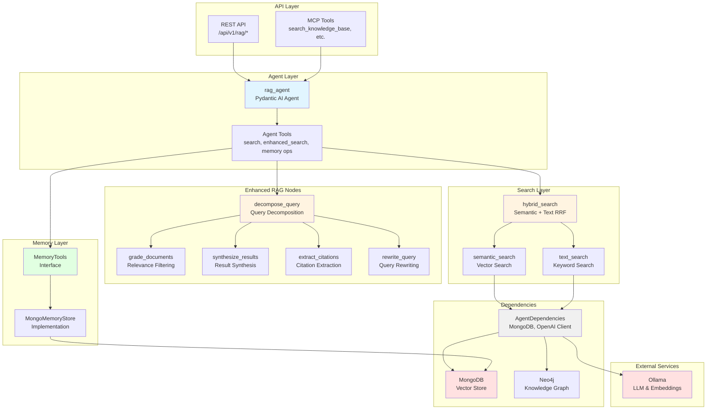
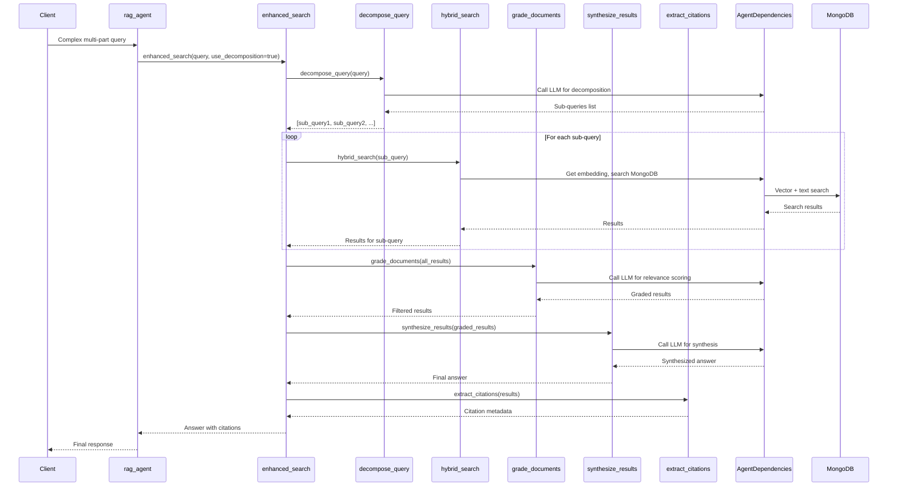
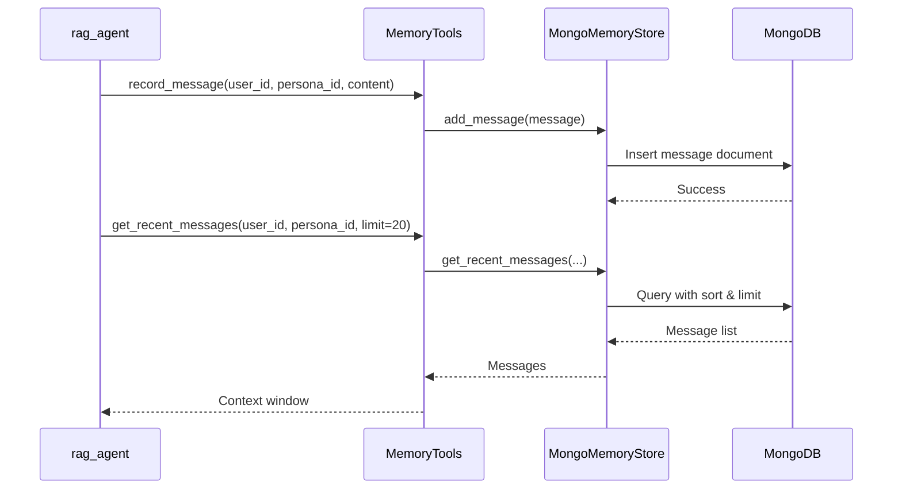

# MongoDB RAG Project - AGENTS.md

> **Override**: This file extends [../../AGENTS.md](../../AGENTS.md). Project-specific rules take precedence.

## Overview

The MongoDB RAG project provides a comprehensive Retrieval-Augmented Generation system with advanced query processing, memory management, and knowledge graph integration. It enables semantic search over documents stored in MongoDB, with sophisticated query decomposition, document grading, and result synthesis capabilities.

**Inspiration**: This implementation is inspired by [MongoDB-RAG-Agent](https://github.com/coleam00/MongoDB-RAG-Agent), which demonstrates best practices for building production-ready RAG systems with MongoDB Atlas Vector Search and Docling document processing.

**Key Capabilities:**
- **Docling Integration**: Production-grade document processing with DocumentConverter and HybridChunker for intelligent document conversion and chunking
- **Hybrid Search**: Combines semantic (vector) and text (keyword) search using Reciprocal Rank Fusion for optimal results
- **Enhanced RAG**: Advanced query processing with decomposition, grading, citations, and synthesis
- **Memory Management**: Persistent storage for conversation messages, facts, and web content with context window retrieval
- **Knowledge Graph Integration**: Optional Neo4j integration for entity relationship exploration
- **Code Example Extraction**: Agentic RAG for extracting and searching code examples from documentation
- **Flexible Search Modes**: Semantic-only, text-only, or hybrid search strategies
- **Multi-Format Support**: PDF, Word, PowerPoint, Excel, HTML, Markdown, and Audio (via Docling)
- **Row-Level Security (RLS)**: User-based access control with document ownership, public sharing, direct sharing, and group-based sharing
- **User-Based Authentication**: MongoDB user provisioning with RBAC roles for secure multi-tenant access

**Use Cases:**
- Document Q&A: Ask questions over ingested documentation and get cited answers
- Conversation Memory: Maintain context across conversations with persistent message storage
- Knowledge Discovery: Explore relationships between entities using knowledge graphs
- Code Search: Find relevant code examples from technical documentation
- Multi-Query Search: Automatically decompose complex questions into focused sub-queries

## Component Identity

- **Project**: `mongo_rag`
- **Location**: `04-lambda/server/projects/mongo_rag/`
- **Purpose**: Enhanced RAG (Retrieval-Augmented Generation) with MongoDB vector search, memory tools, knowledge graph integration, and advanced query processing
- **Dependencies**: MongoDB (01-data), Ollama (02-compute), Neo4j (01-data, optional for graph operations)
- **Agent**: `rag_agent` (Pydantic AI agent with StateDeps)

## Architecture & Patterns

### System Architecture



### Enhanced RAG Flow



### Memory Management Flow



### File Organization

```
mongo_rag/
├── agent.py              # Main RAG agent definition
├── config.py             # Project-specific configuration
├── dependencies.py       # AgentDependencies (MongoDB, OpenAI client)
├── models.py             # Pydantic request/response models
├── prompts.py           # System prompts
├── tools.py             # Core search tools (semantic, text, hybrid)
├── tools_code.py        # Code example extraction tools
├── memory_models.py     # Memory data models (Message, Fact, WebContent)
├── memory_tools.py      # Memory tools interface
├── stores/               # Data storage implementations
│   └── memory_store.py  # MongoDB memory store implementation
├── nodes/               # Enhanced RAG processing nodes
│   ├── decompose.py     # Query decomposition
│   ├── grade.py         # Document grading/relevance filtering
│   ├── citations.py     # Citation extraction
│   ├── synthesize.py    # Result synthesis from multiple queries
│   └── rewrite.py       # Query rewriting
├── ingestion/           # Document ingestion pipeline
│   ├── pipeline.py      # Main ingestion pipeline with Docling integration
│   ├── chunker.py       # Docling HybridChunker wrapper
│   └── embedder.py      # Embedding generation
├── reranking/           # Cross-encoder reranking (optional)
├── extraction/          # Entity extraction (optional)
└── neo4j_client.py      # Neo4j knowledge graph client
```

### Key Patterns

**DO's:**
- ✅ **Use AgentDependencies**: Always initialize and cleanup dependencies in try/finally blocks
  ```python
  deps = AgentDependencies()
  await deps.initialize()
  try:
      # Use deps.db, deps.openai_client, etc.
  finally:
      await deps.cleanup()
  ```

- ✅ **Search Strategies**: Use hybrid search by default (semantic + text with RRF)
  ```python
  # In tools.py
  results = await hybrid_search(ctx, query, match_count=5)
  ```

- ✅ **Enhanced RAG**: Use `enhanced_search` tool for complex queries (decomposition, grading, citations)
  ```python
  # In agent.py
  @rag_agent.tool
  async def enhanced_search(ctx, query, use_decomposition=True, use_grading=True)
  ```

- ✅ **Memory Operations**: Use MemoryTools for message/fact/web content storage
  ```python
  memory_tools = MemoryTools(deps=deps)
  memory_tools.record_message(user_id, persona_id, content, role)
  ```

- ✅ **Vector Search**: Use MongoDB `$vectorSearch` aggregation stage
  ```python
  pipeline = [{
      "$vectorSearch": {
          "index": config.mongodb_vector_index,
          "queryVector": embedding,
          "path": "embedding",
          "numCandidates": 100,
          "limit": match_count
      }
  }]
  ```

**DON'Ts:**
- ❌ **Don't hardcode collection names**: Use `config.mongodb_collection_documents` and `config.mongodb_collection_chunks`
- ❌ **Don't skip cleanup**: Always call `await deps.cleanup()` in finally blocks
- ❌ **Don't use synchronous MongoDB operations**: All operations must be async
- ❌ **Don't bypass memory tools**: Use `MemoryTools` interface, not direct MongoDB access
- ❌ **Don't ignore errors in node processing**: Log warnings but continue with fallback behavior
- ❌ **Don't bypass Docling**: Always use Docling's DocumentConverter and HybridChunker for document processing (don't implement custom chunking for Docling-supported formats)

### Code Examples

**Agent Tool Pattern** (from `agent.py`):
```python
@rag_agent.tool
async def search_knowledge_base(
    ctx: RunContext[StateDeps[RAGState]],
    query: str,
    match_count: Optional[int] = 5
) -> str:
    """Search knowledge base using hybrid search."""
    deps = AgentDependencies()
    await deps.initialize()
    try:
        # Create wrapper for context
        class DepsWrapper:
            def __init__(self, deps):
                self.deps = deps
        wrapper = DepsWrapper(deps)

        results = await hybrid_search(ctx=wrapper, query=query, match_count=match_count)
        # Format results...
    finally:
        await deps.cleanup()
```

**Memory Storage Pattern** (from `memory_store.py`):
```python
# Store message
message = MemoryMessage(user_id=user_id, persona_id=persona_id, role="user", content=content)
store.add_message(message)

# Get context window
messages = store.get_recent_messages(user_id, persona_id, limit=20)
```

**Query Decomposition Pattern** (from `nodes/decompose.py`):
```python
needs_decomp, sub_queries = await decompose_query(query, llm_client)
if needs_decomp:
    # Search each sub-query, then synthesize
    for sub_query in sub_queries:
        results = await hybrid_search(ctx, sub_query, match_count)
```

## Key Files & JIT Search

**Touch Points:**
- `agent.py:50` - `rag_agent` definition with tools
- `dependencies.py:17` - `AgentDependencies` class
- `tools.py:30` - `hybrid_search` function (main search entry point)
- `stores/memory_store.py:14` - `MongoMemoryStore` implementation
- `nodes/decompose.py:12` - Query decomposition logic
- `nodes/grade.py:25` - Document grading logic

**Search Hints:**
```bash
# Find all RAG agent tools
rg -n "@rag_agent\.tool" 04-lambda/server/projects/mongo_rag/

# Find memory operations
rg -n "MemoryTools|MongoMemoryStore" 04-lambda/server/projects/mongo_rag/

# Find search implementations
rg -n "def (semantic|text|hybrid)_search" 04-lambda/server/projects/mongo_rag/

# Find enhanced RAG nodes
rg -n "def (decompose|grade|synthesize|rewrite)" 04-lambda/server/projects/mongo_rag/nodes/

# Find MongoDB vector search usage
rg -n "\$vectorSearch" 04-lambda/server/projects/mongo_rag/
```

## Testing & Validation

**Manual Testing:**
```bash
# Test search endpoint
curl -X POST http://lambda-server:8000/api/v1/rag/search \
  -H "Content-Type: application/json" \
  -d '{"query": "test query", "search_type": "hybrid", "match_count": 5}'

# Test enhanced search
curl -X POST http://lambda-server:8000/api/v1/rag/enhanced-search \
  -H "Content-Type: application/json" \
  -d '{"query": "complex multi-part question", "use_decomposition": true}'

# Test memory operations
curl -X POST http://lambda-server:8000/api/v1/rag/memory/record \
  -H "Content-Type: application/json" \
  -d '{"user_id": "user1", "persona_id": "persona1", "content": "Hello", "role": "user"}'
```

**Validation Strategy:**
- Verify MongoDB indexes exist: `db.chunks.getIndexes()`
- Check vector search returns results: Test with known document
- Validate memory storage: Record message, retrieve context window
- Test enhanced RAG: Complex query should decompose and synthesize

## Domain Dictionary

- **RAG**: Retrieval-Augmented Generation - combines vector search with LLM generation
- **Hybrid Search**: Combines semantic (vector) and text (keyword) search using Reciprocal Rank Fusion
- **Query Decomposition**: Breaking complex multi-part questions into focused sub-queries
- **Document Grading**: LLM-based relevance filtering to remove irrelevant documents
- **Context Window**: Recent messages retrieved for conversation continuity
- **Memory Store**: Persistent storage for messages, facts, and web content

## Integration Points

- **MongoDB**: Primary vector store and document storage (`mongodb:27017`)
- **Ollama**: LLM for agent responses and embeddings (`ollama:11434`)
- **Neo4j**: Optional knowledge graph for entity relationships (`neo4j:7687`)
- **Docling**: Document processing and intelligent chunking (integrated in `ingestion/pipeline.py` and `ingestion/chunker.py`)
- **REST API**: Endpoints in `server/api/mongo_rag.py`
- **MCP Tools**: Exposed via `server/mcp/fastmcp_server.py`

## Docling Integration

**Document Processing**:
- Uses `docling.document_converter.DocumentConverter` for PDF, Word, PowerPoint, Excel, HTML conversion
- Converts documents to markdown while preserving structure (headings, sections, tables)
- Returns both markdown content and `DoclingDocument` object for efficient chunking

**Intelligent Chunking**:
- Uses `docling.chunking.HybridChunker` for token-aware, structure-preserving chunking
- Respects document hierarchy and semantic boundaries
- Contextualizes chunks with heading hierarchy for better RAG performance
- Token-precise chunking (uses actual tokenizer, not character estimates)

**Audio Transcription**:
- Uses Docling's ASR pipeline with Whisper ASR for audio transcription
- Supports MP3, WAV, M4A, FLAC formats
- Transcribes to markdown format for consistent processing

**Implementation Files**:
- `ingestion/pipeline.py`: Document conversion and ingestion pipeline
- `ingestion/chunker.py`: Docling HybridChunker wrapper
- See MongoDB-RAG-Agent for reference implementation patterns

## Row-Level Security (RLS) & User-Based Authentication

**Overview:**
MongoDB RAG implements Row-Level Security (RLS) for multi-tenant data isolation. Documents are filtered based on user ownership, public sharing, direct sharing, and group-based sharing. This ensures users only see documents they have access to.

**RLS Filter Logic:**
- **Own Documents**: Users can access documents where `user_id` or `user_email` matches
- **Public Documents**: Users can access documents where `is_public = true`
- **Shared Documents**: Users can access documents where their `user_id` or `email` is in `shared_with` array
- **Group Documents**: Users can access documents where any of their `user_groups` matches `group_ids` array
- **Admin Bypass**: Admin users (`is_admin = true`) bypass all filtering and see all documents

**Implementation:**
- **RLS Filter Builder**: `rls.py` - `build_access_filter()` creates MongoDB query filters
- **Document Access Check**: `can_access_document()` for application-level validation
- **Sharing Management**: `add_sharing_to_document()` and `remove_sharing_from_document()` for managing access
- **Search Integration**: All search functions (`semantic_search`, `text_search`, `hybrid_search`) automatically apply RLS filters
- **Document Ingestion**: Pipeline automatically sets `user_id` and `user_email` on ingested documents

**MongoDB User Provisioning:**
- **JIT Provisioning**: Users are automatically provisioned in MongoDB on first authentication
- **RBAC Roles**: Each user gets a `rag_user` role with read/write access to RAG collections
- **Service**: `src/services/auth/services/mongodb_service.py` handles user creation and management
- **Credentials Storage**: MongoDB username/password stored in Supabase `profiles` table

**User Context in Dependencies:**
```python
deps = AgentDependencies.from_settings(
    user_id="user-uuid",
    user_email="user@example.com",
    is_admin=False,
    user_groups=["team-alpha"]
)
```

**Constraints:**
- RLS filtering is applied at the application level (not database-level like PostgreSQL RLS)
- MongoDB RBAC provides connection-level security, but document-level access is enforced via query filters
- Sharing fields (`is_public`, `shared_with`, `group_ids`) must be set on documents for sharing to work
- Admin users bypass all RLS filtering (empty filter = see all documents)
- User-based MongoDB connections require credentials stored in Supabase (not yet fully implemented in all scenarios)

**Testing:**
- Unit tests: `tests/test_mongo_rag/test_rls.py` - RLS filter builder functions
- Integration tests: `tests/test_mongo_rag/test_search_rls.py` - Search with RLS filtering
- Provisioning tests: `tests/test_mongo_rag/test_mongodb_provisioning.py` - User provisioning
- Samples: `sample/mongo_rag/rls_sharing_example.py` and `sample/mongo_rag/user_auth_example.py`

## Configuration

**Required Environment Variables:**
- `MONGODB_URI` - MongoDB connection string
- `MONGODB_DATABASE` - Database name
- `LLM_MODEL` - LLM model name (default: llama3.2)
- `LLM_BASE_URL` - LLM API base URL (default: http://ollama:11434/v1)
- `EMBEDDING_MODEL` - Embedding model (default: nomic-embed-text)

**Optional Feature Flags:**
- `USE_KNOWLEDGE_GRAPH` - Enable Neo4j graph operations
- `USE_RERANKING` - Enable cross-encoder reranking
- `USE_AGENTIC_RAG` - Enable code example extraction
