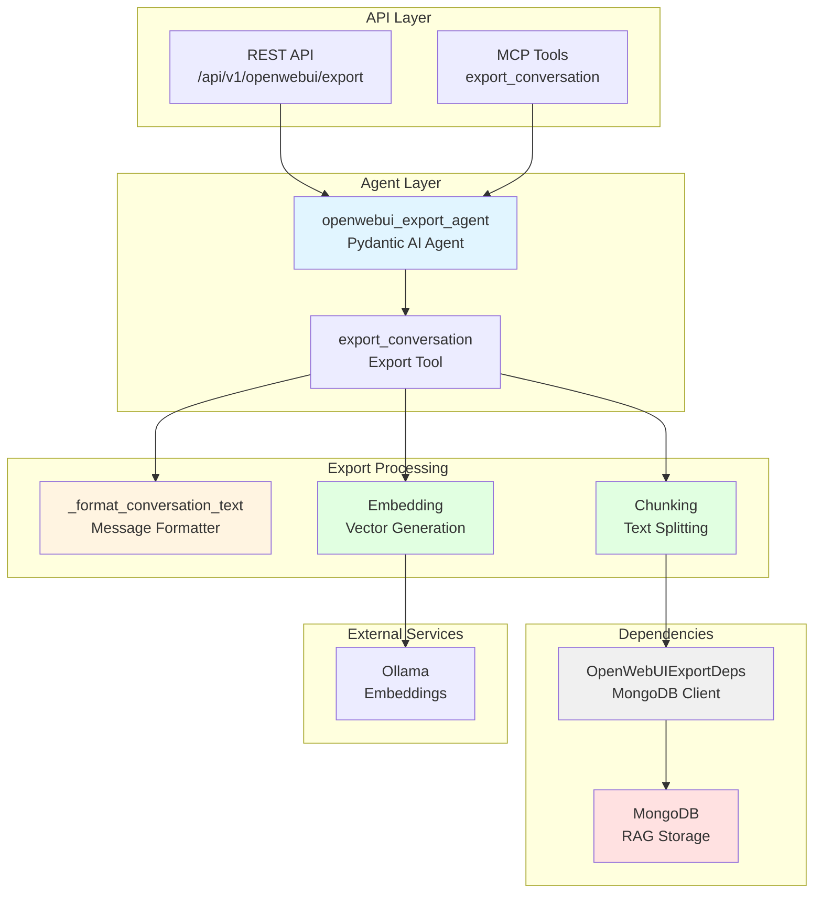
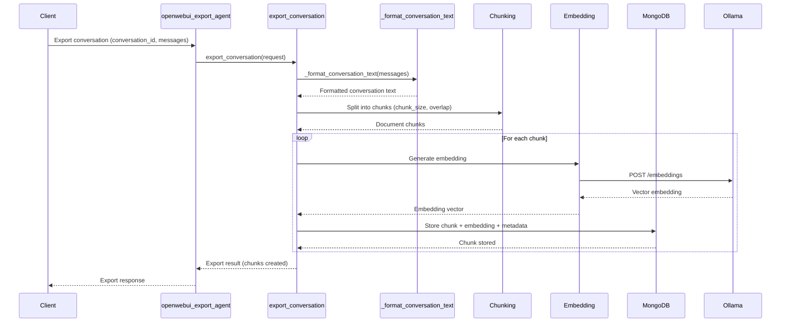

# Open WebUI Export Project - AGENTS.md

> **Override**: This file extends [../../AGENTS.md](../../AGENTS.md). Project-specific rules take precedence.

## Related API Documentation

- **[API Strategy](../../../../docs/API_STRATEGY.md)** - Route naming conventions, error handling, and API standards

## Overview

The Open WebUI Export project enables exporting conversations from Open WebUI into the MongoDB RAG system, making them searchable via semantic search. It processes conversation messages, chunks them, generates embeddings, and stores them in MongoDB for retrieval.

**Key Capabilities:**
- **Conversation Export**: Export Open WebUI conversations to MongoDB RAG
- **Automatic Chunking**: Splits conversations into searchable chunks with configurable size and overlap
- **Embedding Generation**: Generates embeddings for conversation chunks using Ollama
- **Metadata Preservation**: Preserves conversation ID, title, topics, and user information
- **Search Integration**: Exported conversations become searchable via MongoDB RAG search tools
- **Batch Operations**: Export multiple conversations efficiently

**Use Cases:**
- Make Open WebUI conversations searchable across all past discussions
- Build knowledge bases from conversation history
- Enable semantic search over past AI interactions
- Create searchable archives of important conversations

## Component Identity

- **Project**: `openwebui_export`
- **Location**: `04-lambda/src/openwebui_export/`
- **Purpose**: Export Open WebUI conversations to MongoDB RAG system for searchability
- **Dependencies**: MongoDB (01-data), Ollama (02-compute for embeddings)
- **Agent**: `openwebui_export_agent` (Pydantic AI agent with StateDeps)

## Architecture & Patterns

### System Architecture



### Export Flow



### File Organization

```
openwebui_export/
├── agent.py              # Main Open WebUI export agent definition
├── config.py             # Project-specific configuration
├── dependencies.py       # OpenWebUIExportDeps (MongoDB)
├── models.py             # Pydantic request/response models
├── tools.py             # Export tools (export_conversation, get_conversations, etc.)
├── services/             # Business logic services
│   └── exporter.py       # ConversationExporter class (legacy, may be unused)
└── client.py             # Open WebUI API client (if needed)
```

### Key Patterns

**DO's:**
- ✅ **Use OpenWebUIExportDeps**: Always initialize and cleanup in try/finally blocks
  ```python
  deps = OpenWebUIExportDeps.from_settings()
  await deps.initialize()
  try:
      # Use deps.mongo_client, deps.db
  finally:
      await deps.cleanup()
  ```

- ✅ **Export Conversations**: Use `export_conversation` tool to export conversations
  ```python
  # In tools.py
  result = await export_conversation(ctx, request)
  ```

- ✅ **Format Conversation Text**: Use `_format_conversation_text` to format messages
  ```python
  conversation_text = _format_conversation_text(request.messages)
  ```

- ✅ **Chunk and Embed**: Always chunk and embed conversations before storage
  ```python
  chunks = await chunker.chunk_document(content=conversation_text, ...)
  embeddings = await embedder.embed_batch(chunk_texts)
  ```

**DON'Ts:**
- ❌ **Don't skip chunking**: Always chunk conversations before embedding
- ❌ **Don't hardcode metadata**: Use conversation metadata (title, topics, etc.)
- ❌ **Don't ignore export errors**: Log errors but return partial results
- ❌ **Don't bypass tools**: Use tools.py functions, not direct MongoDB access

## Key Files & JIT Search

**Touch Points:**
- `agent.py:29` - `openwebui_export_agent` definition with tools
- `dependencies.py` - `OpenWebUIExportDeps` class
- `tools.py:36` - `export_conversation` function
- `tools.py:150` - `get_conversations` function
- `tools.py:200` - `export_conversations_batch` function

**Search Hints:**
```bash
# Find Open WebUI export agent tools
rg -n "@openwebui_export_agent\.tool" 04-lambda/src/openwebui_export/

# Find export operations
rg -n "export_conversation|get_conversations" 04-lambda/src/openwebui_export/

# Find conversation formatting
rg -n "_format_conversation_text" 04-lambda/src/openwebui_export/
```

## Testing & Validation

**Manual Testing:**
```bash
# Export conversation
curl -X POST http://lambda-server:8000/api/v1/openwebui/export \
  -H "Content-Type: application/json" \
  -d '{
    "conversation_id": "conv_123",
    "user_id": "user_456",
    "messages": [{"role": "user", "content": "Hello"}],
    "title": "Test Conversation"
  }'

# List conversations
curl -X POST http://lambda-server:8000/api/v1/openwebui/list \
  -H "Content-Type: application/json" \
  -d '{"user_id": "user_456"}'
```

**Validation Strategy:**
- Verify export: Check that conversations are exported to MongoDB RAG
- Validate chunking: Verify conversations are chunked correctly
- Test search: Verify exported conversations are searchable
- Check metadata: Verify conversation metadata is preserved

## Domain Dictionary

- **Open WebUI**: Web-based UI for LLM conversations
- **Conversation Export**: Process of converting Open WebUI conversations to MongoDB RAG documents
- **Chunking**: Splitting conversation text into smaller chunks for embedding
- **Embedding**: Converting text chunks to vector embeddings for semantic search

## Integration Points

- **MongoDB RAG**: Stores exported conversations as searchable documents (`mongodb:27017`)
- **Ollama**: Generates embeddings for conversation chunks (`ollama:11434`)
- **REST API**: Endpoints in `server/api/openwebui_export.py`
- **MCP Tools**: Exposed via `src/mcp_server/server.py`

## Configuration

**Required Environment Variables:**
- `MONGODB_URI` - MongoDB connection string
- `MONGODB_DATABASE` - Database name
- `EMBEDDING_MODEL` - Embedding model (default: qwen3-embedding:4b)
- `EMBEDDING_BASE_URL` - Embedding API base URL (default: http://ollama:11434/v1)

**Export Configuration:**
- `chunk_size`: Chunk size for conversation splitting (default: 1000)
- `chunk_overlap`: Chunk overlap size (default: 200)
