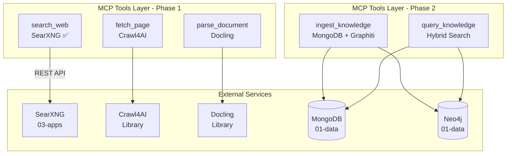

# Deep Research Agent - AGENTS.md

> **Override**: This file extends [../../AGENTS.md](../../AGENTS.md). Project-specific rules take precedence.

## Related API Documentation

- **[API Strategy](../../../../docs/API_STRATEGY.md)** - Route naming conventions, error handling, and API standards

## Overview

The Deep Research Agent is an autonomous system designed to produce high-integrity, comprehensive research reports. Unlike standard RAG implementations that hallucinate when data is missing, this agent uses a "Search-Ingest-Verify-Write" loop.

**Current Phase: Phase 3 - Linear Researcher Agent ✅ COMPLETED**

Phase 1 built the foundational tooling layer:
- **Search**: Web search via SearXNG ✅ Implemented
- **Crawl**: Fetch web pages via Crawl4AI ✅ Implemented
- **Parse**: Convert and chunk documents via Docling ✅ Implemented

Phase 2 adds the memory layer:
- **Ingest**: Store chunks in MongoDB (vectors) and Graphiti (knowledge graph) ✅ Implemented
- **Query**: Hybrid search (vector + text) with session isolation ✅ Implemented

Phase 3 adds the Linear Researcher agent:
- **Agent**: Pydantic-AI agent with fixed sequence workflow ✅ Implemented
- **Tools**: All Phase 1 & 2 tools wrapped as Pydantic-AI tools ✅ Implemented
- **Workflow**: Search → Fetch → Parse → Ingest → Query → Write ✅ Implemented

Future phases:
- Phase 4: LangGraph orchestrator (STORM architecture)
- Phase 5: Validation and auditor
- Phase 6: Graph-enhanced reasoning

## Component Identity

- **Project**: `deep_research`
- **Location**: `04-lambda/src/deep_research/`
- **Purpose**: Deep research agent with zero-hallucination guarantee
- **Dependencies**: SearXNG (03-apps), Crawl4AI, Docling, MongoDB (01-data), Neo4j (01-data)
- **Status**: Phase 2 - Memory layer complete

## Testing Status

**Last Updated**: 2025-01-XX (Run tests to update)
**Test Coverage**: TBD (Run with --coverage to calculate)
**Total Tests**: TBD
**Passing**: TBD
**Failing**: TBD
**Errors**: TBD
**Skipped**: TBD
**Success Rate**: TBD%

### Test Files
- `test_tools.py`: TBD tests - Status TBD (run tests to update)
- `test_linear_agent.py`: TBD tests - Status TBD (run tests to update)
- `test_orchestrator_nodes.py`: TBD tests - Status TBD (run tests to update)
- `test_storm_workflow.py`: TBD tests - Status TBD (run tests to update)
- `test_graph_enhanced.py`: TBD tests - Status TBD (run tests to update)
- `test_state_models.py`: TBD tests - Status TBD (run tests to update)

### Known Issues
- None (run tests to identify issues)

### Test Execution
Run tests using:
```bash
# Full workflow (recommended)
bash .cursor/scripts/test_workflow.sh

# Direct test execution
python .cursor/scripts/run_deep_research_tests.py

# With coverage
python .cursor/scripts/run_deep_research_tests.py --coverage
```

### Debugging & Tracking
- **Scratchpad**: `.cursor/scratchpad.md` - Test run history and notes
- **Test Results**: `.cursor/test_results/` - JSON reports and issue tracking
- **Issue Tracker**: `python .cursor/scripts/track_issues.py --list`

## Architecture & Patterns

### Phase 1-2 Architecture



### Tool Descriptions

#### `search_web`
- **Status**: ✅ Implemented
- **Purpose**: Search the web using SearXNG metasearch engine
- **Parameters**: `query`, `engines` (optional), `result_count` (default: 5)
- **Returns**: List of search results with URLs and snippets
- **Implementation**: Calls SearXNG REST API at `settings.searxng_url`

#### `fetch_page`
- **Status**: Implemented
- **Purpose**: Fetch a single web page using Crawl4AI
- **Parameters**: `url`
- **Returns**: Markdown content and metadata
- **Implementation**: Uses `AsyncWebCrawler` from Crawl4AI library

#### `parse_document`
- **Status**: Implemented
- **Purpose**: Parse and chunk documents using Docling
- **Parameters**: `content`, `content_type` (html/markdown/text)
- **Returns**: Structured chunks with metadata
- **Implementation**: Uses `DocumentConverter` and `HybridChunker` from Docling

#### `ingest_knowledge`
- **Status**: Implemented (Phase 2)
- **Purpose**: Store document chunks in MongoDB (vectors) and Graphiti (knowledge graph)
- **Parameters**: `chunks` (from parse_document), `session_id`, `source_url`, `title` (optional)
- **Returns**: `document_id`, `chunks_created`, `facts_added`, `success`, `errors`
- **Implementation**:
  - Generates embeddings for all chunks using OpenAI
  - Stores documents and chunks in MongoDB with session_id in metadata
  - Ingests facts into Graphiti/Neo4j for knowledge graph
  - All data is isolated by session_id

#### `query_knowledge`
- **Status**: Implemented (Phase 2)
- **Purpose**: Query the knowledge base using hybrid search filtered by session_id
- **Parameters**: `question`, `session_id`, `match_count` (default: 5), `search_type` (semantic/text/hybrid)
- **Returns**: List of cited chunks with `chunk_id`, `content`, `document_id`, `document_source`, `similarity`, `metadata`
- **Implementation**:
  - Performs vector search (semantic) and/or text search (keyword)
  - Combines results using Reciprocal Rank Fusion (RRF) for hybrid search
  - Filters by session_id to ensure data isolation
  - Returns chunks with citation information

## Integration Points

### SearXNG Integration ✅ COMPLETE
- **Service**: `http://searxng:8080` (from 03-apps stack)
- **REST API**: Implemented at `04-lambda/server/api/searxng.py`
- **MCP Tool**: Fully implemented - calls SearXNG REST API
- **Integration**: `search_web` tool in `tools.py` calls `server.api.searxng.search()`
- **Validation**: Tested and working (32+ results for test queries)

### Crawl4AI Integration
- **Library**: Already in `pyproject.toml`
- **Pattern**: Reuses `Crawl4AIDependencies` initialization pattern
- **Service**: Uses `AsyncWebCrawler` with browser configuration

### Docling Integration
- **Library**: Already in `pyproject.toml`
- **Pattern**: Reuses `DocumentConverter` and `HybridChunker` from mongo_rag project
- **Service**: Converts content to DoclingDocument, chunks with HybridChunker

### MongoDB Integration (Phase 2)
- **Database**: MongoDB from 01-data stack
- **Collections**: `documents` (source of truth), `chunks` (searchable units with embeddings)
- **Pattern**: Two-collection pattern with document_id foreign key
- **Session Isolation**: All chunks tagged with `session_id` in metadata
- **Vector Search**: Uses MongoDB `$vectorSearch` aggregation with vector index

### Graphiti Integration (Phase 2)
- **Database**: Neo4j from 01-data stack
- **Pattern**: Uses `GraphitiRAGDeps` for Graphiti client initialization
- **Ingestion**: Automatically extracts entities and relationships from chunks
- **Session Isolation**: Session ID stored in fact metadata for filtering
- **Service**: Links Graphiti facts to MongoDB chunk IDs for retrieval

## Dependencies

### DeepResearchDeps
- **Base**: `BaseDependencies` from `server.projects.shared.dependencies`
- **Mixins**: `MongoDBMixin`, `OpenAIClientMixin`
- **Components**:
  - `http_client: httpx.AsyncClient` - For SearXNG requests
  - `crawler: AsyncWebCrawler` - For web crawling
  - `document_converter: DocumentConverter` - For document parsing
  - `mongo_client: AsyncMongoClient` - For MongoDB operations (from MongoDBMixin)
  - `embedding_client: AsyncOpenAI` - For generating embeddings (from OpenAIClientMixin)
  - `graphiti_deps: GraphitiRAGDeps` - For Graphiti/Neo4j operations (optional)
- **Initialization**: Sets up MongoDB, OpenAI clients, crawler, document converter, and Graphiti
- **Methods**:
  - `get_embedding(text: str) -> list[float]` - Generate embeddings for text
- **Cleanup**: Properly closes all connections (MongoDB, OpenAI, crawler, HTTP client, Graphiti)

## Configuration

### DeepResearchConfig
- **SearXNG URL**: From `settings.searxng_url`
- **Crawl4AI Settings**: Browser headless mode, timeouts
- **Docling Settings**: Chunk size, overlap, max tokens
- **Search Settings**: Default result count, max result count

## MCP Tools

All tools are registered in `04-lambda/src/mcp_server/server.py`:

### Phase 1 Tools
1. **`search_web`** - Web search via SearXNG ✅ Implemented
2. **`fetch_page`** - Fetch web page ✅ Implemented
3. **`parse_document`** - Parse and chunk document ✅ Implemented

### Phase 2 Tools
4. **`ingest_knowledge`** - Store chunks in MongoDB and Graphiti
5. **`query_knowledge`** - Query knowledge base with hybrid search

### Phase 3 Agent Tools
All Phase 1 & 2 tools are wrapped as Pydantic-AI tools in `agent.py`:
1. **`search_web_tool`** - Wrapper for `search_web` MCP tool
2. **`fetch_page_tool`** - Wrapper for `fetch_page` MCP tool
3. **`parse_document_tool`** - Wrapper for `parse_document` MCP tool
4. **`ingest_knowledge_tool`** - Wrapper for `ingest_knowledge` MCP tool
5. **`query_knowledge_tool`** - Wrapper for `query_knowledge` MCP tool

## Phase 3: Linear Researcher Agent

### Agent Definition

The `linear_researcher_agent` is a Pydantic-AI agent that executes a fixed sequence:

1. **Search** - Uses `search_web_tool` to find relevant URLs
2. **Fetch** - Uses `fetch_page_tool` to get page content
3. **Parse** - Uses `parse_document_tool` to chunk the content
4. **Ingest** - Uses `ingest_knowledge_tool` to store in MongoDB and Graphiti
5. **Query** - Uses `query_knowledge_tool` to retrieve relevant facts
6. **Write** - Generates answer based ONLY on retrieved facts

### System Prompt

The agent enforces "closed-book" mode:
- **STRICTLY FORBIDDEN** from using pre-trained knowledge
- May ONLY write sentences supported by facts from the knowledge base
- Must cite sources with [1], [2], etc.
- Must admit when information is not available

### Response Model

```python
class ResearchResponse(BaseModel):
    answer: str  # The answer to the user's question
    sources: List[str]  # List of source URLs used
    citations: List[str]  # List of citation markers [1], [2], etc.
    session_id: str  # Session ID for this research session
```

### Usage

```python
from server.projects.deep_research.workflow import run_linear_research

# Run the agent
result = await run_linear_research("Who is the CEO of Anthropic?")

# Access results
print(result.data.answer)
print(result.data.sources)
print(result.data.citations)
```

### Testing

```bash
# Test the Linear Researcher agent
cd 04-lambda
python ../sample/deep_research/test_linear_researcher.py
```

## Testing

### Manual Testing

```bash
# Start Lambda server
python start_services.py --stack lambda

# Test MCP tools via HTTP
curl -X POST http://localhost:8000/mcp/tools/list

# Test search_web (returns SearXNG results)
curl -X POST http://localhost:8000/api/v1/mcp/tools/call \
  -H "Content-Type: application/json" \
  -d '{"name": "search_web", "arguments": {"query": "test", "result_count": 5}}'

# Test fetch_page
curl -X POST http://localhost:8000/mcp/tools/call \
  -H "Content-Type: application/json" \
  -d '{"name": "fetch_page", "arguments": {"url": "https://example.com"}}'

# Test parse_document
curl -X POST http://localhost:8000/mcp/tools/call \
  -H "Content-Type: application/json" \
  -d '{"name": "parse_document", "arguments": {"content": "<html><body>Test</body></html>", "content_type": "html"}}'

# Test ingest_knowledge (Phase 2)
# First, get chunks from parse_document, then:
curl -X POST http://localhost:8000/mcp/tools/call \
  -H "Content-Type: application/json" \
  -d '{
    "name": "ingest_knowledge",
    "arguments": {
      "chunks": [{"content": "Test chunk", "index": 0, "start_char": 0, "end_char": 10, "metadata": {}, "token_count": 3}],
      "session_id": "test-session-123",
      "source_url": "https://example.com",
      "title": "Test Document"
    }
  }'

# Test query_knowledge (Phase 2)
curl -X POST http://localhost:8000/mcp/tools/call \
  -H "Content-Type: application/json" \
  -d '{
    "name": "query_knowledge",
    "arguments": {
      "question": "What is the test about?",
      "session_id": "test-session-123",
      "match_count": 5,
      "search_type": "hybrid"
    }
  }'
```

## Future Phases

### Phase 2: Memory Layer (RAG & Graphiti) ✅ COMPLETED
- ✅ Store crawled content in MongoDB (vectors) and Neo4j (knowledge graph)
- ✅ Implement ingestion and retrieval tools
- ✅ Session-based data isolation
- ✅ Hybrid search (vector + text) with RRF

### Phase 3: Linear Researcher Agent ✅ COMPLETED
- ✅ Simple Pydantic AI agent with fixed sequence
- ✅ Search → Fetch → Parse → Ingest → Query → Write
- ✅ All Phase 1 & 2 tools wrapped as Pydantic-AI tools
- ✅ System prompt enforces "closed-book" mode (no pre-trained knowledge)
- ✅ Structured response model with citations and sources
- ✅ Workflow function for easy agent execution
- **Files**:
  - `agent.py` - Agent definition with tools and system prompt
  - `workflow.py` - Convenience function `run_linear_research()`
  - `sample/deep_research/test_linear_researcher.py` - Test script

### Phase 4: LangGraph Orchestrator ✅ COMPLETED
- ✅ STORM architecture implementation with LangGraph
- ✅ Planner node: Generates research outline and vectors
- ✅ Executor node: Searches, fetches, parses, ingests
- ✅ Writer node: Synthesizes final report
- ✅ State management with ResearchState TypedDict
- **Files**:
  - `state.py` - ResearchState and ResearchVector models
  - `orchestrator.py` - LangGraph nodes and graph construction
  - `storm_workflow.py` - Workflow function `run_storm_research()`

### Phase 5: Validation & Auditor ✅ COMPLETED
- ✅ Auditor node: Validates RAG data before writing
- ✅ Confidence assessment (high/medium/low)
- ✅ Recursive refinement loop (max 3 attempts)
- ✅ Citation enforcer in Writer node
- ✅ Zero-hallucination guardrails

### Phase 6: Graph-Enhanced Reasoning ✅ COMPLETED
- ✅ Graph RAG using Graphiti knowledge graph
- ✅ Multi-hop reasoning via graph traversal
- ✅ Enhanced `query_knowledge` with `use_graphiti` parameter
- ✅ Graph search integrated with hybrid search
- ✅ Entity relationship queries via Graphiti

## References

- [Deep Research PRD](../../../../.cursor/PRDS/06_deep_research.md)
- [Crawl4AI RAG Project](../crawl4ai_rag/AGENTS.md)
- [MongoDB RAG Project](../mongo_rag/AGENTS.md)
- [MCP Function Design Best Practices](../../mcp/AGENTS.md)
