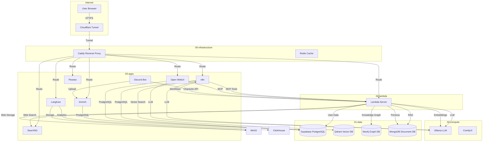
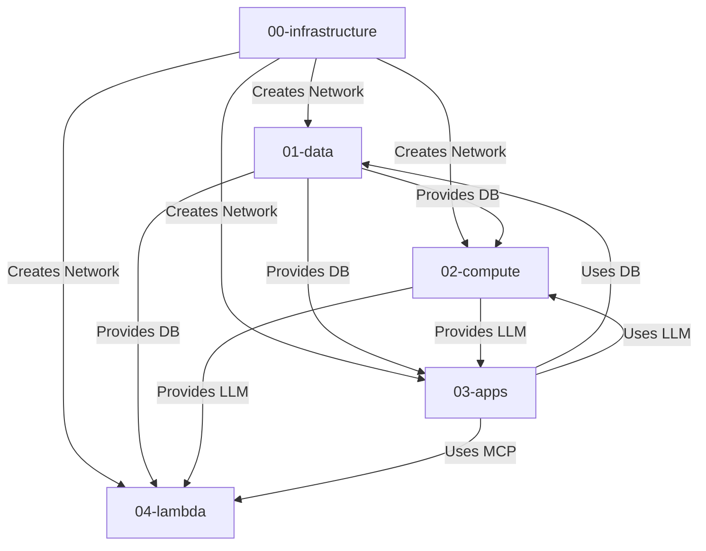
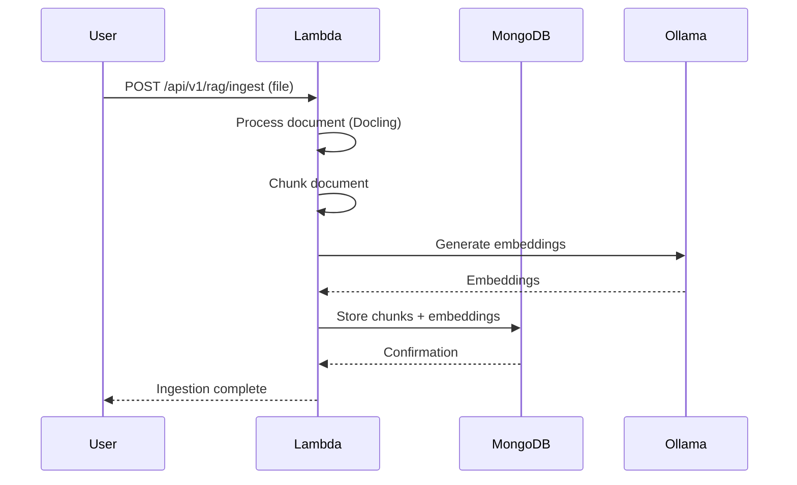
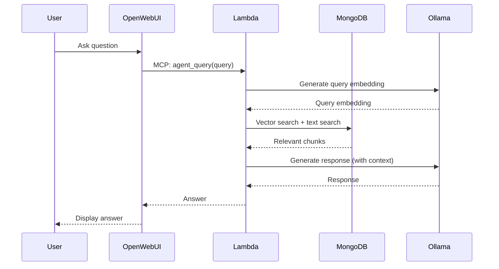
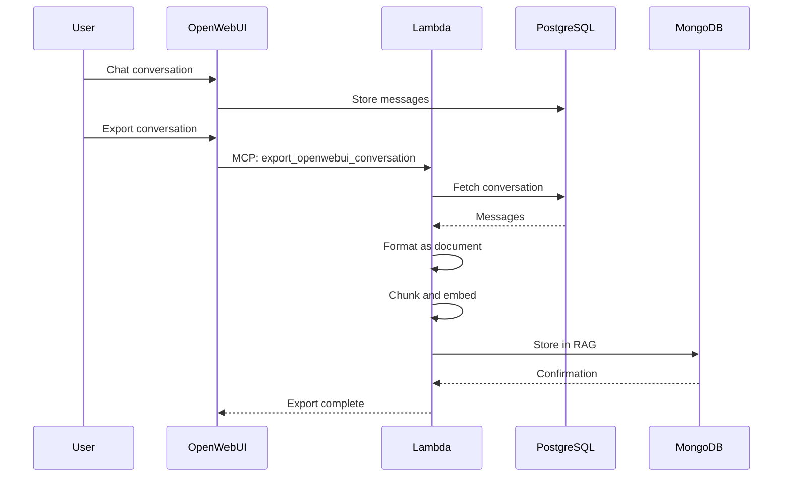
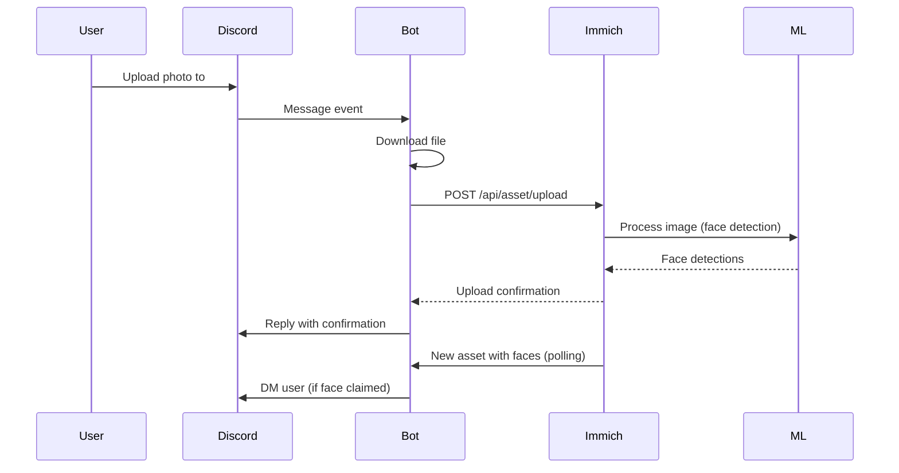
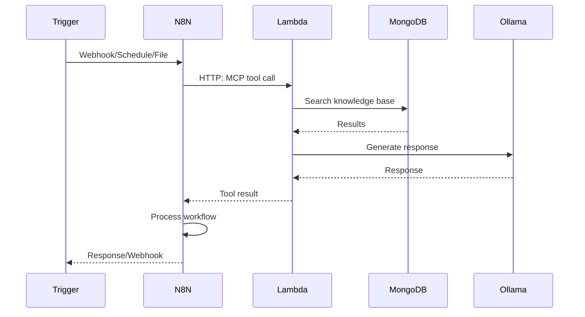
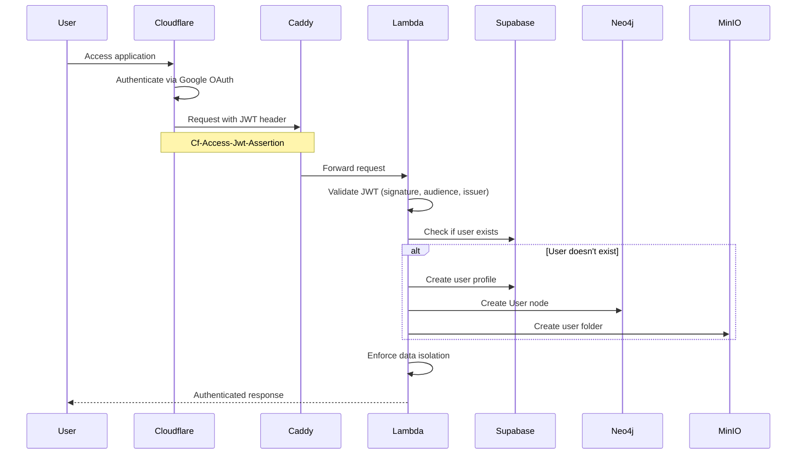
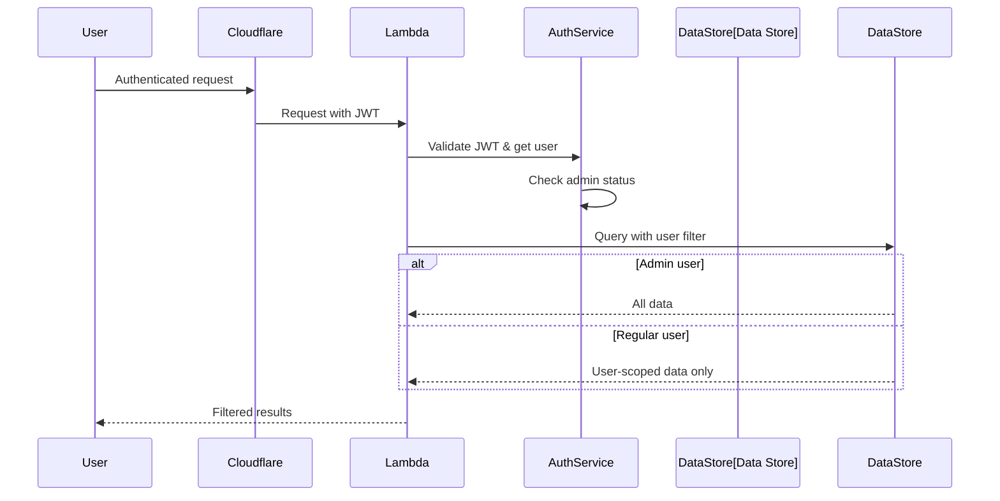
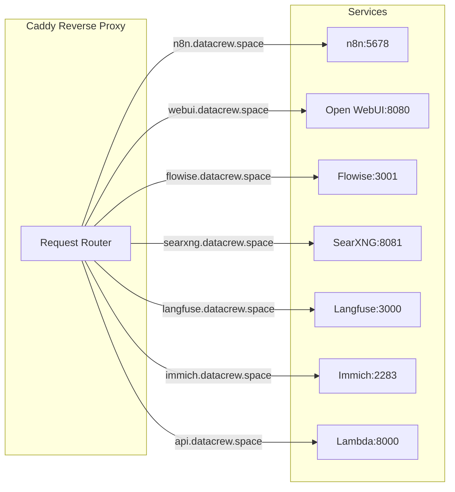

# System Architecture

This document describes the overall architecture of the local-ai-packaged infrastructure, including service dependencies, data flows, and network topology.

## Architecture Overview

The system is organized into numbered stacks with explicit dependencies:

```
00-infrastructure → 01-data → 02-compute → 03-apps → 04-lambda
     ↓                ↓           ↓           ↓          ↓
  (network)      (databases)  (AI models)  (apps)   (APIs/MCP)
```

## Stack Organization

### 00-infrastructure
**Purpose**: Foundation services (networking, reverse proxy, secrets management)  
**Project**: `localai-infra`  
**Services**:
- `cloudflared` - Cloudflare Tunnel (optional, for public access)
- `caddy` - Reverse proxy with automatic HTTPS
- `redis` - Caching and session storage

**Network**: Creates `ai-network` (external network shared by all stacks)

### Infisical (External Standalone Project)
**Status**: External standalone project (not part of this repository)  
**Location**: `/home/jaewilson07/GitHub/infisical-standalone`  
**Project**: `localai-infisical` (when running)  
**Purpose**: Secret management platform  
**Management**: Handled separately by `start_services.py` or `start_infisical.py`  
**Caddy Routing**: Configured in Caddyfile to route `infisical.datacrew.space` → `infisical-backend:8080` (when external Infisical is running)

### 01-data
**Purpose**: Data storage layer  
**Project**: `localai-data`  
**Services**:
- `supabase-db` - PostgreSQL database
- `supabase-kong` - API gateway
- `supabase-studio` - Admin UI
- `qdrant` - Vector database
- `neo4j` - Graph database (for Graphiti, knowledge graphs)
- `mongodb` - Document database (for RAG)
- `minio` - Object storage (S3-compatible)

**Dependencies**: Requires `00-infrastructure` (network)

### 02-compute
**Purpose**: AI compute services  
**Project**: `localai-compute`  
**Services**:
- `ollama` - LLM inference server
- `comfyui` - Stable diffusion image generation

**Dependencies**: Requires `00-infrastructure` (network), `01-data` (optional, for model storage)

### 03-apps
**Purpose**: Application layer  
**Project**: `localai-apps`  
**Services**:
- `n8n` - Workflow automation
- `flowise` - AI agent builder
- `open-webui` - Chat interface
- `searxng` - Privacy-focused search
- `langfuse` - LLM observability
- `clickhouse` - Analytics database
- `immich-server` - Photo/video management
- `immich-microservices` - Background jobs
- `immich-machine-learning` - Face detection
- `discord-bot` - Discord integration (Immich, AI characters via capability system)
- `minio` - Object storage (for Langfuse)

**Dependencies**: Requires `00-infrastructure`, `01-data`, `02-compute`

### 04-lambda
**Purpose**: FastAPI server with MCP and REST APIs  
**Project**: `localai-lambda`  
**Services**:
- `lambda-server` - FastAPI application with 40+ MCP tools, authentication system, and data viewing APIs

**Dependencies**: Requires `00-infrastructure`, `01-data` (MongoDB, Neo4j, Supabase, MinIO), `02-compute` (Ollama)

**Features**:
- Cloudflare Access JWT validation
- Just-In-Time (JIT) user provisioning
- Data isolation across all storage layers
- REST APIs for viewing data (Supabase, Neo4j, MongoDB, MinIO)

## Network Architecture



## Service Dependencies

### Dependency Graph



### Critical Dependencies

**Lambda Server**:
- Requires: MongoDB (RAG), Neo4j (Graphiti), Supabase (user profiles), MinIO (blob storage), Ollama (LLM + embeddings)
- Provides: MCP tools, REST APIs, authentication system, data viewing APIs

**Open WebUI**:
- Requires: PostgreSQL (Supabase), Ollama, Lambda Server (MCP)
- Provides: Chat interface

**n8n**:
- Requires: PostgreSQL (Supabase), Ollama, Qdrant (optional), Lambda Server (MCP tools)
- Provides: Workflow automation

**Immich**:
- Requires: PostgreSQL (dedicated), Typesense, Redis
- Provides: Photo/video management

## Data Flow Diagrams

### Document Ingestion Flow



### RAG Search Flow



### Conversation Export Flow



### Discord → Immich Flow



### N8N Workflow Orchestration Flow



### Authentication Flow



### Data Viewing Flow



## API Gateway Architecture

Caddy acts as the reverse proxy for all services:



### Routing Rules

- **Private Mode**: Services exposed on ports (e.g., `localhost:5678`)
- **Public Mode**: All traffic via Caddy on ports 80/443
- **Cloudflare Tunnel**: Optional, routes through Cloudflare before Caddy
- **Authentication**: Lambda server endpoints protected by Cloudflare Access (JWT validation)

### Lambda Server API Endpoints

**Public Endpoints** (no authentication):
- `GET /health` - Health check
- `GET /docs` - API documentation
- `GET /openapi.json` - OpenAPI schema

**Authenticated Endpoints** (require Cloudflare Access JWT):
- `GET /api/me` - Current user profile
- `GET /api/v1/data/storage` - View MinIO/blob storage files
- `GET /api/v1/data/supabase` - View Supabase table data
- `GET /api/v1/data/neo4j` - View Neo4j graph data
- `GET /api/v1/data/mongodb` - View MongoDB collection data
- `POST /mcp/tools/*` - MCP tool endpoints (internal network only)
- All other `/api/*` endpoints

**Internal Endpoints** (Docker network only):
- MCP endpoints accessible via `http://lambda-server:8000/mcp`
- No authentication required (network isolation provides security)

## Database Architecture

### PostgreSQL (Supabase)
- **Purpose**: Primary relational database
- **Used by**: n8n, Open WebUI, Supabase services, Lambda server (user profiles)
- **Schema**: Multiple schemas for different services
- **User Management**: `profiles` table stores user identity (email, role, tier)
- **Data Isolation**: Application-level filtering by `owner_email` field

### MongoDB
- **Purpose**: Document database for RAG
- **Used by**: Lambda server (MongoDB RAG project, persona management, conversation history)
- **Features**: Vector search, full-text search, Atlas Local
- **Data Isolation**: Filtered by `user_id` or `user_email` fields in documents

### Neo4j
- **Purpose**: Graph database for knowledge graphs
- **Used by**: Lambda server (Graphiti RAG, knowledge graph, user provisioning)
- **Protocol**: Bolt protocol
- **Data Isolation**: User anchoring pattern (`MATCH (u:User {email: $email})`)
- **User Management**: `:User` nodes created via JIT provisioning

### MinIO (Supabase Storage)
- **Purpose**: S3-compatible object storage
- **Used by**: Supabase, Lambda server (user blob storage)
- **Features**: S3-compatible API, bucket management
- **Data Isolation**: User folders organized by `user-{uuid}/` prefix
- **Bucket**: `user-data` (shared bucket with prefix-based organization)

### ClickHouse
- **Purpose**: Analytics database
- **Used by**: Langfuse (trace data storage)
- **Features**: Column-oriented, optimized for analytics

## Security Architecture

### Network Isolation
- All services on `ai-network` (Docker network)
- Services communicate via container names
- No direct external access (except via Caddy/Cloudflare)
- Caddy configured to trust Cloudflare IP ranges (when using Tunnel)

### Authentication & Authorization

#### Cloudflare Access (Lambda Server)
- **Method**: Header-based JWT validation
- **IdP**: Google OAuth (via Cloudflare Access)
- **Flow**: User authenticates at Cloudflare edge → JWT injected → Lambda validates
- **JWT Header**: `Cf-Access-Jwt-Assertion`
- **Validation**: Signature, audience (AUD tag), issuer
- **Location**: `04-lambda/server/projects/auth/`
- **Documentation**: See [Auth Project README](../04-lambda/server/projects/auth/README.md)

#### Just-In-Time (JIT) User Provisioning
- **Supabase**: Auto-creates user profile on first access
- **Neo4j**: Auto-creates `:User` node on first access
- **MinIO**: Auto-creates user folder (`user-{uuid}/`) on first access
- **MongoDB**: User filtering via field matching (no explicit provisioning)

#### Data Isolation
- **Regular Users**: See only their own data (filtered by email/UUID)
- **Admin Users**: Can view all data (bypasses filtering)
- **Enforcement**: Application-level filtering in all data viewing endpoints
- **Storage Layers**:
  - **Supabase**: Filtered by `owner_email` field
  - **Neo4j**: User anchoring pattern (`MATCH (u:User {email: $email})`)
  - **MinIO**: Filtered by `user-{uuid}/` prefix
  - **MongoDB**: Filtered by `user_id` or `user_email` fields

#### Other Services
- **Open WebUI**: Google OAuth (optional), local accounts
- **n8n**: Local accounts, Google OIDC (optional)
- **Infisical**: Admin account, machine identity
- **Immich**: First user is admin

### Secret Management
- **Primary**: Infisical (optional, can use `.env` files)
- **Fallback**: `.env` files in repository root
- **Best Practice**: Use Infisical for production, `.env` for development
- **Auth Secrets**: Cloudflare AUD tag, Supabase credentials, MinIO keys stored in environment variables

## Scaling Considerations

### Horizontal Scaling
- **Stateless Services**: Lambda server, Open WebUI (with shared PostgreSQL)
- **Stateful Services**: Databases require shared storage/replication

### Vertical Scaling
- **GPU Services**: Ollama, ComfyUI, Immich (video transcoding)
- **CPU Services**: Most services can scale with more CPU cores

### Resource Requirements
- **Minimum**: 8GB RAM, 4 CPU cores
- **Recommended**: 16GB+ RAM, 8+ CPU cores, GPU for AI workloads
- **GPU**: NVIDIA GPU recommended for Ollama, ComfyUI, Immich

## Monitoring and Observability

### Logging
- **Format**: JSON logs (via Docker logging driver)
- **Retention**: 1 file, 1MB max per service
- **Access**: `docker compose logs <service>`

### Metrics
- **Langfuse**: LLM trace collection and analytics
- **ClickHouse**: Analytics database for Langfuse traces

### Health Checks
- All services have HTTP health check endpoints
- Docker health checks configured for automatic restart

## Deployment Modes

### Private Mode (Development)
- All ports exposed directly
- No reverse proxy required
- Direct access: `localhost:<port>`

### Public Mode (Production)
- Only ports 80/443 exposed
- All traffic via Caddy reverse proxy
- Domain-based routing

### Cloudflare Tunnel Mode
- No port forwarding required
- Works behind NAT/firewalls
- Origin IP hidden
- Free SSL certificates

## Further Reading

- [Workflows Documentation](WORKFLOWS.md) - Detailed workflow documentation
- [Services Documentation](SERVICES.md) - Complete service catalog
- [MCP Integration](MCP_INTEGRATION.md) - MCP server and tools guide
- [Cloudflare Access Setup](CLOUDFLARE_ACCESS_CLI_SETUP.md) - Cloudflare Access configuration
- [Auth Project README](../04-lambda/server/projects/auth/README.md) - Authentication system documentation
- [Main README](../README.md) - Project overview
